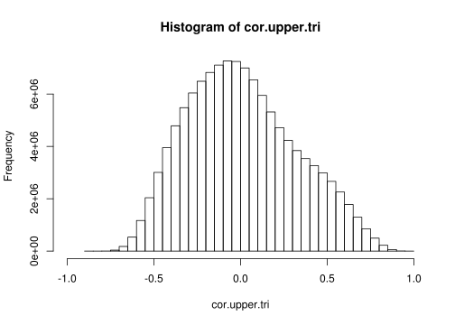
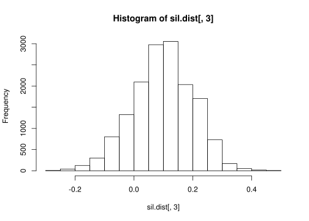

Cluster\_quality
================
Nicholas Rachmaninoff
11/11/2018

``` r
.libPaths("../../../../R_3.4.3_packages")

suppressPackageStartupMessages({
  library(cluster)
  library(Biobase)
  library(BiocGenerics)
  library(gplots)
  library(WGCNA)
  library(parallel)
})
```

    ## ==========================================================================
    ## *
    ## *  Package WGCNA 1.63 loaded.
    ## *
    ## *    Important note: It appears that your system supports multi-threading,
    ## *    but it is not enabled within WGCNA in R. 
    ## *    To allow multi-threading within WGCNA with all available cores, use 
    ## *
    ## *          allowWGCNAThreads()
    ## *
    ## *    within R. Use disableWGCNAThreads() to disable threading if necessary.
    ## *    Alternatively, set the following environment variable on your system:
    ## *
    ## *          ALLOW_WGCNA_THREADS=<number_of_processors>
    ## *
    ## *    for example 
    ## *
    ## *          ALLOW_WGCNA_THREADS=32
    ## *
    ## *    To set the environment variable in linux bash shell, type 
    ## *
    ## *           export ALLOW_WGCNA_THREADS=32
    ## *
    ## *     before running R. Other operating systems or shells will
    ## *     have a similar command to achieve the same aim.
    ## *
    ## ==========================================================================

``` r
knitr::opts_knit$set(root.dir = normalizePath("../../../.."))
```

``` r
getwd()
```

    ## [1] "/hpcdata/sg/sg_data/PROJECTS/Monogenic_Project"

``` r
in.eset.fp <- "Data/Microarray/data_analysis_ready/eset_batch_filtered.rds"
wgcna.res.fp <- "Data/Microarray/analysis_output/WGCNA/batch/modules.rds"

eset <- readRDS(in.eset.fp)
moduleColors <- readRDS(wgcna.res.fp)
```

``` r
datExpr <- t(exprs(eset))
```

Module eigengenes explain a lot of the variation
------------------------------------------------

``` r
MEs <- moduleEigengenes(datExpr, moduleColors)
var.exp <- t(MEs$varExplained)
rownames(var.exp) <- colnames(MEs$eigengenes)
var.exp
```

    ##                    [,1]
    ## MEblack       0.5057303
    ## MEblue        0.4196036
    ## MEbrown       0.4125537
    ## MEgreen       0.4534913
    ## MEgreenyellow 0.5891776
    ## MEmagenta     0.5757736
    ## MEpink        0.6376215
    ## MEpurple      0.5152245
    ## MEred         0.5198712
    ## MEtan         0.6920373
    ## MEturquoise   0.3969190
    ## MEyellow      0.4661100

``` r
#MEs.scaled <- moduleEigengenes(scale(datExpr), moduleColors) #it seems that WGCNA does scale prior to calculating the module eigengenes
#t(MEs.scaled$varExplained)
```

``` r
corMat <- cor(datExpr)
cor.upper.tri <- corMat[upper.tri(corMat)]
hist(cor.upper.tri, xlim = c(-1,1))
```



``` r
mean(cor.upper.tri)
```

    ## [1] 0.008635982

``` r
#IQR(cor.upper.tri)
quantile(cor.upper.tri)
```

    ##          0%         25%         50%         75%        100% 
    ## -0.86416097 -0.22989811 -0.01787952  0.22485260  1.00000000

``` r
# tmp <- prcomp(scale(datExpr[, moduleColors == "pink"]))
# #tmp$x
# plot(MEs$eigengenes$MEpink, tmp$x[, 1])
# cor(MEs$eigengenes$MEpink, tmp$x[, 1])
```

``` r
par(mfrow = c(3,3))
mean.intramod.cor <- mclapply(unique(moduleColors), mc.cores = detectCores(), function(color){
  select <- moduleColors == color
  
  cor.mat <- corMat[select, select]
  cor.upper.tri <- cor.mat[upper.tri(cor.mat)]
  hist(cor.upper.tri,
       main = color,
       xlab = (paste("pairwise cor for every module member,","mean = ", mean(cor.upper.tri))),
       xlim = c(-1,1)
  )
})

#get all of the intra-module correlations, get all of the between-module correlations
```

Silhouette width
================

``` r
emat <- t(scale(t(exprs(eset))))

dist.mat <- dist(emat)
anticor.mat <- (1 - cor(emat)) / 2 # makes anticorrelations 

sil.dist <- silhouette(as.numeric(as.factor(moduleColors)), dist = dist.mat)
#silhouette(as.numeric(as.factor(moduleColors)), dmatrix = anticor.mat)
```

``` r
hist(sil.dist[, 3])
```



The mean silhouette width calculated via euclidean distance is 0.0984564

``` r
#heatmaps of correlations within modules

# mean.intramod.cor <- mclapply(unique(moduleColors), mc.cores = detectCores(), function(color){
#   select <- moduleColors == color
#   
#   cor.mat <- corMat[select, select]
#   heatmap.2(cor.mat, 
#             main = color, 
#             col = bluered,
#             labRow = "",
#             labCol = "",
#             trace = "none",
#             scale = "none")
# })
```
