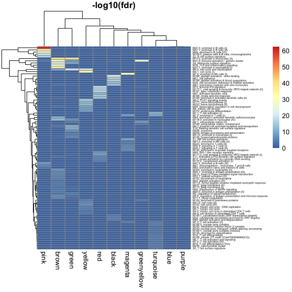

Microarray WGCNA modules
================
Nicholas Rachmaninoff
9/7/2018

``` r
source("scripts_nick/util/Enrichment/hyperGeo.R")

MODULES.PATH <- "Data/Microarray/analysis_output/WGCNA/batch/modules.rds"

moduleColors <- readRDS(MODULES.PATH)
```

``` r
#load btms that have already been processed
gene_set <- readRDS("Gene_sets/btm.rds")
##remove gene sets without title because less interpretable
gene_set <- gene_set[!grepl("TBA", names(gene_set))]
```

Perform enrichment and assign results to dataframes
===================================================

``` r
matList <- moduleColors_hyper_geo(moduleColors, gene_set)
```

``` r
#print the results 
print_topn_hyperGeo(matList, 20)
```

    ## [1] "turquoise"
    ##                                                         Universe Size
    ## M7.1_T cell activation (I)                                      15729
    ## M7.0_enriched in T cells (I)                                    15729
    ## M106.0_nuclear pore complex                                     15729
    ## M7.3_T cell activation (II)                                     15729
    ## M5.1_T cell activation and signaling                            15729
    ## M7.4_T cell activation (III)                                    15729
    ## M169_mitosis (TF motif CCAATNNSNNNGCG)                          15729
    ## S0_T cell surface signature                                     15729
    ## M19_T cell differentiation (Th2)                                15729
    ## M235_mitochondrial cluster                                      15729
    ## M14_T cell differentiation                                      15729
    ## M106.1_nuclear pore complex (mitosis)                           15729
    ## M138_enriched for ubiquitination                                15729
    ## M143_nuclear pore, transport; mRNA splicing, processing         15729
    ## M245_translation initiation factor 3 complex                    15729
    ## M230_cell cycle, mitotic phase                                  15729
    ## M250_spliceosome                                                15729
    ## M204.0_chaperonin mediated protein folding (I)                  15729
    ## M179_enriched for TF motif PAX3                                 15729
    ## M232_enriched for TF motif TNCATNTCCYR                          15729
    ##                                                         Gene Set Size
    ## M7.1_T cell activation (I)                                         48
    ## M7.0_enriched in T cells (I)                                       57
    ## M106.0_nuclear pore complex                                        16
    ## M7.3_T cell activation (II)                                        29
    ## M5.1_T cell activation and signaling                               20
    ## M7.4_T cell activation (III)                                       13
    ## M169_mitosis (TF motif CCAATNNSNNNGCG)                             13
    ## S0_T cell surface signature                                        25
    ## M19_T cell differentiation (Th2)                                   16
    ## M235_mitochondrial cluster                                         16
    ## M14_T cell differentiation                                         12
    ## M106.1_nuclear pore complex (mitosis)                              11
    ## M138_enriched for ubiquitination                                   11
    ## M143_nuclear pore, transport; mRNA splicing, processing            11
    ## M245_translation initiation factor 3 complex                       11
    ## M230_cell cycle, mitotic phase                                     10
    ## M250_spliceosome                                                   10
    ## M204.0_chaperonin mediated protein folding (I)                     13
    ## M179_enriched for TF motif PAX3                                     9
    ## M232_enriched for TF motif TNCATNTCCYR                             12
    ##                                                         Total Hits
    ## M7.1_T cell activation (I)                                    6413
    ## M7.0_enriched in T cells (I)                                  6413
    ## M106.0_nuclear pore complex                                   6413
    ## M7.3_T cell activation (II)                                   6413
    ## M5.1_T cell activation and signaling                          6413
    ## M7.4_T cell activation (III)                                  6413
    ## M169_mitosis (TF motif CCAATNNSNNNGCG)                        6413
    ## S0_T cell surface signature                                   6413
    ## M19_T cell differentiation (Th2)                              6413
    ## M235_mitochondrial cluster                                    6413
    ## M14_T cell differentiation                                    6413
    ## M106.1_nuclear pore complex (mitosis)                         6413
    ## M138_enriched for ubiquitination                              6413
    ## M143_nuclear pore, transport; mRNA splicing, processing       6413
    ## M245_translation initiation factor 3 complex                  6413
    ## M230_cell cycle, mitotic phase                                6413
    ## M250_spliceosome                                              6413
    ## M204.0_chaperonin mediated protein folding (I)                6413
    ## M179_enriched for TF motif PAX3                               6413
    ## M232_enriched for TF motif TNCATNTCCYR                        6413
    ##                                                         Expected Hits
    ## M7.1_T cell activation (I)                                  19.570475
    ## M7.0_enriched in T cells (I)                                23.239939
    ## M106.0_nuclear pore complex                                  6.523492
    ## M7.3_T cell activation (II)                                 11.823829
    ## M5.1_T cell activation and signaling                         8.154365
    ## M7.4_T cell activation (III)                                 5.300337
    ## M169_mitosis (TF motif CCAATNNSNNNGCG)                       5.300337
    ## S0_T cell surface signature                                 10.192956
    ## M19_T cell differentiation (Th2)                             6.523492
    ## M235_mitochondrial cluster                                   6.523492
    ## M14_T cell differentiation                                   4.892619
    ## M106.1_nuclear pore complex (mitosis)                        4.484901
    ## M138_enriched for ubiquitination                             4.484901
    ## M143_nuclear pore, transport; mRNA splicing, processing      4.484901
    ## M245_translation initiation factor 3 complex                 4.484901
    ## M230_cell cycle, mitotic phase                               4.077182
    ## M250_spliceosome                                             4.077182
    ## M204.0_chaperonin mediated protein folding (I)               5.300337
    ## M179_enriched for TF motif PAX3                              3.669464
    ## M232_enriched for TF motif TNCATNTCCYR                       4.892619
    ##                                                         Observed Hits
    ## M7.1_T cell activation (I)                                         45
    ## M7.0_enriched in T cells (I)                                       49
    ## M106.0_nuclear pore complex                                        16
    ## M7.3_T cell activation (II)                                        24
    ## M5.1_T cell activation and signaling                               18
    ## M7.4_T cell activation (III)                                       13
    ## M169_mitosis (TF motif CCAATNNSNNNGCG)                             13
    ## S0_T cell surface signature                                        21
    ## M19_T cell differentiation (Th2)                                   15
    ## M235_mitochondrial cluster                                         15
    ## M14_T cell differentiation                                         12
    ## M106.1_nuclear pore complex (mitosis)                              11
    ## M138_enriched for ubiquitination                                   11
    ## M143_nuclear pore, transport; mRNA splicing, processing            11
    ## M245_translation initiation factor 3 complex                       11
    ## M230_cell cycle, mitotic phase                                     10
    ## M250_spliceosome                                                   10
    ## M204.0_chaperonin mediated protein folding (I)                     12
    ## M179_enriched for TF motif PAX3                                     9
    ## M232_enriched for TF motif TNCATNTCCYR                             11
    ##                                                               Pvalue
    ## M7.1_T cell activation (I)                              1.011733e-14
    ## M7.0_enriched in T cells (I)                            2.081513e-12
    ## M106.0_nuclear pore complex                             5.766913e-07
    ## M7.3_T cell activation (II)                             4.362647e-06
    ## M5.1_T cell activation and signaling                    6.861663e-06
    ## M7.4_T cell activation (III)                            8.541816e-06
    ## M169_mitosis (TF motif CCAATNNSNNNGCG)                  8.541816e-06
    ## S0_T cell surface signature                             1.145913e-05
    ## M19_T cell differentiation (Th2)                        1.401203e-05
    ## M235_mitochondrial cluster                              1.401203e-05
    ## M14_T cell differentiation                              2.097355e-05
    ## M106.1_nuclear pore complex (mitosis)                   5.149365e-05
    ## M138_enriched for ubiquitination                        5.149365e-05
    ## M143_nuclear pore, transport; mRNA splicing, processing 5.149365e-05
    ## M245_translation initiation factor 3 complex            5.149365e-05
    ## M230_cell cycle, mitotic phase                          1.264140e-04
    ## M250_spliceosome                                        1.264140e-04
    ## M204.0_chaperonin mediated protein folding (I)          1.701544e-04
    ## M179_enriched for TF motif PAX3                         3.103104e-04
    ## M232_enriched for TF motif TNCATNTCCYR                  3.872147e-04
    ##                                                         Adjusted.Pvalue
    ## M7.1_T cell activation (I)                                 2.549568e-12
    ## M7.0_enriched in T cells (I)                               2.622706e-10
    ## M106.0_nuclear pore complex                                4.844207e-05
    ## M7.3_T cell activation (II)                                2.748468e-04
    ## M5.1_T cell activation and signaling                       3.075054e-04
    ## M7.4_T cell activation (III)                               3.075054e-04
    ## M169_mitosis (TF motif CCAATNNSNNNGCG)                     3.075054e-04
    ## S0_T cell surface signature                                3.531032e-04
    ## M19_T cell differentiation (Th2)                           3.531032e-04
    ## M235_mitochondrial cluster                                 3.531032e-04
    ## M14_T cell differentiation                                 4.804851e-04
    ## M106.1_nuclear pore complex (mitosis)                      8.650933e-04
    ## M138_enriched for ubiquitination                           8.650933e-04
    ## M143_nuclear pore, transport; mRNA splicing, processing    8.650933e-04
    ## M245_translation initiation factor 3 complex               8.650933e-04
    ## M230_cell cycle, mitotic phase                             1.873901e-03
    ## M250_spliceosome                                           1.873901e-03
    ## M204.0_chaperonin mediated protein folding (I)             2.382162e-03
    ## M179_enriched for TF motif PAX3                            4.115695e-03
    ## M232_enriched for TF motif TNCATNTCCYR                     4.878905e-03
    ## [1] "blue"
    ##                                                             Universe Size
    ## M224_transmembrane and ion transporters (II)                        15729
    ## M2.0_extracellular matrix (I)                                       15729
    ## M88.0_leukocyte migration                                           15729
    ## M17.0_Hox cluster I                                                 15729
    ## M195_muscle contraction, SRF targets                                15729
    ## M189_extracellular region cluster (GO)                              15729
    ## M210_extracellular matrix, collagen                                 15729
    ## M1.1_integrin cell surface interactions (II)                        15729
    ## M17.1_Hox cluster II                                                15729
    ## M17.2_Hox cluster III                                               15729
    ## M172_enriched for TF motif TTCNRGNNNNTTC                            15729
    ## M202_enriched in extracellular matrix & associated proteins         15729
    ## M154.0_amino acid metabolism and transport                          15729
    ## M175_cell development                                               15729
    ## M107_Hox cluster VI                                                 15729
    ## M187_metabolism in mitochondria, peroxisome                         15729
    ## M2.2_extracellular matrix (III)                                     15729
    ## M133.1_cell cell adhesion                                           15729
    ## M89.0_putative targets of PAX3                                      15729
    ## M1.0_integrin cell surface interactions (I)                         15729
    ##                                                             Gene Set Size
    ## M224_transmembrane and ion transporters (II)                            9
    ## M2.0_extracellular matrix (I)                                          24
    ## M88.0_leukocyte migration                                              34
    ## M17.0_Hox cluster I                                                    14
    ## M195_muscle contraction, SRF targets                                    9
    ## M189_extracellular region cluster (GO)                                 13
    ## M210_extracellular matrix, collagen                                    21
    ## M1.1_integrin cell surface interactions (II)                            8
    ## M17.1_Hox cluster II                                                    8
    ## M17.2_Hox cluster III                                                   8
    ## M172_enriched for TF motif TTCNRGNNNNTTC                                8
    ## M202_enriched in extracellular matrix & associated proteins             8
    ## M154.0_amino acid metabolism and transport                             12
    ## M175_cell development                                                  12
    ## M107_Hox cluster VI                                                     7
    ## M187_metabolism in mitochondria, peroxisome                             7
    ## M2.2_extracellular matrix (III)                                         9
    ## M133.1_cell cell adhesion                                               9
    ## M89.0_putative targets of PAX3                                         13
    ## M1.0_integrin cell surface interactions (I)                            22
    ##                                                             Total Hits
    ## M224_transmembrane and ion transporters (II)                      5025
    ## M2.0_extracellular matrix (I)                                     5025
    ## M88.0_leukocyte migration                                         5025
    ## M17.0_Hox cluster I                                               5025
    ## M195_muscle contraction, SRF targets                              5025
    ## M189_extracellular region cluster (GO)                            5025
    ## M210_extracellular matrix, collagen                               5025
    ## M1.1_integrin cell surface interactions (II)                      5025
    ## M17.1_Hox cluster II                                              5025
    ## M17.2_Hox cluster III                                             5025
    ## M172_enriched for TF motif TTCNRGNNNNTTC                          5025
    ## M202_enriched in extracellular matrix & associated proteins       5025
    ## M154.0_amino acid metabolism and transport                        5025
    ## M175_cell development                                             5025
    ## M107_Hox cluster VI                                               5025
    ## M187_metabolism in mitochondria, peroxisome                       5025
    ## M2.2_extracellular matrix (III)                                   5025
    ## M133.1_cell cell adhesion                                         5025
    ## M89.0_putative targets of PAX3                                    5025
    ## M1.0_integrin cell surface interactions (I)                       5025
    ##                                                             Expected Hits
    ## M224_transmembrane and ion transporters (II)                     2.875262
    ## M2.0_extracellular matrix (I)                                    7.667366
    ## M88.0_leukocyte migration                                       10.862102
    ## M17.0_Hox cluster I                                              4.472630
    ## M195_muscle contraction, SRF targets                             2.875262
    ## M189_extracellular region cluster (GO)                           4.153157
    ## M210_extracellular matrix, collagen                              6.708945
    ## M1.1_integrin cell surface interactions (II)                     2.555789
    ## M17.1_Hox cluster II                                             2.555789
    ## M17.2_Hox cluster III                                            2.555789
    ## M172_enriched for TF motif TTCNRGNNNNTTC                         2.555789
    ## M202_enriched in extracellular matrix & associated proteins      2.555789
    ## M154.0_amino acid metabolism and transport                       3.833683
    ## M175_cell development                                            3.833683
    ## M107_Hox cluster VI                                              2.236315
    ## M187_metabolism in mitochondria, peroxisome                      2.236315
    ## M2.2_extracellular matrix (III)                                  2.875262
    ## M133.1_cell cell adhesion                                        2.875262
    ## M89.0_putative targets of PAX3                                   4.153157
    ## M1.0_integrin cell surface interactions (I)                      7.028419
    ##                                                             Observed Hits
    ## M224_transmembrane and ion transporters (II)                            9
    ## M2.0_extracellular matrix (I)                                          17
    ## M88.0_leukocyte migration                                              21
    ## M17.0_Hox cluster I                                                    11
    ## M195_muscle contraction, SRF targets                                    8
    ## M189_extracellular region cluster (GO)                                 10
    ## M210_extracellular matrix, collagen                                    14
    ## M1.1_integrin cell surface interactions (II)                            7
    ## M17.1_Hox cluster II                                                    7
    ## M17.2_Hox cluster III                                                   7
    ## M172_enriched for TF motif TTCNRGNNNNTTC                                7
    ## M202_enriched in extracellular matrix & associated proteins             7
    ## M154.0_amino acid metabolism and transport                              9
    ## M175_cell development                                                   9
    ## M107_Hox cluster VI                                                     6
    ## M187_metabolism in mitochondria, peroxisome                             6
    ## M2.2_extracellular matrix (III)                                         7
    ## M133.1_cell cell adhesion                                               7
    ## M89.0_putative targets of PAX3                                          9
    ## M1.0_integrin cell surface interactions (I)                            13
    ##                                                                   Pvalue
    ## M224_transmembrane and ion transporters (II)                3.449814e-05
    ## M2.0_extracellular matrix (I)                               1.054791e-04
    ## M88.0_leukocyte migration                                   3.280324e-04
    ## M17.0_Hox cluster I                                         4.545023e-04
    ## M195_muscle contraction, SRF targets                        6.969284e-04
    ## M189_extracellular region cluster (GO)                      1.131323e-03
    ## M210_extracellular matrix, collagen                         1.137465e-03
    ## M1.1_integrin cell surface interactions (II)                1.952850e-03
    ## M17.1_Hox cluster II                                        1.952850e-03
    ## M17.2_Hox cluster III                                       1.952850e-03
    ## M172_enriched for TF motif TTCNRGNNNNTTC                    1.952850e-03
    ## M202_enriched in extracellular matrix & associated proteins 1.952850e-03
    ## M154.0_amino acid metabolism and transport                  2.762552e-03
    ## M175_cell development                                       2.762552e-03
    ## M107_Hox cluster VI                                         5.395029e-03
    ## M187_metabolism in mitochondria, peroxisome                 5.395029e-03
    ## M2.2_extracellular matrix (III)                             6.348575e-03
    ## M133.1_cell cell adhesion                                   6.348575e-03
    ## M89.0_putative targets of PAX3                              6.432817e-03
    ## M1.0_integrin cell surface interactions (I)                 7.810457e-03
    ##                                                             Adjusted.Pvalue
    ## M224_transmembrane and ion transporters (II)                     0.00869353
    ## M2.0_extracellular matrix (I)                                    0.01329037
    ## M88.0_leukocyte migration                                        0.02755472
    ## M17.0_Hox cluster I                                              0.02863365
    ## M195_muscle contraction, SRF targets                             0.03512519
    ## M189_extracellular region cluster (GO)                           0.04094874
    ## M210_extracellular matrix, collagen                              0.04094874
    ## M1.1_integrin cell surface interactions (II)                     0.04100985
    ## M17.1_Hox cluster II                                             0.04100985
    ## M17.2_Hox cluster III                                            0.04100985
    ## M172_enriched for TF motif TTCNRGNNNNTTC                         0.04100985
    ## M202_enriched in extracellular matrix & associated proteins      0.04100985
    ## M154.0_amino acid metabolism and transport                       0.04972593
    ## M175_cell development                                            0.04972593
    ## M107_Hox cluster VI                                              0.08497171
    ## M187_metabolism in mitochondria, peroxisome                      0.08497171
    ## M2.2_extracellular matrix (III)                                  0.08531946
    ## M133.1_cell cell adhesion                                        0.08531946
    ## M89.0_putative targets of PAX3                                   0.08531946
    ## M1.0_integrin cell surface interactions (I)                      0.09841176
    ## [1] "red"
    ##                                                              Universe Size
    ## M127_type I interferon response                                      15729
    ## M75_antiviral IFN signature                                          15729
    ## M111.1_viral sensing & immunity; IRF2 targets network (II)           15729
    ## M150_innate antiviral response                                       15729
    ## M165_enriched in activated dendritic cells (II)                      15729
    ## M67_activated dendritic cells                                        15729
    ## M111.0_viral sensing & immunity; IRF2 targets network (I)            15729
    ## M68_RIG-1 like receptor signaling                                    15729
    ## M13_innate activation by cytosolic DNA sensing                       15729
    ## S11_Activated (LPS) dendritic cell surface signature                 15729
    ## M112.0_complement activation (I)                                     15729
    ## M27.1_chemokine cluster (II)                                         15729
    ## M86.1_proinflammatory dendritic cell, myeloid cell response          15729
    ## M40_complement and other receptors in DCs                            15729
    ## S5_DC surface signature                                              15729
    ## M86.0_chemokines and inflammatory molecules in myeloid cells         15729
    ## M119_enriched in activated dendritic cells (I)                       15729
    ## M4.9_mitotic cell cycle in stimulated CD4 T cells                    15729
    ## M24_cell activation (IL15, IL23, TNF)                                15729
    ## M4.6_cell division in stimulated CD4 T cells                         15729
    ##                                                              Gene Set Size
    ## M127_type I interferon response                                         12
    ## M75_antiviral IFN signature                                             20
    ## M111.1_viral sensing & immunity; IRF2 targets network (II)              11
    ## M150_innate antiviral response                                          11
    ## M165_enriched in activated dendritic cells (II)                         31
    ## M67_activated dendritic cells                                           12
    ## M111.0_viral sensing & immunity; IRF2 targets network (I)               17
    ## M68_RIG-1 like receptor signaling                                        9
    ## M13_innate activation by cytosolic DNA sensing                          11
    ## S11_Activated (LPS) dendritic cell surface signature                    33
    ## M112.0_complement activation (I)                                        14
    ## M27.1_chemokine cluster (II)                                            10
    ## M86.1_proinflammatory dendritic cell, myeloid cell response             11
    ## M40_complement and other receptors in DCs                               13
    ## S5_DC surface signature                                                 71
    ## M86.0_chemokines and inflammatory molecules in myeloid cells            17
    ## M119_enriched in activated dendritic cells (I)                          10
    ## M4.9_mitotic cell cycle in stimulated CD4 T cells                       13
    ## M24_cell activation (IL15, IL23, TNF)                                   14
    ## M4.6_cell division in stimulated CD4 T cells                            16
    ##                                                              Total Hits
    ## M127_type I interferon response                                     282
    ## M75_antiviral IFN signature                                         282
    ## M111.1_viral sensing & immunity; IRF2 targets network (II)          282
    ## M150_innate antiviral response                                      282
    ## M165_enriched in activated dendritic cells (II)                     282
    ## M67_activated dendritic cells                                       282
    ## M111.0_viral sensing & immunity; IRF2 targets network (I)           282
    ## M68_RIG-1 like receptor signaling                                   282
    ## M13_innate activation by cytosolic DNA sensing                      282
    ## S11_Activated (LPS) dendritic cell surface signature                282
    ## M112.0_complement activation (I)                                    282
    ## M27.1_chemokine cluster (II)                                        282
    ## M86.1_proinflammatory dendritic cell, myeloid cell response         282
    ## M40_complement and other receptors in DCs                           282
    ## S5_DC surface signature                                             282
    ## M86.0_chemokines and inflammatory molecules in myeloid cells        282
    ## M119_enriched in activated dendritic cells (I)                      282
    ## M4.9_mitotic cell cycle in stimulated CD4 T cells                   282
    ## M24_cell activation (IL15, IL23, TNF)                               282
    ## M4.6_cell division in stimulated CD4 T cells                        282
    ##                                                              Expected Hits
    ## M127_type I interferon response                                  0.2151440
    ## M75_antiviral IFN signature                                      0.3585733
    ## M111.1_viral sensing & immunity; IRF2 targets network (II)       0.1972153
    ## M150_innate antiviral response                                   0.1972153
    ## M165_enriched in activated dendritic cells (II)                  0.5557887
    ## M67_activated dendritic cells                                    0.2151440
    ## M111.0_viral sensing & immunity; IRF2 targets network (I)        0.3047873
    ## M68_RIG-1 like receptor signaling                                0.1613580
    ## M13_innate activation by cytosolic DNA sensing                   0.1972153
    ## S11_Activated (LPS) dendritic cell surface signature             0.5916460
    ## M112.0_complement activation (I)                                 0.2510013
    ## M27.1_chemokine cluster (II)                                     0.1792867
    ## M86.1_proinflammatory dendritic cell, myeloid cell response      0.1972153
    ## M40_complement and other receptors in DCs                        0.2330727
    ## S5_DC surface signature                                          1.2729353
    ## M86.0_chemokines and inflammatory molecules in myeloid cells     0.3047873
    ## M119_enriched in activated dendritic cells (I)                   0.1792867
    ## M4.9_mitotic cell cycle in stimulated CD4 T cells                0.2330727
    ## M24_cell activation (IL15, IL23, TNF)                            0.2510013
    ## M4.6_cell division in stimulated CD4 T cells                     0.2868587
    ##                                                              Observed Hits
    ## M127_type I interferon response                                         12
    ## M75_antiviral IFN signature                                             14
    ## M111.1_viral sensing & immunity; IRF2 targets network (II)              11
    ## M150_innate antiviral response                                          10
    ## M165_enriched in activated dendritic cells (II)                         14
    ## M67_activated dendritic cells                                            9
    ## M111.0_viral sensing & immunity; IRF2 targets network (I)                8
    ## M68_RIG-1 like receptor signaling                                        6
    ## M13_innate activation by cytosolic DNA sensing                           5
    ## S11_Activated (LPS) dendritic cell surface signature                     7
    ## M112.0_complement activation (I)                                         5
    ## M27.1_chemokine cluster (II)                                             3
    ## M86.1_proinflammatory dendritic cell, myeloid cell response              3
    ## M40_complement and other receptors in DCs                                3
    ## S5_DC surface signature                                                  6
    ## M86.0_chemokines and inflammatory molecules in myeloid cells             3
    ## M119_enriched in activated dendritic cells (I)                           2
    ## M4.9_mitotic cell cycle in stimulated CD4 T cells                        2
    ## M24_cell activation (IL15, IL23, TNF)                                    2
    ## M4.6_cell division in stimulated CD4 T cells                             2
    ##                                                                    Pvalue
    ## M127_type I interferon response                              8.736648e-22
    ## M75_antiviral IFN signature                                  9.043262e-21
    ## M111.1_viral sensing & immunity; IRF2 targets network (II)   5.067256e-20
    ## M150_innate antiviral response                               3.170556e-17
    ## M165_enriched in activated dendritic cells (II)              5.186177e-17
    ## M67_activated dendritic cells                                3.538498e-14
    ## M111.0_viral sensing & immunity; IRF2 targets network (I)    2.043806e-10
    ## M68_RIG-1 like receptor signaling                            2.529192e-09
    ## M13_innate activation by cytosolic DNA sensing               7.562653e-07
    ## S11_Activated (LPS) dendritic cell surface signature         1.583927e-06
    ## M112.0_complement activation (I)                             3.135298e-06
    ## M27.1_chemokine cluster (II)                                 6.232418e-04
    ## M86.1_proinflammatory dendritic cell, myeloid cell response  8.456232e-04
    ## M40_complement and other receptors in DCs                    1.427281e-03
    ## S5_DC surface signature                                      1.699831e-03
    ## M86.0_chemokines and inflammatory molecules in myeloid cells 3.218215e-03
    ## M119_enriched in activated dendritic cells (I)               1.310758e-02
    ## M4.9_mitotic cell cycle in stimulated CD4 T cells            2.193082e-02
    ## M24_cell activation (IL15, IL23, TNF)                        2.528719e-02
    ## M4.6_cell division in stimulated CD4 T cells                 3.257330e-02
    ##                                                              Adjusted.Pvalue
    ## M127_type I interferon response                                 2.201635e-19
    ## M75_antiviral IFN signature                                     1.139451e-18
    ## M111.1_viral sensing & immunity; IRF2 targets network (II)      4.256495e-18
    ## M150_innate antiviral response                                  1.997450e-15
    ## M165_enriched in activated dendritic cells (II)                 2.613833e-15
    ## M67_activated dendritic cells                                   1.486169e-12
    ## M111.0_viral sensing & immunity; IRF2 targets network (I)       7.357702e-09
    ## M68_RIG-1 like receptor signaling                               7.966956e-08
    ## M13_innate activation by cytosolic DNA sensing                  2.117543e-05
    ## S11_Activated (LPS) dendritic cell surface signature            3.991496e-05
    ## M112.0_complement activation (I)                                7.182682e-05
    ## M27.1_chemokine cluster (II)                                    1.308808e-02
    ## M86.1_proinflammatory dendritic cell, myeloid cell response     1.639208e-02
    ## M40_complement and other receptors in DCs                       2.569106e-02
    ## S5_DC surface signature                                         2.855716e-02
    ## M86.0_chemokines and inflammatory molecules in myeloid cells    5.068689e-02
    ## M119_enriched in activated dendritic cells (I)                  1.943005e-01
    ## M4.9_mitotic cell cycle in stimulated CD4 T cells               3.070314e-01
    ## M24_cell activation (IL15, IL23, TNF)                           3.353880e-01
    ## M4.6_cell division in stimulated CD4 T cells                    4.104236e-01
    ## [1] "yellow"
    ##                                                   Universe Size
    ## M4.1_cell cycle (I)                                       15729
    ## M4.0_cell cycle and transcription                         15729
    ## M4.2_PLK1 signaling events                                15729
    ## M222_heme biosynthesis (II)                               15729
    ## M171_heme biosynthesis (I)                                15729
    ## M49_transcription regulation in cell development          15729
    ## M173_erythrocyte differentiation                          15729
    ## M6_mitotic cell division                                  15729
    ## M103_cell cycle (III)                                     15729
    ## M4.10_cell cycle (II)                                     15729
    ## M4.4_mitotic cell cycle - DNA replication                 15729
    ## M124_enriched in membrane proteins                        15729
    ## M4.7_mitotic cell cycle                                   15729
    ## M4.6_cell division in stimulated CD4 T cells              15729
    ## M4.5_mitotic cell cycle in stimulated CD4 T cells         15729
    ## M4.9_mitotic cell cycle in stimulated CD4 T cells         15729
    ## M167_enriched in cell cycle                               15729
    ## M87_transmembrane transport (I)                           15729
    ## M4.14_Rho GTPase cycle                                    15729
    ## M15_Ran mediated mitosis                                  15729
    ##                                                   Gene Set Size Total Hits
    ## M4.1_cell cycle (I)                                         125       1014
    ## M4.0_cell cycle and transcription                           285       1014
    ## M4.2_PLK1 signaling events                                   27       1014
    ## M222_heme biosynthesis (II)                                  12       1014
    ## M171_heme biosynthesis (I)                                   11       1014
    ## M49_transcription regulation in cell development             41       1014
    ## M173_erythrocyte differentiation                             10       1014
    ## M6_mitotic cell division                                     23       1014
    ## M103_cell cycle (III)                                        47       1014
    ## M4.10_cell cycle (II)                                        13       1014
    ## M4.4_mitotic cell cycle - DNA replication                    26       1014
    ## M124_enriched in membrane proteins                           17       1014
    ## M4.7_mitotic cell cycle                                      18       1014
    ## M4.6_cell division in stimulated CD4 T cells                 16       1014
    ## M4.5_mitotic cell cycle in stimulated CD4 T cells            29       1014
    ## M4.9_mitotic cell cycle in stimulated CD4 T cells            13       1014
    ## M167_enriched in cell cycle                                  15       1014
    ## M87_transmembrane transport (I)                              22       1014
    ## M4.14_Rho GTPase cycle                                        7       1014
    ## M15_Ran mediated mitosis                                     13       1014
    ##                                                   Expected Hits
    ## M4.1_cell cycle (I)                                   8.0583635
    ## M4.0_cell cycle and transcription                    18.3730689
    ## M4.2_PLK1 signaling events                            1.7406065
    ## M222_heme biosynthesis (II)                           0.7736029
    ## M171_heme biosynthesis (I)                            0.7091360
    ## M49_transcription regulation in cell development      2.6431432
    ## M173_erythrocyte differentiation                      0.6446691
    ## M6_mitotic cell division                              1.4827389
    ## M103_cell cycle (III)                                 3.0299447
    ## M4.10_cell cycle (II)                                 0.8380698
    ## M4.4_mitotic cell cycle - DNA replication             1.6761396
    ## M124_enriched in membrane proteins                    1.0959374
    ## M4.7_mitotic cell cycle                               1.1604043
    ## M4.6_cell division in stimulated CD4 T cells          1.0314705
    ## M4.5_mitotic cell cycle in stimulated CD4 T cells     1.8695403
    ## M4.9_mitotic cell cycle in stimulated CD4 T cells     0.8380698
    ## M167_enriched in cell cycle                           0.9670036
    ## M87_transmembrane transport (I)                       1.4182720
    ## M4.14_Rho GTPase cycle                                0.4512684
    ## M15_Ran mediated mitosis                              0.8380698
    ##                                                   Observed Hits
    ## M4.1_cell cycle (I)                                          59
    ## M4.0_cell cycle and transcription                            68
    ## M4.2_PLK1 signaling events                                   20
    ## M222_heme biosynthesis (II)                                  12
    ## M171_heme biosynthesis (I)                                   11
    ## M49_transcription regulation in cell development             18
    ## M173_erythrocyte differentiation                              9
    ## M6_mitotic cell division                                     13
    ## M103_cell cycle (III)                                        16
    ## M4.10_cell cycle (II)                                         8
    ## M4.4_mitotic cell cycle - DNA replication                    10
    ## M124_enriched in membrane proteins                            8
    ## M4.7_mitotic cell cycle                                       8
    ## M4.6_cell division in stimulated CD4 T cells                  7
    ## M4.5_mitotic cell cycle in stimulated CD4 T cells             9
    ## M4.9_mitotic cell cycle in stimulated CD4 T cells             6
    ## M167_enriched in cell cycle                                   6
    ## M87_transmembrane transport (I)                               7
    ## M4.14_Rho GTPase cycle                                        4
    ## M15_Ran mediated mitosis                                      5
    ##                                                         Pvalue
    ## M4.1_cell cycle (I)                               4.717444e-37
    ## M4.0_cell cycle and transcription                 1.088083e-21
    ## M4.2_PLK1 signaling events                        7.406367e-19
    ## M222_heme biosynthesis (II)                       4.847186e-15
    ## M171_heme biosynthesis (I)                        7.596020e-14
    ## M49_transcription regulation in cell development  1.563759e-11
    ## M173_erythrocyte differentiation                  1.753184e-10
    ## M6_mitotic cell division                          1.923110e-10
    ## M103_cell cycle (III)                             1.780195e-08
    ## M4.10_cell cycle (II)                             2.792814e-07
    ## M4.4_mitotic cell cycle - DNA replication         2.434338e-06
    ## M124_enriched in membrane proteins                4.178344e-06
    ## M4.7_mitotic cell cycle                           7.096018e-06
    ## M4.6_cell division in stimulated CD4 T cells      3.095707e-05
    ## M4.5_mitotic cell cycle in stimulated CD4 T cells 5.734400e-05
    ## M4.9_mitotic cell cycle in stimulated CD4 T cells 8.190691e-05
    ## M167_enriched in cell cycle                       2.135847e-04
    ## M87_transmembrane transport (I)                   3.277584e-04
    ## M4.14_Rho GTPase cycle                            5.133777e-04
    ## M15_Ran mediated mitosis                          9.170759e-04
    ##                                                   Adjusted.Pvalue
    ## M4.1_cell cycle (I)                                  1.188796e-34
    ## M4.0_cell cycle and transcription                    1.370984e-19
    ## M4.2_PLK1 signaling events                           6.221349e-17
    ## M222_heme biosynthesis (II)                          3.053727e-13
    ## M171_heme biosynthesis (I)                           3.828394e-12
    ## M49_transcription regulation in cell development     6.567786e-10
    ## M173_erythrocyte differentiation                     6.057795e-09
    ## M6_mitotic cell division                             6.057795e-09
    ## M103_cell cycle (III)                                4.984546e-07
    ## M4.10_cell cycle (II)                                7.037892e-06
    ## M4.4_mitotic cell cycle - DNA replication            5.576848e-05
    ## M124_enriched in membrane proteins                   8.774522e-05
    ## M4.7_mitotic cell cycle                              1.375536e-04
    ## M4.6_cell division in stimulated CD4 T cells         5.572273e-04
    ## M4.5_mitotic cell cycle in stimulated CD4 T cells    9.633793e-04
    ## M4.9_mitotic cell cycle in stimulated CD4 T cells    1.290034e-03
    ## M167_enriched in cell cycle                          3.166080e-03
    ## M87_transmembrane transport (I)                      4.588618e-03
    ## M4.14_Rho GTPase cycle                               6.809010e-03
    ## M15_Ran mediated mitosis                             1.155516e-02
    ## [1] "brown"
    ##                                                             Universe Size
    ## M11.0_enriched in monocytes (II)                                    15729
    ## M37.1_enriched in neutrophils (I)                                   15729
    ## M37.0_immune activation - generic cluster                           15729
    ## M16_TLR and inflammatory signaling                                  15729
    ## S4_Monocyte surface signature                                       15729
    ## M118.0_enriched in monocytes (IV)                                   15729
    ## M64_enriched in activated dendritic cells/monocytes                 15729
    ## M4.0_cell cycle and transcription                                   15729
    ## M163_enriched in neutrophils (II)                                   15729
    ## M5.0_regulation of antigen presentation and immune response         15729
    ## M215_small GTPase mediated signal transduction                      15729
    ## M11.1_blood coagulation                                             15729
    ## M95.1_enriched in antigen presentation (III)                        15729
    ## M32.1_platelet activation (II)                                      15729
    ## M132_recruitment of neutrophils                                     15729
    ## M95.0_enriched in antigen presentation (II)                         15729
    ## M237_golgi membrane (II)                                            15729
    ## M11.2_formyl peptide receptor mediated neutrophil response          15729
    ## M56_suppression of MAPK signaling                                   15729
    ## M3_regulation of signal transduction                                15729
    ##                                                             Gene Set Size
    ## M11.0_enriched in monocytes (II)                                      174
    ## M37.1_enriched in neutrophils (I)                                      45
    ## M37.0_immune activation - generic cluster                             298
    ## M16_TLR and inflammatory signaling                                     41
    ## S4_Monocyte surface signature                                          78
    ## M118.0_enriched in monocytes (IV)                                      50
    ## M64_enriched in activated dendritic cells/monocytes                    16
    ## M4.0_cell cycle and transcription                                     285
    ## M163_enriched in neutrophils (II)                                      12
    ## M5.0_regulation of antigen presentation and immune response            76
    ## M215_small GTPase mediated signal transduction                         15
    ## M11.1_blood coagulation                                                21
    ## M95.1_enriched in antigen presentation (III)                           11
    ## M32.1_platelet activation (II)                                         19
    ## M132_recruitment of neutrophils                                         9
    ## M95.0_enriched in antigen presentation (II)                            19
    ## M237_golgi membrane (II)                                               17
    ## M11.2_formyl peptide receptor mediated neutrophil response              9
    ## M56_suppression of MAPK signaling                                      12
    ## M3_regulation of signal transduction                                   46
    ##                                                             Total Hits
    ## M11.0_enriched in monocytes (II)                                  2151
    ## M37.1_enriched in neutrophils (I)                                 2151
    ## M37.0_immune activation - generic cluster                         2151
    ## M16_TLR and inflammatory signaling                                2151
    ## S4_Monocyte surface signature                                     2151
    ## M118.0_enriched in monocytes (IV)                                 2151
    ## M64_enriched in activated dendritic cells/monocytes               2151
    ## M4.0_cell cycle and transcription                                 2151
    ## M163_enriched in neutrophils (II)                                 2151
    ## M5.0_regulation of antigen presentation and immune response       2151
    ## M215_small GTPase mediated signal transduction                    2151
    ## M11.1_blood coagulation                                           2151
    ## M95.1_enriched in antigen presentation (III)                      2151
    ## M32.1_platelet activation (II)                                    2151
    ## M132_recruitment of neutrophils                                   2151
    ## M95.0_enriched in antigen presentation (II)                       2151
    ## M237_golgi membrane (II)                                          2151
    ## M11.2_formyl peptide receptor mediated neutrophil response        2151
    ## M56_suppression of MAPK signaling                                 2151
    ## M3_regulation of signal transduction                              2151
    ##                                                             Expected Hits
    ## M11.0_enriched in monocytes (II)                                23.795155
    ## M37.1_enriched in neutrophils (I)                                6.153920
    ## M37.0_immune activation - generic cluster                       40.752623
    ## M16_TLR and inflammatory signaling                               5.606904
    ## S4_Monocyte surface signature                                   10.666794
    ## M118.0_enriched in monocytes (IV)                                6.837688
    ## M64_enriched in activated dendritic cells/monocytes              2.188060
    ## M4.0_cell cycle and transcription                               38.974824
    ## M163_enriched in neutrophils (II)                                1.641045
    ## M5.0_regulation of antigen presentation and immune response     10.393286
    ## M215_small GTPase mediated signal transduction                   2.051307
    ## M11.1_blood coagulation                                          2.871829
    ## M95.1_enriched in antigen presentation (III)                     1.504291
    ## M32.1_platelet activation (II)                                   2.598322
    ## M132_recruitment of neutrophils                                  1.230784
    ## M95.0_enriched in antigen presentation (II)                      2.598322
    ## M237_golgi membrane (II)                                         2.324814
    ## M11.2_formyl peptide receptor mediated neutrophil response       1.230784
    ## M56_suppression of MAPK signaling                                1.641045
    ## M3_regulation of signal transduction                             6.290673
    ##                                                             Observed Hits
    ## M11.0_enriched in monocytes (II)                                      102
    ## M37.1_enriched in neutrophils (I)                                      44
    ## M37.0_immune activation - generic cluster                             121
    ## M16_TLR and inflammatory signaling                                     37
    ## S4_Monocyte surface signature                                          51
    ## M118.0_enriched in monocytes (IV)                                      31
    ## M64_enriched in activated dendritic cells/monocytes                    15
    ## M4.0_cell cycle and transcription                                      81
    ## M163_enriched in neutrophils (II)                                      11
    ## M5.0_regulation of antigen presentation and immune response            29
    ## M215_small GTPase mediated signal transduction                         11
    ## M11.1_blood coagulation                                                13
    ## M95.1_enriched in antigen presentation (III)                            9
    ## M32.1_platelet activation (II)                                         12
    ## M132_recruitment of neutrophils                                         8
    ## M95.0_enriched in antigen presentation (II)                            11
    ## M237_golgi membrane (II)                                               10
    ## M11.2_formyl peptide receptor mediated neutrophil response              7
    ## M56_suppression of MAPK signaling                                       8
    ## M3_regulation of signal transduction                                   17
    ##                                                                   Pvalue
    ## M11.0_enriched in monocytes (II)                            4.290196e-44
    ## M37.1_enriched in neutrophils (I)                           2.554057e-37
    ## M37.0_immune activation - generic cluster                   3.693826e-31
    ## M16_TLR and inflammatory signaling                          4.722297e-28
    ## S4_Monocyte surface signature                               7.647559e-26
    ## M118.0_enriched in monocytes (IV)                           2.881628e-15
    ## M64_enriched in activated dendritic cells/monocytes         1.464401e-12
    ## M4.0_cell cycle and transcription                           3.843442e-11
    ## M163_enriched in neutrophils (II)                           3.213772e-09
    ## M5.0_regulation of antigen presentation and immune response 8.685346e-08
    ## M215_small GTPase mediated signal transduction              2.452654e-07
    ## M11.1_blood coagulation                                     3.928105e-07
    ## M95.1_enriched in antigen presentation (III)                6.981949e-07
    ## M32.1_platelet activation (II)                              8.223009e-07
    ## M132_recruitment of neutrophils                             9.567003e-07
    ## M95.0_enriched in antigen presentation (II)                 7.992529e-06
    ## M237_golgi membrane (II)                                    1.738004e-05
    ## M11.2_formyl peptide receptor mediated neutrophil response  2.477249e-05
    ## M56_suppression of MAPK signaling                           3.576542e-05
    ## M3_regulation of signal transduction                        6.503242e-05
    ##                                                             Adjusted.Pvalue
    ## M11.0_enriched in monocytes (II)                               1.081129e-41
    ## M37.1_enriched in neutrophils (I)                              3.218112e-35
    ## M37.0_immune activation - generic cluster                      3.102814e-29
    ## M16_TLR and inflammatory signaling                             2.975047e-26
    ## S4_Monocyte surface signature                                  3.854370e-24
    ## M118.0_enriched in monocytes (IV)                              1.210284e-13
    ## M64_enriched in activated dendritic cells/monocytes            5.271844e-11
    ## M4.0_cell cycle and transcription                              1.210684e-09
    ## M163_enriched in neutrophils (II)                              8.998562e-08
    ## M5.0_regulation of antigen presentation and immune response    2.188707e-06
    ## M215_small GTPase mediated signal transduction                 5.618807e-06
    ## M11.1_blood coagulation                                        8.249021e-06
    ## M95.1_enriched in antigen presentation (III)                   1.353424e-05
    ## M32.1_platelet activation (II)                                 1.480142e-05
    ## M132_recruitment of neutrophils                                1.607256e-05
    ## M95.0_enriched in antigen presentation (II)                    1.258823e-04
    ## M237_golgi membrane (II)                                       2.576335e-04
    ## M11.2_formyl peptide receptor mediated neutrophil response     3.468148e-04
    ## M56_suppression of MAPK signaling                              4.743625e-04
    ## M3_regulation of signal transduction                           8.194085e-04
    ## [1] "green"
    ##                                                             Universe Size
    ## M11.0_enriched in monocytes (II)                                    15729
    ## M4.0_cell cycle and transcription                                   15729
    ## S10_Resting dendritic cell surface signature                        15729
    ## M4.3_myeloid cell enriched receptors and transporters               15729
    ## S4_Monocyte surface signature                                       15729
    ## M37.0_immune activation - generic cluster                           15729
    ## M118.0_enriched in monocytes (IV)                                   15729
    ## M209_lysosome                                                       15729
    ## M139_lysosomal/endosomal proteins                                   15729
    ## M4.15_enriched in monocytes (I)                                     15729
    ## M2.1_extracellular matrix (II)                                      15729
    ## M200_antigen processing and presentation                            15729
    ## M3_regulation of signal transduction                                15729
    ## M4.13_cell junction (GO)                                            15729
    ## M5.0_regulation of antigen presentation and immune response         15729
    ## M87_transmembrane transport (I)                                     15729
    ## M168_enriched in dendritic cells                                    15729
    ## M111.0_viral sensing & immunity; IRF2 targets network (I)           15729
    ## M119_enriched in activated dendritic cells (I)                      15729
    ## M11.1_blood coagulation                                             15729
    ##                                                             Gene Set Size
    ## M11.0_enriched in monocytes (II)                                      174
    ## M4.0_cell cycle and transcription                                     285
    ## S10_Resting dendritic cell surface signature                           66
    ## M4.3_myeloid cell enriched receptors and transporters                  29
    ## S4_Monocyte surface signature                                          78
    ## M37.0_immune activation - generic cluster                             298
    ## M118.0_enriched in monocytes (IV)                                      50
    ## M209_lysosome                                                           8
    ## M139_lysosomal/endosomal proteins                                      11
    ## M4.15_enriched in monocytes (I)                                         9
    ## M2.1_extracellular matrix (II)                                         40
    ## M200_antigen processing and presentation                                7
    ## M3_regulation of signal transduction                                   46
    ## M4.13_cell junction (GO)                                               11
    ## M5.0_regulation of antigen presentation and immune response            76
    ## M87_transmembrane transport (I)                                        22
    ## M168_enriched in dendritic cells                                       16
    ## M111.0_viral sensing & immunity; IRF2 targets network (I)              17
    ## M119_enriched in activated dendritic cells (I)                         10
    ## M11.1_blood coagulation                                                21
    ##                                                             Total Hits
    ## M11.0_enriched in monocytes (II)                                   437
    ## M4.0_cell cycle and transcription                                  437
    ## S10_Resting dendritic cell surface signature                       437
    ## M4.3_myeloid cell enriched receptors and transporters              437
    ## S4_Monocyte surface signature                                      437
    ## M37.0_immune activation - generic cluster                          437
    ## M118.0_enriched in monocytes (IV)                                  437
    ## M209_lysosome                                                      437
    ## M139_lysosomal/endosomal proteins                                  437
    ## M4.15_enriched in monocytes (I)                                    437
    ## M2.1_extracellular matrix (II)                                     437
    ## M200_antigen processing and presentation                           437
    ## M3_regulation of signal transduction                               437
    ## M4.13_cell junction (GO)                                           437
    ## M5.0_regulation of antigen presentation and immune response        437
    ## M87_transmembrane transport (I)                                    437
    ## M168_enriched in dendritic cells                                   437
    ## M111.0_viral sensing & immunity; IRF2 targets network (I)          437
    ## M119_enriched in activated dendritic cells (I)                     437
    ## M11.1_blood coagulation                                            437
    ##                                                             Expected Hits
    ## M11.0_enriched in monocytes (II)                                4.8342552
    ## M4.0_cell cycle and transcription                               7.9181766
    ## S10_Resting dendritic cell surface signature                    1.8336830
    ## M4.3_myeloid cell enriched receptors and transporters           0.8057092
    ## S4_Monocyte surface signature                                   2.1670799
    ## M37.0_immune activation - generic cluster                       8.2793566
    ## M118.0_enriched in monocytes (IV)                               1.3891538
    ## M209_lysosome                                                   0.2222646
    ## M139_lysosomal/endosomal proteins                               0.3056138
    ## M4.15_enriched in monocytes (I)                                 0.2500477
    ## M2.1_extracellular matrix (II)                                  1.1113230
    ## M200_antigen processing and presentation                        0.1944815
    ## M3_regulation of signal transduction                            1.2780215
    ## M4.13_cell junction (GO)                                        0.3056138
    ## M5.0_regulation of antigen presentation and immune response     2.1115138
    ## M87_transmembrane transport (I)                                 0.6112277
    ## M168_enriched in dendritic cells                                0.4445292
    ## M111.0_viral sensing & immunity; IRF2 targets network (I)       0.4723123
    ## M119_enriched in activated dendritic cells (I)                  0.2778308
    ## M11.1_blood coagulation                                         0.5834446
    ##                                                             Observed Hits
    ## M11.0_enriched in monocytes (II)                                       55
    ## M4.0_cell cycle and transcription                                      46
    ## S10_Resting dendritic cell surface signature                           18
    ## M4.3_myeloid cell enriched receptors and transporters                  13
    ## S4_Monocyte surface signature                                          18
    ## M37.0_immune activation - generic cluster                              31
    ## M118.0_enriched in monocytes (IV)                                      12
    ## M209_lysosome                                                           6
    ## M139_lysosomal/endosomal proteins                                       6
    ## M4.15_enriched in monocytes (I)                                         5
    ## M2.1_extracellular matrix (II)                                          8
    ## M200_antigen processing and presentation                                4
    ## M3_regulation of signal transduction                                    8
    ## M4.13_cell junction (GO)                                                4
    ## M5.0_regulation of antigen presentation and immune response             9
    ## M87_transmembrane transport (I)                                         5
    ## M168_enriched in dendritic cells                                        4
    ## M111.0_viral sensing & immunity; IRF2 targets network (I)               4
    ## M119_enriched in activated dendritic cells (I)                          3
    ## M11.1_blood coagulation                                                 4
    ##                                                                   Pvalue
    ## M11.0_enriched in monocytes (II)                            4.068968e-43
    ## M4.0_cell cycle and transcription                           2.043128e-22
    ## S10_Resting dendritic cell surface signature                1.381975e-13
    ## M4.3_myeloid cell enriched receptors and transporters       2.230873e-13
    ## S4_Monocyte surface signature                               3.155932e-12
    ## M37.0_immune activation - generic cluster                   2.662024e-10
    ## M118.0_enriched in monocytes (IV)                           8.488884e-09
    ## M209_lysosome                                               1.187509e-08
    ## M139_lysosomal/endosomal proteins                           1.824672e-07
    ## M4.15_enriched in monocytes (I)                             1.859425e-06
    ## M2.1_extracellular matrix (II)                              1.172618e-05
    ## M200_antigen processing and presentation                    1.924778e-05
    ## M3_regulation of signal transduction                        3.438476e-05
    ## M4.13_cell junction (GO)                                    1.660691e-04
    ## M5.0_regulation of antigen presentation and immune response 2.489618e-04
    ## M87_transmembrane transport (I)                             2.881365e-04
    ## M168_enriched in dendritic cells                            8.201163e-04
    ## M111.0_viral sensing & immunity; IRF2 targets network (I)   1.049094e-03
    ## M119_enriched in activated dendritic cells (I)              2.209520e-03
    ## M11.1_blood coagulation                                     2.416168e-03
    ##                                                             Adjusted.Pvalue
    ## M11.0_enriched in monocytes (II)                               1.025380e-40
    ## M4.0_cell cycle and transcription                              2.574341e-20
    ## S10_Resting dendritic cell surface signature                   1.160859e-11
    ## M4.3_myeloid cell enriched receptors and transporters          1.405450e-11
    ## S4_Monocyte surface signature                                  1.590590e-10
    ## M37.0_immune activation - generic cluster                      1.118050e-08
    ## M118.0_enriched in monocytes (IV)                              3.055998e-07
    ## M209_lysosome                                                  3.740652e-07
    ## M139_lysosomal/endosomal proteins                              5.109083e-06
    ## M4.15_enriched in monocytes (I)                                4.685751e-05
    ## M2.1_extracellular matrix (II)                                 2.686362e-04
    ## M200_antigen processing and presentation                       4.042034e-04
    ## M3_regulation of signal transduction                           6.665353e-04
    ## M4.13_cell junction (GO)                                       2.989243e-03
    ## M5.0_regulation of antigen presentation and immune response    4.182559e-03
    ## M87_transmembrane transport (I)                                4.538149e-03
    ## M168_enriched in dendritic cells                               1.215702e-02
    ## M111.0_viral sensing & immunity; IRF2 targets network (I)      1.468731e-02
    ## M119_enriched in activated dendritic cells (I)                 2.930521e-02
    ## M11.1_blood coagulation                                        3.044371e-02
    ## [1] "black"
    ##                                                        Universe Size
    ## M196_platelet activation - actin binding                       15729
    ## M199_platelet activation & blood coagulation                   15729
    ## M51_cell adhesion                                              15729
    ## M81_enriched in myeloid cells and monocytes                    15729
    ## M30_cell movement, Adhesion & Platelet activation              15729
    ## M34_cytoskeletal remodeling (enriched for SRF targets)         15729
    ## M85_platelet activation and degranulation                      15729
    ## M145.1_cytoskeleton/actin (SRF transcription targets)          15729
    ## M159_G protein mediated calcium signaling                      15729
    ## M1.0_integrin cell surface interactions (I)                    15729
    ## M77_collagen, TGFB family et al                                15729
    ## M145.0_cytoskeleton/actin (SRF transcription targets)          15729
    ## M112.1_complement activation (II)                              15729
    ## M2.0_extracellular matrix (I)                                  15729
    ## M122_enriched for cell migration                               15729
    ## M37.0_immune activation - generic cluster                      15729
    ## M62.0_T & B cell development, activation                       15729
    ## M91_adhesion and migration, chemotaxis                         15729
    ## S5_DC surface signature                                        15729
    ## S2_B cell surface signature                                    15729
    ##                                                        Gene Set Size
    ## M196_platelet activation - actin binding                          16
    ## M199_platelet activation & blood coagulation                      11
    ## M51_cell adhesion                                                 28
    ## M81_enriched in myeloid cells and monocytes                       35
    ## M30_cell movement, Adhesion & Platelet activation                 19
    ## M34_cytoskeletal remodeling (enriched for SRF targets)             9
    ## M85_platelet activation and degranulation                          9
    ## M145.1_cytoskeleton/actin (SRF transcription targets)             12
    ## M159_G protein mediated calcium signaling                          8
    ## M1.0_integrin cell surface interactions (I)                       22
    ## M77_collagen, TGFB family et al                                   28
    ## M145.0_cytoskeleton/actin (SRF transcription targets)             14
    ## M112.1_complement activation (II)                                  6
    ## M2.0_extracellular matrix (I)                                     24
    ## M122_enriched for cell migration                                   7
    ## M37.0_immune activation - generic cluster                        298
    ## M62.0_T & B cell development, activation                          30
    ## M91_adhesion and migration, chemotaxis                            12
    ## S5_DC surface signature                                           71
    ## S2_B cell surface signature                                       75
    ##                                                        Total Hits
    ## M196_platelet activation - actin binding                      188
    ## M199_platelet activation & blood coagulation                  188
    ## M51_cell adhesion                                             188
    ## M81_enriched in myeloid cells and monocytes                   188
    ## M30_cell movement, Adhesion & Platelet activation             188
    ## M34_cytoskeletal remodeling (enriched for SRF targets)        188
    ## M85_platelet activation and degranulation                     188
    ## M145.1_cytoskeleton/actin (SRF transcription targets)         188
    ## M159_G protein mediated calcium signaling                     188
    ## M1.0_integrin cell surface interactions (I)                   188
    ## M77_collagen, TGFB family et al                               188
    ## M145.0_cytoskeleton/actin (SRF transcription targets)         188
    ## M112.1_complement activation (II)                             188
    ## M2.0_extracellular matrix (I)                                 188
    ## M122_enriched for cell migration                              188
    ## M37.0_immune activation - generic cluster                     188
    ## M62.0_T & B cell development, activation                      188
    ## M91_adhesion and migration, chemotaxis                        188
    ## S5_DC surface signature                                       188
    ## S2_B cell surface signature                                   188
    ##                                                        Expected Hits
    ## M196_platelet activation - actin binding                  0.19123911
    ## M199_platelet activation & blood coagulation              0.13147689
    ## M51_cell adhesion                                         0.33466845
    ## M81_enriched in myeloid cells and monocytes               0.41833556
    ## M30_cell movement, Adhesion & Platelet activation         0.22709645
    ## M34_cytoskeletal remodeling (enriched for SRF targets)    0.10757200
    ## M85_platelet activation and degranulation                 0.10757200
    ## M145.1_cytoskeleton/actin (SRF transcription targets)     0.14342933
    ## M159_G protein mediated calcium signaling                 0.09561956
    ## M1.0_integrin cell surface interactions (I)               0.26295378
    ## M77_collagen, TGFB family et al                           0.33466845
    ## M145.0_cytoskeleton/actin (SRF transcription targets)     0.16733422
    ## M112.1_complement activation (II)                         0.07171467
    ## M2.0_extracellular matrix (I)                             0.28685867
    ## M122_enriched for cell migration                          0.08366711
    ## M37.0_immune activation - generic cluster                 3.56182847
    ## M62.0_T & B cell development, activation                  0.35857334
    ## M91_adhesion and migration, chemotaxis                    0.14342933
    ## S5_DC surface signature                                   0.84862356
    ## S2_B cell surface signature                               0.89643334
    ##                                                        Observed Hits
    ## M196_platelet activation - actin binding                          14
    ## M199_platelet activation & blood coagulation                      10
    ## M51_cell adhesion                                                 13
    ## M81_enriched in myeloid cells and monocytes                       13
    ## M30_cell movement, Adhesion & Platelet activation                 10
    ## M34_cytoskeletal remodeling (enriched for SRF targets)             4
    ## M85_platelet activation and degranulation                          4
    ## M145.1_cytoskeleton/actin (SRF transcription targets)              4
    ## M159_G protein mediated calcium signaling                          3
    ## M1.0_integrin cell surface interactions (I)                        4
    ## M77_collagen, TGFB family et al                                    4
    ## M145.0_cytoskeleton/actin (SRF transcription targets)              3
    ## M112.1_complement activation (II)                                  2
    ## M2.0_extracellular matrix (I)                                      3
    ## M122_enriched for cell migration                                   2
    ## M37.0_immune activation - generic cluster                         10
    ## M62.0_T & B cell development, activation                           3
    ## M91_adhesion and migration, chemotaxis                             2
    ## S5_DC surface signature                                            4
    ## S2_B cell surface signature                                        4
    ##                                                              Pvalue
    ## M196_platelet activation - actin binding               8.742360e-26
    ## M199_platelet activation & blood coagulation           5.092826e-19
    ## M51_cell adhesion                                      2.140052e-18
    ## M81_enriched in myeloid cells and monocytes            7.846012e-17
    ## M30_cell movement, Adhesion & Platelet activation      3.937200e-15
    ## M34_cytoskeletal remodeling (enriched for SRF targets) 2.376880e-06
    ## M85_platelet activation and degranulation              2.376880e-06
    ## M145.1_cytoskeleton/actin (SRF transcription targets)  9.078491e-06
    ## M159_G protein mediated calcium signaling              9.004448e-05
    ## M1.0_integrin cell surface interactions (I)            1.221674e-04
    ## M77_collagen, TGFB family et al                        3.233211e-04
    ## M145.0_cytoskeleton/actin (SRF transcription targets)  5.551023e-04
    ## M112.1_complement activation (II)                      2.065307e-03
    ## M2.0_extracellular matrix (I)                          2.826998e-03
    ## M122_enriched for cell migration                       2.868719e-03
    ## M37.0_immune activation - generic cluster              3.163951e-03
    ## M62.0_T & B cell development, activation               5.380869e-03
    ## M91_adhesion and migration, chemotaxis                 8.668394e-03
    ## S5_DC surface signature                                1.030761e-02
    ## S2_B cell surface signature                            1.243002e-02
    ##                                                        Adjusted.Pvalue
    ## M196_platelet activation - actin binding                  2.203075e-23
    ## M199_platelet activation & blood coagulation              6.416961e-17
    ## M51_cell adhesion                                         1.797643e-16
    ## M81_enriched in myeloid cells and monocytes               4.942988e-15
    ## M30_cell movement, Adhesion & Platelet activation         1.984349e-13
    ## M34_cytoskeletal remodeling (enriched for SRF targets)    8.556768e-05
    ## M85_platelet activation and degranulation                 8.556768e-05
    ## M145.1_cytoskeleton/actin (SRF transcription targets)     2.859725e-04
    ## M159_G protein mediated calcium signaling                 2.521246e-03
    ## M1.0_integrin cell surface interactions (I)               3.078617e-03
    ## M77_collagen, TGFB family et al                           7.406993e-03
    ## M145.0_cytoskeleton/actin (SRF transcription targets)     1.165715e-02
    ## M112.1_complement activation (II)                         4.003518e-02
    ## M2.0_extracellular matrix (I)                             4.819447e-02
    ## M122_enriched for cell migration                          4.819447e-02
    ## M37.0_immune activation - generic cluster                 4.983224e-02
    ## M62.0_T & B cell development, activation                  7.976347e-02
    ## M91_adhesion and migration, chemotaxis                    1.213575e-01
    ## S5_DC surface signature                                   1.367114e-01
    ## S2_B cell surface signature                               1.566183e-01
    ## [1] "purple"
    ##                                                            Universe Size
    ## M62.1_enriched for unknown TF motif CTCNANGTGNY                    15729
    ## M155_G protein coupled receptors cluster                           15729
    ## S2_B cell surface signature                                        15729
    ## S4_Monocyte surface signature                                      15729
    ## M11.2_formyl peptide receptor mediated neutrophil response         15729
    ## M132_recruitment of neutrophils                                    15729
    ## M206_Wnt signaling pathway                                         15729
    ## M191_transmembrane transport (II)                                  15729
    ## M32.1_platelet activation (II)                                     15729
    ## S3_Plasma cell surface signature                                   15729
    ## M37.0_immune activation - generic cluster                          15729
    ## S8_Naive B cell surface signature                                  15729
    ## M77_collagen, TGFB family et al                                    15729
    ## S1_NK cell surface signature                                       15729
    ## M0_targets of FOSL1/2                                              15729
    ## M1.0_integrin cell surface interactions (I)                        15729
    ## M1.1_integrin cell surface interactions (II)                       15729
    ## M2.0_extracellular matrix (I)                                      15729
    ## M2.1_extracellular matrix (II)                                     15729
    ## M2.2_extracellular matrix (III)                                    15729
    ##                                                            Gene Set Size
    ## M62.1_enriched for unknown TF motif CTCNANGTGNY                        7
    ## M155_G protein coupled receptors cluster                               7
    ## S2_B cell surface signature                                           75
    ## S4_Monocyte surface signature                                         78
    ## M11.2_formyl peptide receptor mediated neutrophil response             9
    ## M132_recruitment of neutrophils                                        9
    ## M206_Wnt signaling pathway                                             9
    ## M191_transmembrane transport (II)                                     15
    ## M32.1_platelet activation (II)                                        19
    ## S3_Plasma cell surface signature                                      21
    ## M37.0_immune activation - generic cluster                            298
    ## S8_Naive B cell surface signature                                     26
    ## M77_collagen, TGFB family et al                                       28
    ## S1_NK cell surface signature                                          30
    ## M0_targets of FOSL1/2                                                  7
    ## M1.0_integrin cell surface interactions (I)                           22
    ## M1.1_integrin cell surface interactions (II)                           8
    ## M2.0_extracellular matrix (I)                                         24
    ## M2.1_extracellular matrix (II)                                        40
    ## M2.2_extracellular matrix (III)                                        9
    ##                                                            Total Hits
    ## M62.1_enriched for unknown TF motif CTCNANGTGNY                    53
    ## M155_G protein coupled receptors cluster                           53
    ## S2_B cell surface signature                                        53
    ## S4_Monocyte surface signature                                      53
    ## M11.2_formyl peptide receptor mediated neutrophil response         53
    ## M132_recruitment of neutrophils                                    53
    ## M206_Wnt signaling pathway                                         53
    ## M191_transmembrane transport (II)                                  53
    ## M32.1_platelet activation (II)                                     53
    ## S3_Plasma cell surface signature                                   53
    ## M37.0_immune activation - generic cluster                          53
    ## S8_Naive B cell surface signature                                  53
    ## M77_collagen, TGFB family et al                                    53
    ## S1_NK cell surface signature                                       53
    ## M0_targets of FOSL1/2                                              53
    ## M1.0_integrin cell surface interactions (I)                        53
    ## M1.1_integrin cell surface interactions (II)                       53
    ## M2.0_extracellular matrix (I)                                      53
    ## M2.1_extracellular matrix (II)                                     53
    ## M2.2_extracellular matrix (III)                                    53
    ##                                                            Expected Hits
    ## M62.1_enriched for unknown TF motif CTCNANGTGNY               0.02358700
    ## M155_G protein coupled receptors cluster                      0.02358700
    ## S2_B cell surface signature                                   0.25271791
    ## S4_Monocyte surface signature                                 0.26282663
    ## M11.2_formyl peptide receptor mediated neutrophil response    0.03032615
    ## M132_recruitment of neutrophils                               0.03032615
    ## M206_Wnt signaling pathway                                    0.03032615
    ## M191_transmembrane transport (II)                             0.05054358
    ## M32.1_platelet activation (II)                                0.06402187
    ## S3_Plasma cell surface signature                              0.07076101
    ## M37.0_immune activation - generic cluster                     1.00413249
    ## S8_Naive B cell surface signature                             0.08760888
    ## M77_collagen, TGFB family et al                               0.09434802
    ## S1_NK cell surface signature                                  0.10108716
    ## M0_targets of FOSL1/2                                         0.02358700
    ## M1.0_integrin cell surface interactions (I)                   0.07413059
    ## M1.1_integrin cell surface interactions (II)                  0.02695658
    ## M2.0_extracellular matrix (I)                                 0.08086973
    ## M2.1_extracellular matrix (II)                                0.13478289
    ## M2.2_extracellular matrix (III)                               0.03032615
    ##                                                            Observed Hits
    ## M62.1_enriched for unknown TF motif CTCNANGTGNY                        1
    ## M155_G protein coupled receptors cluster                               1
    ## S2_B cell surface signature                                            2
    ## S4_Monocyte surface signature                                          2
    ## M11.2_formyl peptide receptor mediated neutrophil response             1
    ## M132_recruitment of neutrophils                                        1
    ## M206_Wnt signaling pathway                                             1
    ## M191_transmembrane transport (II)                                      1
    ## M32.1_platelet activation (II)                                         1
    ## S3_Plasma cell surface signature                                       1
    ## M37.0_immune activation - generic cluster                              3
    ## S8_Naive B cell surface signature                                      1
    ## M77_collagen, TGFB family et al                                        1
    ## S1_NK cell surface signature                                           1
    ## M0_targets of FOSL1/2                                                  0
    ## M1.0_integrin cell surface interactions (I)                            0
    ## M1.1_integrin cell surface interactions (II)                           0
    ## M2.0_extracellular matrix (I)                                          0
    ## M2.1_extracellular matrix (II)                                         0
    ## M2.2_extracellular matrix (III)                                        0
    ##                                                                Pvalue
    ## M62.1_enriched for unknown TF motif CTCNANGTGNY            0.02335431
    ## M155_G protein coupled receptors cluster                   0.02335431
    ## S2_B cell surface signature                                0.02643115
    ## S4_Monocyte surface signature                              0.02842082
    ## M11.2_formyl peptide receptor mediated neutrophil response 0.02992811
    ## M132_recruitment of neutrophils                            0.02992811
    ## M206_Wnt signaling pathway                                 0.02992811
    ## M191_transmembrane transport (II)                          0.04939011
    ## M32.1_platelet activation (II)                             0.06215141
    ## S3_Plasma cell surface signature                           0.06846888
    ## M37.0_immune activation - generic cluster                  0.07897625
    ## S8_Naive B cell surface signature                          0.08408045
    ## M77_collagen, TGFB family et al                            0.09025295
    ## S1_NK cell surface signature                               0.09638462
    ## M0_targets of FOSL1/2                                      1.00000000
    ## M1.0_integrin cell surface interactions (I)                1.00000000
    ## M1.1_integrin cell surface interactions (II)               1.00000000
    ## M2.0_extracellular matrix (I)                              1.00000000
    ## M2.1_extracellular matrix (II)                             1.00000000
    ## M2.2_extracellular matrix (III)                            1.00000000
    ##                                                            Adjusted.Pvalue
    ## M62.1_enriched for unknown TF motif CTCNANGTGNY                          1
    ## M155_G protein coupled receptors cluster                                 1
    ## S2_B cell surface signature                                              1
    ## S4_Monocyte surface signature                                            1
    ## M11.2_formyl peptide receptor mediated neutrophil response               1
    ## M132_recruitment of neutrophils                                          1
    ## M206_Wnt signaling pathway                                               1
    ## M191_transmembrane transport (II)                                        1
    ## M32.1_platelet activation (II)                                           1
    ## S3_Plasma cell surface signature                                         1
    ## M37.0_immune activation - generic cluster                                1
    ## S8_Naive B cell surface signature                                        1
    ## M77_collagen, TGFB family et al                                          1
    ## S1_NK cell surface signature                                             1
    ## M0_targets of FOSL1/2                                                    1
    ## M1.0_integrin cell surface interactions (I)                              1
    ## M1.1_integrin cell surface interactions (II)                             1
    ## M2.0_extracellular matrix (I)                                            1
    ## M2.1_extracellular matrix (II)                                           1
    ## M2.2_extracellular matrix (III)                                          1
    ## [1] "greenyellow"
    ##                                                             Universe Size
    ## M37.0_immune activation - generic cluster                           15729
    ## M2.1_extracellular matrix (II)                                      15729
    ## M140_extracellular matrix, complement                               15729
    ## M124_enriched in membrane proteins                                  15729
    ## M75_antiviral IFN signature                                         15729
    ## M29_proinflammatory cytokines and chemokines                        15729
    ## M21_cell adhesion (lymphocyte homing)                               15729
    ## M12_CD28 costimulation                                              15729
    ## M40_complement and other receptors in DCs                           15729
    ## M1.0_integrin cell surface interactions (I)                         15729
    ## M47.2_enriched in B cells (III)                                     15729
    ## M77_collagen, TGFB family et al                                     15729
    ## M47.1_enriched in B cells (II)                                      15729
    ## M47.0_enriched in B cells (I)                                       15729
    ## M118.0_enriched in monocytes (IV)                                   15729
    ## S5_DC surface signature                                             15729
    ## S2_B cell surface signature                                         15729
    ## M5.0_regulation of antigen presentation and immune response         15729
    ## M4.0_cell cycle and transcription                                   15729
    ## M0_targets of FOSL1/2                                               15729
    ##                                                             Gene Set Size
    ## M37.0_immune activation - generic cluster                             298
    ## M2.1_extracellular matrix (II)                                         40
    ## M140_extracellular matrix, complement                                  13
    ## M124_enriched in membrane proteins                                     17
    ## M75_antiviral IFN signature                                            20
    ## M29_proinflammatory cytokines and chemokines                            5
    ## M21_cell adhesion (lymphocyte homing)                                   8
    ## M12_CD28 costimulation                                                  9
    ## M40_complement and other receptors in DCs                              13
    ## M1.0_integrin cell surface interactions (I)                            22
    ## M47.2_enriched in B cells (III)                                        22
    ## M77_collagen, TGFB family et al                                        28
    ## M47.1_enriched in B cells (II)                                         31
    ## M47.0_enriched in B cells (I)                                          38
    ## M118.0_enriched in monocytes (IV)                                      50
    ## S5_DC surface signature                                                71
    ## S2_B cell surface signature                                            75
    ## M5.0_regulation of antigen presentation and immune response            76
    ## M4.0_cell cycle and transcription                                     285
    ## M0_targets of FOSL1/2                                                   7
    ##                                                             Total Hits
    ## M37.0_immune activation - generic cluster                           32
    ## M2.1_extracellular matrix (II)                                      32
    ## M140_extracellular matrix, complement                               32
    ## M124_enriched in membrane proteins                                  32
    ## M75_antiviral IFN signature                                         32
    ## M29_proinflammatory cytokines and chemokines                        32
    ## M21_cell adhesion (lymphocyte homing)                               32
    ## M12_CD28 costimulation                                              32
    ## M40_complement and other receptors in DCs                           32
    ## M1.0_integrin cell surface interactions (I)                         32
    ## M47.2_enriched in B cells (III)                                     32
    ## M77_collagen, TGFB family et al                                     32
    ## M47.1_enriched in B cells (II)                                      32
    ## M47.0_enriched in B cells (I)                                       32
    ## M118.0_enriched in monocytes (IV)                                   32
    ## S5_DC surface signature                                             32
    ## S2_B cell surface signature                                         32
    ## M5.0_regulation of antigen presentation and immune response         32
    ## M4.0_cell cycle and transcription                                   32
    ## M0_targets of FOSL1/2                                               32
    ##                                                             Expected Hits
    ## M37.0_immune activation - generic cluster                      0.60626868
    ## M2.1_extracellular matrix (II)                                 0.08137835
    ## M140_extracellular matrix, complement                          0.02644796
    ## M124_enriched in membrane proteins                             0.03458580
    ## M75_antiviral IFN signature                                    0.04068917
    ## M29_proinflammatory cytokines and chemokines                   0.01017229
    ## M21_cell adhesion (lymphocyte homing)                          0.01627567
    ## M12_CD28 costimulation                                         0.01831013
    ## M40_complement and other receptors in DCs                      0.02644796
    ## M1.0_integrin cell surface interactions (I)                    0.04475809
    ## M47.2_enriched in B cells (III)                                0.04475809
    ## M77_collagen, TGFB family et al                                0.05696484
    ## M47.1_enriched in B cells (II)                                 0.06306822
    ## M47.0_enriched in B cells (I)                                  0.07730943
    ## M118.0_enriched in monocytes (IV)                              0.10172293
    ## S5_DC surface signature                                        0.14444656
    ## S2_B cell surface signature                                    0.15258440
    ## M5.0_regulation of antigen presentation and immune response    0.15461886
    ## M4.0_cell cycle and transcription                              0.57982071
    ## M0_targets of FOSL1/2                                          0.01424121
    ##                                                             Observed Hits
    ## M37.0_immune activation - generic cluster                              21
    ## M2.1_extracellular matrix (II)                                          6
    ## M140_extracellular matrix, complement                                   3
    ## M124_enriched in membrane proteins                                      3
    ## M75_antiviral IFN signature                                             2
    ## M29_proinflammatory cytokines and chemokines                            1
    ## M21_cell adhesion (lymphocyte homing)                                   1
    ## M12_CD28 costimulation                                                  1
    ## M40_complement and other receptors in DCs                               1
    ## M1.0_integrin cell surface interactions (I)                             1
    ## M47.2_enriched in B cells (III)                                         1
    ## M77_collagen, TGFB family et al                                         1
    ## M47.1_enriched in B cells (II)                                          1
    ## M47.0_enriched in B cells (I)                                           1
    ## M118.0_enriched in monocytes (IV)                                       1
    ## S5_DC surface signature                                                 1
    ## S2_B cell surface signature                                             1
    ## M5.0_regulation of antigen presentation and immune response             1
    ## M4.0_cell cycle and transcription                                       1
    ## M0_targets of FOSL1/2                                                   0
    ##                                                                   Pvalue
    ## M37.0_immune activation - generic cluster                   3.547041e-29
    ## M2.1_extracellular matrix (II)                              1.577448e-10
    ## M140_extracellular matrix, complement                       2.157590e-06
    ## M124_enriched in membrane proteins                          5.101626e-06
    ## M75_antiviral IFN signature                                 7.446506e-04
    ## M29_proinflammatory cytokines and chemokines                1.013227e-02
    ## M21_cell adhesion (lymphocyte homing)                       1.616382e-02
    ## M12_CD28 costimulation                                      1.816641e-02
    ## M40_complement and other receptors in DCs                   2.613737e-02
    ## M1.0_integrin cell surface interactions (I)                 4.384347e-02
    ## M47.2_enriched in B cells (III)                             4.384347e-02
    ## M77_collagen, TGFB family et al                             5.547386e-02
    ## M47.1_enriched in B cells (II)                              6.123754e-02
    ## M47.0_enriched in B cells (I)                               7.455395e-02
    ## M118.0_enriched in monocytes (IV)                           9.695749e-02
    ## S5_DC surface signature                                     1.349057e-01
    ## S2_B cell surface signature                                 1.419566e-01
    ## M5.0_regulation of antigen presentation and immune response 1.437106e-01
    ## M4.0_cell cycle and transcription                           4.432955e-01
    ## M0_targets of FOSL1/2                                       1.000000e+00
    ##                                                             Adjusted.Pvalue
    ## M37.0_immune activation - generic cluster                      8.938544e-27
    ## M2.1_extracellular matrix (II)                                 1.987585e-08
    ## M140_extracellular matrix, complement                          1.812375e-04
    ## M124_enriched in membrane proteins                             3.214024e-04
    ## M75_antiviral IFN signature                                    3.753039e-02
    ## M29_proinflammatory cytokines and chemokines                   4.255554e-01
    ## M21_cell adhesion (lymphocyte homing)                          5.722419e-01
    ## M12_CD28 costimulation                                         5.722419e-01
    ## M40_complement and other receptors in DCs                      7.318462e-01
    ## M1.0_integrin cell surface interactions (I)                    1.000000e+00
    ## M47.2_enriched in B cells (III)                                1.000000e+00
    ## M77_collagen, TGFB family et al                                1.000000e+00
    ## M47.1_enriched in B cells (II)                                 1.000000e+00
    ## M47.0_enriched in B cells (I)                                  1.000000e+00
    ## M118.0_enriched in monocytes (IV)                              1.000000e+00
    ## S5_DC surface signature                                        1.000000e+00
    ## S2_B cell surface signature                                    1.000000e+00
    ## M5.0_regulation of antigen presentation and immune response    1.000000e+00
    ## M4.0_cell cycle and transcription                              1.000000e+00
    ## M0_targets of FOSL1/2                                          1.000000e+00
    ## [1] "magenta"
    ##                                                  Universe Size
    ## M7.2_enriched in NK cells (I)                            15729
    ## S1_NK cell surface signature                             15729
    ## M7.0_enriched in T cells (I)                             15729
    ## M130_enriched in G-protein coupled receptors             15729
    ## M35.1_signaling in T cells (II)                          15729
    ## M35.0_signaling in T cells (I)                           15729
    ## M7.3_T cell activation (II)                              15729
    ## M61.0_enriched in NK cells (II)                          15729
    ## M223_enriched in T cells (II)                            15729
    ## M91_adhesion and migration, chemotaxis                   15729
    ## M157_enriched in NK cells (III)                          15729
    ## M27.0_chemokine cluster (I)                              15729
    ## M7.1_T cell activation (I)                               15729
    ## M155_G protein coupled receptors cluster                 15729
    ## M61.2_enriched in NK cells (receptor activation)         15729
    ## M38_chemokines and receptors                             15729
    ## M27.1_chemokine cluster (II)                             15729
    ## M115_cytokines - recepters cluster                       15729
    ## M13_innate activation by cytosolic DNA sensing           15729
    ## M18_T cell differentiation via ITK and PKC               15729
    ##                                                  Gene Set Size Total Hits
    ## M7.2_enriched in NK cells (I)                               44         59
    ## S1_NK cell surface signature                                30         59
    ## M7.0_enriched in T cells (I)                                57         59
    ## M130_enriched in G-protein coupled receptors                10         59
    ## M35.1_signaling in T cells (II)                             11         59
    ## M35.0_signaling in T cells (I)                              14         59
    ## M7.3_T cell activation (II)                                 29         59
    ## M61.0_enriched in NK cells (II)                             11         59
    ## M223_enriched in T cells (II)                               11         59
    ## M91_adhesion and migration, chemotaxis                      12         59
    ## M157_enriched in NK cells (III)                             13         59
    ## M27.0_chemokine cluster (I)                                 17         59
    ## M7.1_T cell activation (I)                                  48         59
    ## M155_G protein coupled receptors cluster                     7         59
    ## M61.2_enriched in NK cells (receptor activation)             8         59
    ## M38_chemokines and receptors                                 9         59
    ## M27.1_chemokine cluster (II)                                10         59
    ## M115_cytokines - recepters cluster                          10         59
    ## M13_innate activation by cytosolic DNA sensing              11         59
    ## M18_T cell differentiation via ITK and PKC                  11         59
    ##                                                  Expected Hits
    ## M7.2_enriched in NK cells (I)                       0.16504546
    ## S1_NK cell surface signature                        0.11253099
    ## M7.0_enriched in T cells (I)                        0.21380889
    ## M130_enriched in G-protein coupled receptors        0.03751033
    ## M35.1_signaling in T cells (II)                     0.04126136
    ## M35.0_signaling in T cells (I)                      0.05251446
    ## M7.3_T cell activation (II)                         0.10877996
    ## M61.0_enriched in NK cells (II)                     0.04126136
    ## M223_enriched in T cells (II)                       0.04126136
    ## M91_adhesion and migration, chemotaxis              0.04501240
    ## M157_enriched in NK cells (III)                     0.04876343
    ## M27.0_chemokine cluster (I)                         0.06376756
    ## M7.1_T cell activation (I)                          0.18004959
    ## M155_G protein coupled receptors cluster            0.02625723
    ## M61.2_enriched in NK cells (receptor activation)    0.03000826
    ## M38_chemokines and receptors                        0.03375930
    ## M27.1_chemokine cluster (II)                        0.03751033
    ## M115_cytokines - recepters cluster                  0.03751033
    ## M13_innate activation by cytosolic DNA sensing      0.04126136
    ## M18_T cell differentiation via ITK and PKC          0.04126136
    ##                                                  Observed Hits
    ## M7.2_enriched in NK cells (I)                               18
    ## S1_NK cell surface signature                                 7
    ## M7.0_enriched in T cells (I)                                 8
    ## M130_enriched in G-protein coupled receptors                 4
    ## M35.1_signaling in T cells (II)                              4
    ## M35.0_signaling in T cells (I)                               4
    ## M7.3_T cell activation (II)                                  4
    ## M61.0_enriched in NK cells (II)                              3
    ## M223_enriched in T cells (II)                                3
    ## M91_adhesion and migration, chemotaxis                       2
    ## M157_enriched in NK cells (III)                              2
    ## M27.0_chemokine cluster (I)                                  2
    ## M7.1_T cell activation (I)                                   2
    ## M155_G protein coupled receptors cluster                     1
    ## M61.2_enriched in NK cells (receptor activation)             1
    ## M38_chemokines and receptors                                 1
    ## M27.1_chemokine cluster (II)                                 1
    ## M115_cytokines - recepters cluster                           1
    ## M13_innate activation by cytosolic DNA sensing               1
    ## M18_T cell differentiation via ITK and PKC                   1
    ##                                                        Pvalue
    ## M7.2_enriched in NK cells (I)                    1.163779e-33
    ## S1_NK cell surface signature                     1.376669e-11
    ## M7.0_enriched in T cells (I)                     3.429077e-11
    ## M130_enriched in G-protein coupled receptors     3.686576e-08
    ## M35.1_signaling in T cells (II)                  5.776987e-08
    ## M35.0_signaling in T cells (I)                   1.737692e-07
    ## M7.3_T cell activation (II)                      3.953550e-06
    ## M61.0_enriched in NK cells (II)                  8.097127e-06
    ## M223_enriched in T cells (II)                    8.097127e-06
    ## M91_adhesion and migration, chemotaxis           8.911590e-04
    ## M157_enriched in NK cells (III)                  1.050650e-03
    ## M27.0_chemokine cluster (I)                      1.814317e-03
    ## M7.1_T cell activation (I)                       1.396905e-02
    ## M155_G protein coupled receptors cluster         2.596849e-02
    ## M61.2_enriched in NK cells (receptor activation) 2.962375e-02
    ## M38_chemokines and receptors                     3.326551e-02
    ## M27.1_chemokine cluster (II)                     3.689384e-02
    ## M115_cytokines - recepters cluster               3.689384e-02
    ## M13_innate activation by cytosolic DNA sensing   4.050878e-02
    ## M18_T cell differentiation via ITK and PKC       4.050878e-02
    ##                                                  Adjusted.Pvalue
    ## M7.2_enriched in NK cells (I)                       2.932723e-31
    ## S1_NK cell surface signature                        1.734602e-09
    ## M7.0_enriched in T cells (I)                        2.880424e-09
    ## M130_enriched in G-protein coupled receptors        2.322543e-06
    ## M35.1_signaling in T cells (II)                     2.911602e-06
    ## M35.0_signaling in T cells (I)                      7.298305e-06
    ## M7.3_T cell activation (II)                         1.423278e-04
    ## M61.0_enriched in NK cells (II)                     2.267196e-04
    ## M223_enriched in T cells (II)                       2.267196e-04
    ## M91_adhesion and migration, chemotaxis              2.245721e-02
    ## M157_enriched in NK cells (III)                     2.406943e-02
    ## M27.0_chemokine cluster (I)                         3.810066e-02
    ## M7.1_T cell activation (I)                          2.707847e-01
    ## M155_G protein coupled receptors cluster            4.674329e-01
    ## M61.2_enriched in NK cells (receptor activation)    4.861054e-01
    ## M38_chemokines and receptors                        4.861054e-01
    ## M27.1_chemokine cluster (II)                        4.861054e-01
    ## M115_cytokines - recepters cluster                  4.861054e-01
    ## M13_innate activation by cytosolic DNA sensing      4.861054e-01
    ## M18_T cell differentiation via ITK and PKC          4.861054e-01
    ## [1] "pink"
    ##                                                                        Universe Size
    ## M47.0_enriched in B cells (I)                                                  15729
    ## M47.1_enriched in B cells (II)                                                 15729
    ## M69_enriched in B cells (VI)                                                   15729
    ## M156.0_plasma cells & B cells, immunoglobulins                                 15729
    ## S2_B cell surface signature                                                    15729
    ## M47.2_enriched in B cells (III)                                                15729
    ## M57_immuregulation - monocytes, T and B cells                                  15729
    ## M83_enriched in naive and memory B cells                                       15729
    ## M37.0_immune activation - generic cluster                                      15729
    ## M156.1_plasma cells, immunoglobulins                                           15729
    ## S8_Naive B cell surface signature                                              15729
    ## M62.0_T & B cell development, activation                                       15729
    ## M178_enriched for promoter motif NATCACGTGAY (putative SREBF1 targets)         15729
    ## M123_enriched in B cell differentiation                                        15729
    ## M47.3_enriched in B cells (IV)                                                 15729
    ## M58_B cell development/activation                                              15729
    ## M134_Membrane, ER proteins                                                     15729
    ## M60_lymphocyte generic cluster                                                 15729
    ## M29_proinflammatory cytokines and chemokines                                   15729
    ## M0_targets of FOSL1/2                                                          15729
    ##                                                                        Gene Set Size
    ## M47.0_enriched in B cells (I)                                                     38
    ## M47.1_enriched in B cells (II)                                                    31
    ## M69_enriched in B cells (VI)                                                      17
    ## M156.0_plasma cells & B cells, immunoglobulins                                    16
    ## S2_B cell surface signature                                                       75
    ## M47.2_enriched in B cells (III)                                                   22
    ## M57_immuregulation - monocytes, T and B cells                                     11
    ## M83_enriched in naive and memory B cells                                           8
    ## M37.0_immune activation - generic cluster                                        298
    ## M156.1_plasma cells, immunoglobulins                                               5
    ## S8_Naive B cell surface signature                                                 26
    ## M62.0_T & B cell development, activation                                          30
    ## M178_enriched for promoter motif NATCACGTGAY (putative SREBF1 targets)             9
    ## M123_enriched in B cell differentiation                                           10
    ## M47.3_enriched in B cells (IV)                                                    11
    ## M58_B cell development/activation                                                 11
    ## M134_Membrane, ER proteins                                                        15
    ## M60_lymphocyte generic cluster                                                    16
    ## M29_proinflammatory cytokines and chemokines                                       5
    ## M0_targets of FOSL1/2                                                              7
    ##                                                                        Total Hits
    ## M47.0_enriched in B cells (I)                                                  75
    ## M47.1_enriched in B cells (II)                                                 75
    ## M69_enriched in B cells (VI)                                                   75
    ## M156.0_plasma cells & B cells, immunoglobulins                                 75
    ## S2_B cell surface signature                                                    75
    ## M47.2_enriched in B cells (III)                                                75
    ## M57_immuregulation - monocytes, T and B cells                                  75
    ## M83_enriched in naive and memory B cells                                       75
    ## M37.0_immune activation - generic cluster                                      75
    ## M156.1_plasma cells, immunoglobulins                                           75
    ## S8_Naive B cell surface signature                                              75
    ## M62.0_T & B cell development, activation                                       75
    ## M178_enriched for promoter motif NATCACGTGAY (putative SREBF1 targets)         75
    ## M123_enriched in B cell differentiation                                        75
    ## M47.3_enriched in B cells (IV)                                                 75
    ## M58_B cell development/activation                                              75
    ## M134_Membrane, ER proteins                                                     75
    ## M60_lymphocyte generic cluster                                                 75
    ## M29_proinflammatory cytokines and chemokines                                   75
    ## M0_targets of FOSL1/2                                                          75
    ##                                                                        Expected Hits
    ## M47.0_enriched in B cells (I)                                             0.18119397
    ## M47.1_enriched in B cells (II)                                            0.14781614
    ## M69_enriched in B cells (VI)                                              0.08106046
    ## M156.0_plasma cells & B cells, immunoglobulins                            0.07629220
    ## S2_B cell surface signature                                               0.35761968
    ## M47.2_enriched in B cells (III)                                           0.10490177
    ## M57_immuregulation - monocytes, T and B cells                             0.05245089
    ## M83_enriched in naive and memory B cells                                  0.03814610
    ## M37.0_immune activation - generic cluster                                 1.42094221
    ## M156.1_plasma cells, immunoglobulins                                      0.02384131
    ## S8_Naive B cell surface signature                                         0.12397482
    ## M62.0_T & B cell development, activation                                  0.14304787
    ## M178_enriched for promoter motif NATCACGTGAY (putative SREBF1 targets)    0.04291436
    ## M123_enriched in B cell differentiation                                   0.04768262
    ## M47.3_enriched in B cells (IV)                                            0.05245089
    ## M58_B cell development/activation                                         0.05245089
    ## M134_Membrane, ER proteins                                                0.07152394
    ## M60_lymphocyte generic cluster                                            0.07629220
    ## M29_proinflammatory cytokines and chemokines                              0.02384131
    ## M0_targets of FOSL1/2                                                     0.03337784
    ##                                                                        Observed Hits
    ## M47.0_enriched in B cells (I)                                                     30
    ## M47.1_enriched in B cells (II)                                                    20
    ## M69_enriched in B cells (VI)                                                      13
    ## M156.0_plasma cells & B cells, immunoglobulins                                    11
    ## S2_B cell surface signature                                                       14
    ## M47.2_enriched in B cells (III)                                                    6
    ## M57_immuregulation - monocytes, T and B cells                                      4
    ## M83_enriched in naive and memory B cells                                           3
    ## M37.0_immune activation - generic cluster                                          8
    ## M156.1_plasma cells, immunoglobulins                                               2
    ## S8_Naive B cell surface signature                                                  3
    ## M62.0_T & B cell development, activation                                           3
    ## M178_enriched for promoter motif NATCACGTGAY (putative SREBF1 targets)             2
    ## M123_enriched in B cell differentiation                                            2
    ## M47.3_enriched in B cells (IV)                                                     2
    ## M58_B cell development/activation                                                  2
    ## M134_Membrane, ER proteins                                                         2
    ## M60_lymphocyte generic cluster                                                     2
    ## M29_proinflammatory cytokines and chemokines                                       1
    ## M0_targets of FOSL1/2                                                              1
    ##                                                                              Pvalue
    ## M47.0_enriched in B cells (I)                                          1.280771e-65
    ## M47.1_enriched in B cells (II)                                         1.879049e-40
    ## M69_enriched in B cells (VI)                                           5.151768e-28
    ## M156.0_plasma cells & B cells, immunoglobulins                         5.769837e-23
    ## S2_B cell surface signature                                            3.892487e-19
    ## M47.2_enriched in B cells (III)                                        6.732001e-10
    ## M57_immuregulation - monocytes, T and B cells                          1.534002e-07
    ## M83_enriched in naive and memory B cells                               5.732140e-06
    ## M37.0_immune activation - generic cluster                              8.481179e-05
    ## M156.1_plasma cells, immunoglobulins                                   2.222705e-04
    ## S8_Naive B cell surface signature                                      2.501949e-04
    ## M62.0_T & B cell development, activation                               3.853740e-04
    ## M178_enriched for promoter motif NATCACGTGAY (putative SREBF1 targets) 7.903302e-04
    ## M123_enriched in B cell differentiation                                9.848630e-04
    ## M47.3_enriched in B cells (IV)                                         1.200007e-03
    ## M58_B cell development/activation                                      1.200007e-03
    ## M134_Membrane, ER proteins                                             2.262797e-03
    ## M60_lymphocyte generic cluster                                         2.578087e-03
    ## M29_proinflammatory cytokines and chemokines                           2.361801e-02
    ## M0_targets of FOSL1/2                                                  3.291034e-02
    ##                                                                        Adjusted.Pvalue
    ## M47.0_enriched in B cells (I)                                             3.227544e-63
    ## M47.1_enriched in B cells (II)                                            2.367602e-38
    ## M69_enriched in B cells (VI)                                              4.327485e-26
    ## M156.0_plasma cells & B cells, immunoglobulins                            3.634997e-21
    ## S2_B cell surface signature                                               1.961814e-17
    ## M47.2_enriched in B cells (III)                                           2.827440e-08
    ## M57_immuregulation - monocytes, T and B cells                             5.522407e-06
    ## M83_enriched in naive and memory B cells                                  1.805624e-04
    ## M37.0_immune activation - generic cluster                                 2.374730e-03
    ## M156.1_plasma cells, immunoglobulins                                      5.601216e-03
    ## S8_Naive B cell surface signature                                         5.731739e-03
    ## M62.0_T & B cell development, activation                                  8.092854e-03
    ## M178_enriched for promoter motif NATCACGTGAY (putative SREBF1 targets)    1.532025e-02
    ## M123_enriched in B cell differentiation                                   1.772753e-02
    ## M47.3_enriched in B cells (IV)                                            1.890011e-02
    ## M58_B cell development/activation                                         1.890011e-02
    ## M134_Membrane, ER proteins                                                3.354264e-02
    ## M60_lymphocyte generic cluster                                            3.609322e-02
    ## M29_proinflammatory cytokines and chemokines                              3.132493e-01
    ## M0_targets of FOSL1/2                                                     4.146703e-01

plot enrichment results as heatmap
==================================

``` r
heatmap_moduleHyperGeo(matList, cutoff = .001)
```


