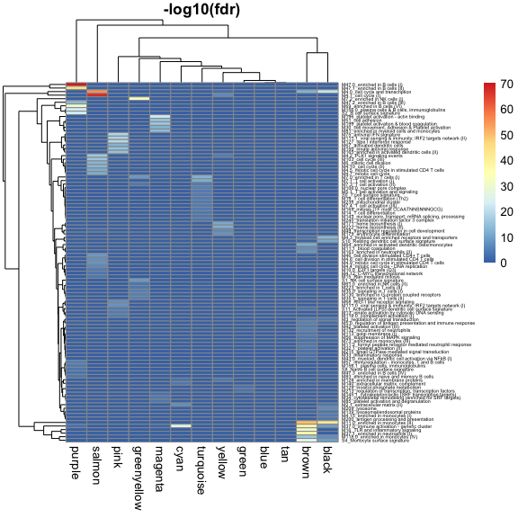

Microarray WGCNA modules
================
Nicholas Rachmaninoff
9/7/2018

``` r
source("scripts_nick/util/Enrichment/hyperGeo.R")

MODULES.PATH <- "Data/Microarray/analysis_output/WGCNA/uncorrected/modules.rds"

moduleColors <- readRDS(MODULES.PATH)
```

``` r
#load btms that have already been processed
gene_set <- readRDS("Gene_sets/btm.rds")
##remove gene sets without title because less interpretable
gene_set <- gene_set[!grepl("TBA", names(gene_set))]
```

Perform enrichment and assign results to dataframes
===================================================

``` r
matList <- moduleColors_hyper_geo(moduleColors, gene_set)
```

``` r
#print the results 
print_topn_hyperGeo(matList, 20)
```

    ## [1] "turquoise"
    ##                                                         Universe Size
    ## M7.0_enriched in T cells (I)                                    15729
    ## M7.1_T cell activation (I)                                      15729
    ## M106.0_nuclear pore complex                                     15729
    ## M5.1_T cell activation and signaling                            15729
    ## S0_T cell surface signature                                     15729
    ## M7.4_T cell activation (III)                                    15729
    ## M169_mitosis (TF motif CCAATNNSNNNGCG)                          15729
    ## M7.3_T cell activation (II)                                     15729
    ## M19_T cell differentiation (Th2)                                15729
    ## M235_mitochondrial cluster                                      15729
    ## M14_T cell differentiation                                      15729
    ## M143_nuclear pore, transport; mRNA splicing, processing         15729
    ## M245_translation initiation factor 3 complex                    15729
    ## M179_enriched for TF motif PAX3                                 15729
    ## M18_T cell differentiation via ITK and PKC                      15729
    ## M106.1_nuclear pore complex (mitosis)                           15729
    ## M65_IL2, IL7, TCR network                                       15729
    ## M126_double positive thymocytes                                 15729
    ## M230_cell cycle, mitotic phase                                  15729
    ## M250_spliceosome                                                15729
    ##                                                         Gene Set Size
    ## M7.0_enriched in T cells (I)                                       57
    ## M7.1_T cell activation (I)                                         48
    ## M106.0_nuclear pore complex                                        16
    ## M5.1_T cell activation and signaling                               20
    ## S0_T cell surface signature                                        25
    ## M7.4_T cell activation (III)                                       13
    ## M169_mitosis (TF motif CCAATNNSNNNGCG)                             13
    ## M7.3_T cell activation (II)                                        29
    ## M19_T cell differentiation (Th2)                                   16
    ## M235_mitochondrial cluster                                         16
    ## M14_T cell differentiation                                         12
    ## M143_nuclear pore, transport; mRNA splicing, processing            11
    ## M245_translation initiation factor 3 complex                       11
    ## M179_enriched for TF motif PAX3                                     9
    ## M18_T cell differentiation via ITK and PKC                         11
    ## M106.1_nuclear pore complex (mitosis)                              11
    ## M65_IL2, IL7, TCR network                                          10
    ## M126_double positive thymocytes                                    10
    ## M230_cell cycle, mitotic phase                                     10
    ## M250_spliceosome                                                   10
    ##                                                         Total Hits
    ## M7.0_enriched in T cells (I)                                  5438
    ## M7.1_T cell activation (I)                                    5438
    ## M106.0_nuclear pore complex                                   5438
    ## M5.1_T cell activation and signaling                          5438
    ## S0_T cell surface signature                                   5438
    ## M7.4_T cell activation (III)                                  5438
    ## M169_mitosis (TF motif CCAATNNSNNNGCG)                        5438
    ## M7.3_T cell activation (II)                                   5438
    ## M19_T cell differentiation (Th2)                              5438
    ## M235_mitochondrial cluster                                    5438
    ## M14_T cell differentiation                                    5438
    ## M143_nuclear pore, transport; mRNA splicing, processing       5438
    ## M245_translation initiation factor 3 complex                  5438
    ## M179_enriched for TF motif PAX3                               5438
    ## M18_T cell differentiation via ITK and PKC                    5438
    ## M106.1_nuclear pore complex (mitosis)                         5438
    ## M65_IL2, IL7, TCR network                                     5438
    ## M126_double positive thymocytes                               5438
    ## M230_cell cycle, mitotic phase                                5438
    ## M250_spliceosome                                              5438
    ##                                                         Expected Hits
    ## M7.0_enriched in T cells (I)                                19.706656
    ## M7.1_T cell activation (I)                                  16.595079
    ## M106.0_nuclear pore complex                                  5.531693
    ## M5.1_T cell activation and signaling                         6.914616
    ## S0_T cell surface signature                                  8.643270
    ## M7.4_T cell activation (III)                                 4.494501
    ## M169_mitosis (TF motif CCAATNNSNNNGCG)                       4.494501
    ## M7.3_T cell activation (II)                                 10.026194
    ## M19_T cell differentiation (Th2)                             5.531693
    ## M235_mitochondrial cluster                                   5.531693
    ## M14_T cell differentiation                                   4.148770
    ## M143_nuclear pore, transport; mRNA splicing, processing      3.803039
    ## M245_translation initiation factor 3 complex                 3.803039
    ## M179_enriched for TF motif PAX3                              3.111577
    ## M18_T cell differentiation via ITK and PKC                   3.803039
    ## M106.1_nuclear pore complex (mitosis)                        3.803039
    ## M65_IL2, IL7, TCR network                                    3.457308
    ## M126_double positive thymocytes                              3.457308
    ## M230_cell cycle, mitotic phase                               3.457308
    ## M250_spliceosome                                             3.457308
    ##                                                         Observed Hits
    ## M7.0_enriched in T cells (I)                                       49
    ## M7.1_T cell activation (I)                                         42
    ## M106.0_nuclear pore complex                                        16
    ## M5.1_T cell activation and signaling                               18
    ## S0_T cell surface signature                                        21
    ## M7.4_T cell activation (III)                                       13
    ## M169_mitosis (TF motif CCAATNNSNNNGCG)                             13
    ## M7.3_T cell activation (II)                                        23
    ## M19_T cell differentiation (Th2)                                   15
    ## M235_mitochondrial cluster                                         15
    ## M14_T cell differentiation                                         12
    ## M143_nuclear pore, transport; mRNA splicing, processing            11
    ## M245_translation initiation factor 3 complex                       11
    ## M179_enriched for TF motif PAX3                                     9
    ## M18_T cell differentiation via ITK and PKC                         10
    ## M106.1_nuclear pore complex (mitosis)                              10
    ## M65_IL2, IL7, TCR network                                           9
    ## M126_double positive thymocytes                                     9
    ## M230_cell cycle, mitotic phase                                      9
    ## M250_spliceosome                                                    9
    ##                                                               Pvalue
    ## M7.0_enriched in T cells (I)                            1.344631e-15
    ## M7.1_T cell activation (I)                              4.023182e-14
    ## M106.0_nuclear pore complex                             4.107061e-08
    ## M5.1_T cell activation and signaling                    4.212713e-07
    ## S0_T cell surface signature                             5.155571e-07
    ## M7.4_T cell activation (III)                            9.988846e-07
    ## M169_mitosis (TF motif CCAATNNSNNNGCG)                  9.988846e-07
    ## M7.3_T cell activation (II)                             1.028039e-06
    ## M19_T cell differentiation (Th2)                        1.288078e-06
    ## M235_mitochondrial cluster                              1.288078e-06
    ## M14_T cell differentiation                              2.893378e-06
    ## M143_nuclear pore, transport; mRNA splicing, processing 8.379974e-06
    ## M245_translation initiation factor 3 complex            8.379974e-06
    ## M179_enriched for TF motif PAX3                         7.026846e-05
    ## M18_T cell differentiation via ITK and PKC              1.831444e-04
    ## M106.1_nuclear pore complex (mitosis)                   1.831444e-04
    ## M65_IL2, IL7, TCR network                               4.842757e-04
    ## M126_double positive thymocytes                         4.842757e-04
    ## M230_cell cycle, mitotic phase                          4.842757e-04
    ## M250_spliceosome                                        4.842757e-04
    ##                                                         Adjusted.Pvalue
    ## M7.0_enriched in T cells (I)                               3.388471e-13
    ## M7.1_T cell activation (I)                                 5.069210e-12
    ## M106.0_nuclear pore complex                                3.449932e-06
    ## M5.1_T cell activation and signaling                       2.598408e-05
    ## S0_T cell surface signature                                2.598408e-05
    ## M7.4_T cell activation (III)                               3.238322e-05
    ## M169_mitosis (TF motif CCAATNNSNNNGCG)                     3.238322e-05
    ## M7.3_T cell activation (II)                                3.238322e-05
    ## M19_T cell differentiation (Th2)                           3.245958e-05
    ## M235_mitochondrial cluster                                 3.245958e-05
    ## M14_T cell differentiation                                 6.628466e-05
    ## M143_nuclear pore, transport; mRNA splicing, processing    1.624426e-04
    ## M245_translation initiation factor 3 complex               1.624426e-04
    ## M179_enriched for TF motif PAX3                            1.264832e-03
    ## M18_T cell differentiation via ITK and PKC                 2.884525e-03
    ## M106.1_nuclear pore complex (mitosis)                      2.884525e-03
    ## M65_IL2, IL7, TCR network                                  6.101874e-03
    ## M126_double positive thymocytes                            6.101874e-03
    ## M230_cell cycle, mitotic phase                             6.101874e-03
    ## M250_spliceosome                                           6.101874e-03
    ## [1] "blue"
    ##                                                             Universe Size
    ## M224_transmembrane and ion transporters (II)                        15729
    ## M88.0_leukocyte migration                                           15729
    ## M2.0_extracellular matrix (I)                                       15729
    ## M17.0_Hox cluster I                                                 15729
    ## M195_muscle contraction, SRF targets                                15729
    ## M189_extracellular region cluster (GO)                              15729
    ## M210_extracellular matrix, collagen                                 15729
    ## M1.1_integrin cell surface interactions (II)                        15729
    ## M17.1_Hox cluster II                                                15729
    ## M17.2_Hox cluster III                                               15729
    ## M172_enriched for TF motif TTCNRGNNNNTTC                            15729
    ## M202_enriched in extracellular matrix & associated proteins         15729
    ## M154.0_amino acid metabolism and transport                          15729
    ## M175_cell development                                               15729
    ## M107_Hox cluster VI                                                 15729
    ## M187_metabolism in mitochondria, peroxisome                         15729
    ## M133.1_cell cell adhesion                                           15729
    ## M89.0_putative targets of PAX3                                      15729
    ## M1.0_integrin cell surface interactions (I)                         15729
    ## S9_Memory B cell surface signature                                  15729
    ##                                                             Gene Set Size
    ## M224_transmembrane and ion transporters (II)                            9
    ## M88.0_leukocyte migration                                              34
    ## M2.0_extracellular matrix (I)                                          24
    ## M17.0_Hox cluster I                                                    14
    ## M195_muscle contraction, SRF targets                                    9
    ## M189_extracellular region cluster (GO)                                 13
    ## M210_extracellular matrix, collagen                                    21
    ## M1.1_integrin cell surface interactions (II)                            8
    ## M17.1_Hox cluster II                                                    8
    ## M17.2_Hox cluster III                                                   8
    ## M172_enriched for TF motif TTCNRGNNNNTTC                                8
    ## M202_enriched in extracellular matrix & associated proteins             8
    ## M154.0_amino acid metabolism and transport                             12
    ## M175_cell development                                                  12
    ## M107_Hox cluster VI                                                     7
    ## M187_metabolism in mitochondria, peroxisome                             7
    ## M133.1_cell cell adhesion                                               9
    ## M89.0_putative targets of PAX3                                         13
    ## M1.0_integrin cell surface interactions (I)                            22
    ## S9_Memory B cell surface signature                                     20
    ##                                                             Total Hits
    ## M224_transmembrane and ion transporters (II)                      5024
    ## M88.0_leukocyte migration                                         5024
    ## M2.0_extracellular matrix (I)                                     5024
    ## M17.0_Hox cluster I                                               5024
    ## M195_muscle contraction, SRF targets                              5024
    ## M189_extracellular region cluster (GO)                            5024
    ## M210_extracellular matrix, collagen                               5024
    ## M1.1_integrin cell surface interactions (II)                      5024
    ## M17.1_Hox cluster II                                              5024
    ## M17.2_Hox cluster III                                             5024
    ## M172_enriched for TF motif TTCNRGNNNNTTC                          5024
    ## M202_enriched in extracellular matrix & associated proteins       5024
    ## M154.0_amino acid metabolism and transport                        5024
    ## M175_cell development                                             5024
    ## M107_Hox cluster VI                                               5024
    ## M187_metabolism in mitochondria, peroxisome                       5024
    ## M133.1_cell cell adhesion                                         5024
    ## M89.0_putative targets of PAX3                                    5024
    ## M1.0_integrin cell surface interactions (I)                       5024
    ## S9_Memory B cell surface signature                                5024
    ##                                                             Expected Hits
    ## M224_transmembrane and ion transporters (II)                      2.87469
    ## M88.0_leukocyte migration                                        10.85994
    ## M2.0_extracellular matrix (I)                                     7.66584
    ## M17.0_Hox cluster I                                               4.47174
    ## M195_muscle contraction, SRF targets                              2.87469
    ## M189_extracellular region cluster (GO)                            4.15233
    ## M210_extracellular matrix, collagen                               6.70761
    ## M1.1_integrin cell surface interactions (II)                      2.55528
    ## M17.1_Hox cluster II                                              2.55528
    ## M17.2_Hox cluster III                                             2.55528
    ## M172_enriched for TF motif TTCNRGNNNNTTC                          2.55528
    ## M202_enriched in extracellular matrix & associated proteins       2.55528
    ## M154.0_amino acid metabolism and transport                        3.83292
    ## M175_cell development                                             3.83292
    ## M107_Hox cluster VI                                               2.23587
    ## M187_metabolism in mitochondria, peroxisome                       2.23587
    ## M133.1_cell cell adhesion                                         2.87469
    ## M89.0_putative targets of PAX3                                    4.15233
    ## M1.0_integrin cell surface interactions (I)                       7.02702
    ## S9_Memory B cell surface signature                                6.38820
    ##                                                             Observed Hits
    ## M224_transmembrane and ion transporters (II)                            9
    ## M88.0_leukocyte migration                                              22
    ## M2.0_extracellular matrix (I)                                          17
    ## M17.0_Hox cluster I                                                    11
    ## M195_muscle contraction, SRF targets                                    8
    ## M189_extracellular region cluster (GO)                                 10
    ## M210_extracellular matrix, collagen                                    14
    ## M1.1_integrin cell surface interactions (II)                            7
    ## M17.1_Hox cluster II                                                    7
    ## M17.2_Hox cluster III                                                   7
    ## M172_enriched for TF motif TTCNRGNNNNTTC                                7
    ## M202_enriched in extracellular matrix & associated proteins             7
    ## M154.0_amino acid metabolism and transport                              9
    ## M175_cell development                                                   9
    ## M107_Hox cluster VI                                                     6
    ## M187_metabolism in mitochondria, peroxisome                             6
    ## M133.1_cell cell adhesion                                               7
    ## M89.0_putative targets of PAX3                                          9
    ## M1.0_integrin cell surface interactions (I)                            13
    ## S9_Memory B cell surface signature                                     12
    ##                                                                   Pvalue
    ## M224_transmembrane and ion transporters (II)                3.443635e-05
    ## M88.0_leukocyte migration                                   8.685021e-05
    ## M2.0_extracellular matrix (I)                               1.051848e-04
    ## M17.0_Hox cluster I                                         4.536186e-04
    ## M195_muscle contraction, SRF targets                        6.958738e-04
    ## M189_extracellular region cluster (GO)                      1.129345e-03
    ## M210_extracellular matrix, collagen                         1.134956e-03
    ## M1.1_integrin cell surface interactions (II)                1.950280e-03
    ## M17.1_Hox cluster II                                        1.950280e-03
    ## M17.2_Hox cluster III                                       1.950280e-03
    ## M172_enriched for TF motif TTCNRGNNNNTTC                    1.950280e-03
    ## M202_enriched in extracellular matrix & associated proteins 1.950280e-03
    ## M154.0_amino acid metabolism and transport                  2.758261e-03
    ## M175_cell development                                       2.758261e-03
    ## M107_Hox cluster VI                                         5.388992e-03
    ## M187_metabolism in mitochondria, peroxisome                 5.388992e-03
    ## M133.1_cell cell adhesion                                   6.340702e-03
    ## M89.0_putative targets of PAX3                              6.423321e-03
    ## M1.0_integrin cell surface interactions (I)                 7.795971e-03
    ## S9_Memory B cell surface signature                          8.929503e-03
    ##                                                             Adjusted.Pvalue
    ## M224_transmembrane and ion transporters (II)                    0.008677960
    ## M88.0_leukocyte migration                                       0.008835521
    ## M2.0_extracellular matrix (I)                                   0.008835521
    ## M17.0_Hox cluster I                                             0.028577973
    ## M195_muscle contraction, SRF targets                            0.035072038
    ## M189_extracellular region cluster (GO)                          0.040858399
    ## M210_extracellular matrix, collagen                             0.040858399
    ## M1.1_integrin cell surface interactions (II)                    0.040955882
    ## M17.1_Hox cluster II                                            0.040955882
    ## M17.2_Hox cluster III                                           0.040955882
    ## M172_enriched for TF motif TTCNRGNNNNTTC                        0.040955882
    ## M202_enriched in extracellular matrix & associated proteins     0.040955882
    ## M154.0_amino acid metabolism and transport                      0.049648695
    ## M175_cell development                                           0.049648695
    ## M107_Hox cluster VI                                             0.084876624
    ## M187_metabolism in mitochondria, peroxisome                     0.084876624
    ## M133.1_cell cell adhesion                                       0.089926499
    ## M89.0_putative targets of PAX3                                  0.089926499
    ## M1.0_integrin cell surface interactions (I)                     0.103399188
    ## S9_Memory B cell surface signature                              0.112511739
    ## [1] "pink"
    ##                                                              Universe Size
    ## M127_type I interferon response                                      15729
    ## M75_antiviral IFN signature                                          15729
    ## M111.1_viral sensing & immunity; IRF2 targets network (II)           15729
    ## M150_innate antiviral response                                       15729
    ## M165_enriched in activated dendritic cells (II)                      15729
    ## M67_activated dendritic cells                                        15729
    ## M111.0_viral sensing & immunity; IRF2 targets network (I)            15729
    ## M68_RIG-1 like receptor signaling                                    15729
    ## M13_innate activation by cytosolic DNA sensing                       15729
    ## S11_Activated (LPS) dendritic cell surface signature                 15729
    ## M112.0_complement activation (I)                                     15729
    ## M27.1_chemokine cluster (II)                                         15729
    ## M86.1_proinflammatory dendritic cell, myeloid cell response          15729
    ## M40_complement and other receptors in DCs                            15729
    ## M86.0_chemokines and inflammatory molecules in myeloid cells         15729
    ## S5_DC surface signature                                              15729
    ## M119_enriched in activated dendritic cells (I)                       15729
    ## M4.6_cell division in stimulated CD4 T cells                         15729
    ## M27.0_chemokine cluster (I)                                          15729
    ## S8_Naive B cell surface signature                                    15729
    ##                                                              Gene Set Size
    ## M127_type I interferon response                                         12
    ## M75_antiviral IFN signature                                             20
    ## M111.1_viral sensing & immunity; IRF2 targets network (II)              11
    ## M150_innate antiviral response                                          11
    ## M165_enriched in activated dendritic cells (II)                         31
    ## M67_activated dendritic cells                                           12
    ## M111.0_viral sensing & immunity; IRF2 targets network (I)               17
    ## M68_RIG-1 like receptor signaling                                        9
    ## M13_innate activation by cytosolic DNA sensing                          11
    ## S11_Activated (LPS) dendritic cell surface signature                    33
    ## M112.0_complement activation (I)                                        14
    ## M27.1_chemokine cluster (II)                                            10
    ## M86.1_proinflammatory dendritic cell, myeloid cell response             11
    ## M40_complement and other receptors in DCs                               13
    ## M86.0_chemokines and inflammatory molecules in myeloid cells            17
    ## S5_DC surface signature                                                 71
    ## M119_enriched in activated dendritic cells (I)                          10
    ## M4.6_cell division in stimulated CD4 T cells                            16
    ## M27.0_chemokine cluster (I)                                             17
    ## S8_Naive B cell surface signature                                       26
    ##                                                              Total Hits
    ## M127_type I interferon response                                     262
    ## M75_antiviral IFN signature                                         262
    ## M111.1_viral sensing & immunity; IRF2 targets network (II)          262
    ## M150_innate antiviral response                                      262
    ## M165_enriched in activated dendritic cells (II)                     262
    ## M67_activated dendritic cells                                       262
    ## M111.0_viral sensing & immunity; IRF2 targets network (I)           262
    ## M68_RIG-1 like receptor signaling                                   262
    ## M13_innate activation by cytosolic DNA sensing                      262
    ## S11_Activated (LPS) dendritic cell surface signature                262
    ## M112.0_complement activation (I)                                    262
    ## M27.1_chemokine cluster (II)                                        262
    ## M86.1_proinflammatory dendritic cell, myeloid cell response         262
    ## M40_complement and other receptors in DCs                           262
    ## M86.0_chemokines and inflammatory molecules in myeloid cells        262
    ## S5_DC surface signature                                             262
    ## M119_enriched in activated dendritic cells (I)                      262
    ## M4.6_cell division in stimulated CD4 T cells                        262
    ## M27.0_chemokine cluster (I)                                         262
    ## S8_Naive B cell surface signature                                   262
    ##                                                              Expected Hits
    ## M127_type I interferon response                                  0.1998856
    ## M75_antiviral IFN signature                                      0.3331426
    ## M111.1_viral sensing & immunity; IRF2 targets network (II)       0.1832284
    ## M150_innate antiviral response                                   0.1832284
    ## M165_enriched in activated dendritic cells (II)                  0.5163710
    ## M67_activated dendritic cells                                    0.1998856
    ## M111.0_viral sensing & immunity; IRF2 targets network (I)        0.2831712
    ## M68_RIG-1 like receptor signaling                                0.1499142
    ## M13_innate activation by cytosolic DNA sensing                   0.1832284
    ## S11_Activated (LPS) dendritic cell surface signature             0.5496853
    ## M112.0_complement activation (I)                                 0.2331998
    ## M27.1_chemokine cluster (II)                                     0.1665713
    ## M86.1_proinflammatory dendritic cell, myeloid cell response      0.1832284
    ## M40_complement and other receptors in DCs                        0.2165427
    ## M86.0_chemokines and inflammatory molecules in myeloid cells     0.2831712
    ## S5_DC surface signature                                          1.1826562
    ## M119_enriched in activated dendritic cells (I)                   0.1665713
    ## M4.6_cell division in stimulated CD4 T cells                     0.2665141
    ## M27.0_chemokine cluster (I)                                      0.2831712
    ## S8_Naive B cell surface signature                                0.4330854
    ##                                                              Observed Hits
    ## M127_type I interferon response                                         12
    ## M75_antiviral IFN signature                                             14
    ## M111.1_viral sensing & immunity; IRF2 targets network (II)              11
    ## M150_innate antiviral response                                          10
    ## M165_enriched in activated dendritic cells (II)                         14
    ## M67_activated dendritic cells                                            9
    ## M111.0_viral sensing & immunity; IRF2 targets network (I)                8
    ## M68_RIG-1 like receptor signaling                                        6
    ## M13_innate activation by cytosolic DNA sensing                           5
    ## S11_Activated (LPS) dendritic cell surface signature                     7
    ## M112.0_complement activation (I)                                         5
    ## M27.1_chemokine cluster (II)                                             3
    ## M86.1_proinflammatory dendritic cell, myeloid cell response              3
    ## M40_complement and other receptors in DCs                                3
    ## M86.0_chemokines and inflammatory molecules in myeloid cells             3
    ## S5_DC surface signature                                                  5
    ## M119_enriched in activated dendritic cells (I)                           2
    ## M4.6_cell division in stimulated CD4 T cells                             2
    ## M27.0_chemokine cluster (I)                                              2
    ## S8_Naive B cell surface signature                                        2
    ##                                                                    Pvalue
    ## M127_type I interferon response                              3.548018e-22
    ## M75_antiviral IFN signature                                  3.170532e-21
    ## M111.1_viral sensing & immunity; IRF2 targets network (II)   2.221823e-20
    ## M150_innate antiviral response                               1.502278e-17
    ## M165_enriched in activated dendritic cells (II)              1.842519e-17
    ## M67_activated dendritic cells                                1.813344e-14
    ## M111.0_viral sensing & immunity; IRF2 targets network (I)    1.137587e-10
    ## M68_RIG-1 like receptor signaling                            1.625354e-09
    ## M13_innate activation by cytosolic DNA sensing               5.254634e-07
    ## S11_Activated (LPS) dendritic cell surface signature         9.688977e-07
    ## M112.0_complement activation (I)                             2.185446e-06
    ## M27.1_chemokine cluster (II)                                 5.027829e-04
    ## M86.1_proinflammatory dendritic cell, myeloid cell response  6.828344e-04
    ## M40_complement and other receptors in DCs                    1.154715e-03
    ## M86.0_chemokines and inflammatory molecules in myeloid cells 2.613517e-03
    ## S5_DC surface signature                                      6.574144e-03
    ## M119_enriched in activated dendritic cells (I)               1.138828e-02
    ## M4.6_cell division in stimulated CD4 T cells                 2.844222e-02
    ## M27.0_chemokine cluster (I)                                  3.188605e-02
    ## S8_Naive B cell surface signature                            6.914580e-02
    ##                                                              Adjusted.Pvalue
    ## M127_type I interferon response                                 8.941005e-20
    ## M75_antiviral IFN signature                                     3.994870e-19
    ## M111.1_viral sensing & immunity; IRF2 targets network (II)      1.866331e-18
    ## M150_innate antiviral response                                  9.286295e-16
    ## M165_enriched in activated dendritic cells (II)                 9.286295e-16
    ## M67_activated dendritic cells                                   7.616046e-13
    ## M111.0_viral sensing & immunity; IRF2 targets network (I)       4.095314e-09
    ## M68_RIG-1 like receptor signaling                               5.119866e-08
    ## M13_innate activation by cytosolic DNA sensing                  1.471298e-05
    ## S11_Activated (LPS) dendritic cell surface signature            2.441622e-05
    ## M112.0_complement activation (I)                                5.006659e-05
    ## M27.1_chemokine cluster (II)                                    1.055844e-02
    ## M86.1_proinflammatory dendritic cell, myeloid cell response     1.323648e-02
    ## M40_complement and other receptors in DCs                       2.078488e-02
    ## M86.0_chemokines and inflammatory molecules in myeloid cells    4.390708e-02
    ## S5_DC surface signature                                         1.035428e-01
    ## M119_enriched in activated dendritic cells (I)                  1.688145e-01
    ## M4.6_cell division in stimulated CD4 T cells                    3.981911e-01
    ## M27.0_chemokine cluster (I)                                     4.229097e-01
    ## S8_Naive B cell surface signature                               8.712370e-01
    ## [1] "green"
    ##                                                              Universe Size
    ## M129_inositol phosphate metabolism                                   15729
    ## M213_regulation of transcription, transcription factors              15729
    ## M101_phosphatidylinositol signaling system                           15729
    ## M237_golgi membrane (II)                                             15729
    ## M144_cell cycle, ATP binding                                         15729
    ## M215_small GTPase mediated signal transduction                       15729
    ## M95.1_enriched in antigen presentation (III)                         15729
    ## M147_intracellular transport                                         15729
    ## M38_chemokines and receptors                                         15729
    ## M226_proteasome                                                      15729
    ## M86.0_chemokines and inflammatory molecules in myeloid cells         15729
    ## M29_proinflammatory cytokines and chemokines                         15729
    ## M95.0_enriched in antigen presentation (II)                          15729
    ## M204.0_chaperonin mediated protein folding (I)                       15729
    ## M109_receptors, cell migration                                       15729
    ## M32.8_cytoskeletal remodeling                                        15729
    ## M47.4_enriched in B cells (V)                                        15729
    ## M100_MAPK, RAS signaling                                             15729
    ## M204.1_chaperonin mediated protein folding (II)                      15729
    ## M86.1_proinflammatory dendritic cell, myeloid cell response          15729
    ##                                                              Gene Set Size
    ## M129_inositol phosphate metabolism                                      13
    ## M213_regulation of transcription, transcription factors                 17
    ## M101_phosphatidylinositol signaling system                              12
    ## M237_golgi membrane (II)                                                17
    ## M144_cell cycle, ATP binding                                            15
    ## M215_small GTPase mediated signal transduction                          15
    ## M95.1_enriched in antigen presentation (III)                            11
    ## M147_intracellular transport                                            17
    ## M38_chemokines and receptors                                             9
    ## M226_proteasome                                                         10
    ## M86.0_chemokines and inflammatory molecules in myeloid cells            17
    ## M29_proinflammatory cytokines and chemokines                             5
    ## M95.0_enriched in antigen presentation (II)                             19
    ## M204.0_chaperonin mediated protein folding (I)                          13
    ## M109_receptors, cell migration                                          15
    ## M32.8_cytoskeletal remodeling                                           10
    ## M47.4_enriched in B cells (V)                                           10
    ## M100_MAPK, RAS signaling                                                10
    ## M204.1_chaperonin mediated protein folding (II)                         10
    ## M86.1_proinflammatory dendritic cell, myeloid cell response             11
    ##                                                              Total Hits
    ## M129_inositol phosphate metabolism                                 1360
    ## M213_regulation of transcription, transcription factors            1360
    ## M101_phosphatidylinositol signaling system                         1360
    ## M237_golgi membrane (II)                                           1360
    ## M144_cell cycle, ATP binding                                       1360
    ## M215_small GTPase mediated signal transduction                     1360
    ## M95.1_enriched in antigen presentation (III)                       1360
    ## M147_intracellular transport                                       1360
    ## M38_chemokines and receptors                                       1360
    ## M226_proteasome                                                    1360
    ## M86.0_chemokines and inflammatory molecules in myeloid cells       1360
    ## M29_proinflammatory cytokines and chemokines                       1360
    ## M95.0_enriched in antigen presentation (II)                        1360
    ## M204.0_chaperonin mediated protein folding (I)                     1360
    ## M109_receptors, cell migration                                     1360
    ## M32.8_cytoskeletal remodeling                                      1360
    ## M47.4_enriched in B cells (V)                                      1360
    ## M100_MAPK, RAS signaling                                           1360
    ## M204.1_chaperonin mediated protein folding (II)                    1360
    ## M86.1_proinflammatory dendritic cell, myeloid cell response        1360
    ##                                                              Expected Hits
    ## M129_inositol phosphate metabolism                               1.1240384
    ## M213_regulation of transcription, transcription factors          1.4698964
    ## M101_phosphatidylinositol signaling system                       1.0375739
    ## M237_golgi membrane (II)                                         1.4698964
    ## M144_cell cycle, ATP binding                                     1.2969674
    ## M215_small GTPase mediated signal transduction                   1.2969674
    ## M95.1_enriched in antigen presentation (III)                     0.9511094
    ## M147_intracellular transport                                     1.4698964
    ## M38_chemokines and receptors                                     0.7781804
    ## M226_proteasome                                                  0.8646449
    ## M86.0_chemokines and inflammatory molecules in myeloid cells     1.4698964
    ## M29_proinflammatory cytokines and chemokines                     0.4323225
    ## M95.0_enriched in antigen presentation (II)                      1.6428254
    ## M204.0_chaperonin mediated protein folding (I)                   1.1240384
    ## M109_receptors, cell migration                                   1.2969674
    ## M32.8_cytoskeletal remodeling                                    0.8646449
    ## M47.4_enriched in B cells (V)                                    0.8646449
    ## M100_MAPK, RAS signaling                                         0.8646449
    ## M204.1_chaperonin mediated protein folding (II)                  0.8646449
    ## M86.1_proinflammatory dendritic cell, myeloid cell response      0.9511094
    ##                                                              Observed Hits
    ## M129_inositol phosphate metabolism                                       8
    ## M213_regulation of transcription, transcription factors                  9
    ## M101_phosphatidylinositol signaling system                               6
    ## M237_golgi membrane (II)                                                 7
    ## M144_cell cycle, ATP binding                                             6
    ## M215_small GTPase mediated signal transduction                           5
    ## M95.1_enriched in antigen presentation (III)                             4
    ## M147_intracellular transport                                             5
    ## M38_chemokines and receptors                                             3
    ## M226_proteasome                                                          3
    ## M86.0_chemokines and inflammatory molecules in myeloid cells             4
    ## M29_proinflammatory cytokines and chemokines                             2
    ## M95.0_enriched in antigen presentation (II)                              4
    ## M204.0_chaperonin mediated protein folding (I)                           3
    ## M109_receptors, cell migration                                           3
    ## M32.8_cytoskeletal remodeling                                            2
    ## M47.4_enriched in B cells (V)                                            2
    ## M100_MAPK, RAS signaling                                                 2
    ## M204.1_chaperonin mediated protein folding (II)                          2
    ## M86.1_proinflammatory dendritic cell, myeloid cell response              2
    ##                                                                    Pvalue
    ## M129_inositol phosphate metabolism                           2.653192e-06
    ## M213_regulation of transcription, transcription factors      3.372345e-06
    ## M101_phosphatidylinositol signaling system                   2.417449e-04
    ## M237_golgi membrane (II)                                     3.181671e-04
    ## M144_cell cycle, ATP binding                                 1.043294e-03
    ## M215_small GTPase mediated signal transduction               6.895794e-03
    ## M95.1_enriched in antigen presentation (III)                 1.119213e-02
    ## M147_intracellular transport                                 1.228826e-02
    ## M38_chemokines and receptors                                 3.644774e-02
    ## M226_proteasome                                              4.879423e-02
    ## M86.0_chemokines and inflammatory molecules in myeloid cells 5.329349e-02
    ## M29_proinflammatory cytokines and chemokines                 6.262435e-02
    ## M95.0_enriched in antigen presentation (II)                  7.573508e-02
    ## M204.0_chaperonin mediated protein folding (I)               9.590561e-02
    ## M109_receptors, cell migration                               1.344174e-01
    ## M32.8_cytoskeletal remodeling                                2.120124e-01
    ## M47.4_enriched in B cells (V)                                2.120124e-01
    ## M100_MAPK, RAS signaling                                     2.120124e-01
    ## M204.1_chaperonin mediated protein folding (II)              2.120124e-01
    ## M86.1_proinflammatory dendritic cell, myeloid cell response  2.451496e-01
    ##                                                              Adjusted.Pvalue
    ## M129_inositol phosphate metabolism                              0.0004249155
    ## M213_regulation of transcription, transcription factors         0.0004249155
    ## M101_phosphatidylinositol signaling system                      0.0200445303
    ## M237_golgi membrane (II)                                        0.0200445303
    ## M144_cell cycle, ATP binding                                    0.0525820114
    ## M215_small GTPase mediated signal transduction                  0.2896233421
    ## M95.1_enriched in antigen presentation (III)                    0.3870800554
    ## M147_intracellular transport                                    0.3870800554
    ## M38_chemokines and receptors                                    1.0000000000
    ## M226_proteasome                                                 1.0000000000
    ## M86.0_chemokines and inflammatory molecules in myeloid cells    1.0000000000
    ## M29_proinflammatory cytokines and chemokines                    1.0000000000
    ## M95.0_enriched in antigen presentation (II)                     1.0000000000
    ## M204.0_chaperonin mediated protein folding (I)                  1.0000000000
    ## M109_receptors, cell migration                                  1.0000000000
    ## M32.8_cytoskeletal remodeling                                   1.0000000000
    ## M47.4_enriched in B cells (V)                                   1.0000000000
    ## M100_MAPK, RAS signaling                                        1.0000000000
    ## M204.1_chaperonin mediated protein folding (II)                 1.0000000000
    ## M86.1_proinflammatory dendritic cell, myeloid cell response     1.0000000000
    ## [1] "yellow"
    ##                                                       Universe Size
    ## M222_heme biosynthesis (II)                                   15729
    ## M171_heme biosynthesis (I)                                    15729
    ## M173_erythrocyte differentiation                              15729
    ## M49_transcription regulation in cell development              15729
    ## M4.1_cell cycle (I)                                           15729
    ## M4.2_PLK1 signaling events                                    15729
    ## M124_enriched in membrane proteins                            15729
    ## M4.0_cell cycle and transcription                             15729
    ## M167_enriched in cell cycle                                   15729
    ## M87_transmembrane transport (I)                               15729
    ## M6_mitotic cell division                                      15729
    ## M4.4_mitotic cell cycle - DNA replication                     15729
    ## M63_regulation of localization (GO)                           15729
    ## M4.14_Rho GTPase cycle                                        15729
    ## M4.9_mitotic cell cycle in stimulated CD4 T cells             15729
    ## M8_E2F transcription factor network                           15729
    ## M30_cell movement, Adhesion & Platelet activation             15729
    ## M145.1_cytoskeleton/actin (SRF transcription targets)         15729
    ## M234_transcription elongation, RNA polymerase II              15729
    ## M88.2_enriched in hepatocyte nuclear factors (II)             15729
    ##                                                       Gene Set Size
    ## M222_heme biosynthesis (II)                                      12
    ## M171_heme biosynthesis (I)                                       11
    ## M173_erythrocyte differentiation                                 10
    ## M49_transcription regulation in cell development                 41
    ## M4.1_cell cycle (I)                                             125
    ## M4.2_PLK1 signaling events                                       27
    ## M124_enriched in membrane proteins                               17
    ## M4.0_cell cycle and transcription                               285
    ## M167_enriched in cell cycle                                      15
    ## M87_transmembrane transport (I)                                  22
    ## M6_mitotic cell division                                         23
    ## M4.4_mitotic cell cycle - DNA replication                        26
    ## M63_regulation of localization (GO)                              12
    ## M4.14_Rho GTPase cycle                                            7
    ## M4.9_mitotic cell cycle in stimulated CD4 T cells                13
    ## M8_E2F transcription factor network                              11
    ## M30_cell movement, Adhesion & Platelet activation                19
    ## M145.1_cytoskeleton/actin (SRF transcription targets)            12
    ## M234_transcription elongation, RNA polymerase II                 12
    ## M88.2_enriched in hepatocyte nuclear factors (II)                 6
    ##                                                       Total Hits
    ## M222_heme biosynthesis (II)                                 1032
    ## M171_heme biosynthesis (I)                                  1032
    ## M173_erythrocyte differentiation                            1032
    ## M49_transcription regulation in cell development            1032
    ## M4.1_cell cycle (I)                                         1032
    ## M4.2_PLK1 signaling events                                  1032
    ## M124_enriched in membrane proteins                          1032
    ## M4.0_cell cycle and transcription                           1032
    ## M167_enriched in cell cycle                                 1032
    ## M87_transmembrane transport (I)                             1032
    ## M6_mitotic cell division                                    1032
    ## M4.4_mitotic cell cycle - DNA replication                   1032
    ## M63_regulation of localization (GO)                         1032
    ## M4.14_Rho GTPase cycle                                      1032
    ## M4.9_mitotic cell cycle in stimulated CD4 T cells           1032
    ## M8_E2F transcription factor network                         1032
    ## M30_cell movement, Adhesion & Platelet activation           1032
    ## M145.1_cytoskeleton/actin (SRF transcription targets)       1032
    ## M234_transcription elongation, RNA polymerase II            1032
    ## M88.2_enriched in hepatocyte nuclear factors (II)           1032
    ##                                                       Expected Hits
    ## M222_heme biosynthesis (II)                               0.7873355
    ## M171_heme biosynthesis (I)                                0.7217242
    ## M173_erythrocyte differentiation                          0.6561129
    ## M49_transcription regulation in cell development          2.6900629
    ## M4.1_cell cycle (I)                                       8.2014114
    ## M4.2_PLK1 signaling events                                1.7715049
    ## M124_enriched in membrane proteins                        1.1153920
    ## M4.0_cell cycle and transcription                        18.6992180
    ## M167_enriched in cell cycle                               0.9841694
    ## M87_transmembrane transport (I)                           1.4434484
    ## M6_mitotic cell division                                  1.5090597
    ## M4.4_mitotic cell cycle - DNA replication                 1.7058936
    ## M63_regulation of localization (GO)                       0.7873355
    ## M4.14_Rho GTPase cycle                                    0.4592790
    ## M4.9_mitotic cell cycle in stimulated CD4 T cells         0.8529468
    ## M8_E2F transcription factor network                       0.7217242
    ## M30_cell movement, Adhesion & Platelet activation         1.2466145
    ## M145.1_cytoskeleton/actin (SRF transcription targets)     0.7873355
    ## M234_transcription elongation, RNA polymerase II          0.7873355
    ## M88.2_enriched in hepatocyte nuclear factors (II)         0.3936677
    ##                                                       Observed Hits
    ## M222_heme biosynthesis (II)                                      12
    ## M171_heme biosynthesis (I)                                       11
    ## M173_erythrocyte differentiation                                  9
    ## M49_transcription regulation in cell development                 16
    ## M4.1_cell cycle (I)                                              28
    ## M4.2_PLK1 signaling events                                       11
    ## M124_enriched in membrane proteins                                8
    ## M4.0_cell cycle and transcription                                36
    ## M167_enriched in cell cycle                                       6
    ## M87_transmembrane transport (I)                                   7
    ## M6_mitotic cell division                                          6
    ## M4.4_mitotic cell cycle - DNA replication                         6
    ## M63_regulation of localization (GO)                               4
    ## M4.14_Rho GTPase cycle                                            3
    ## M4.9_mitotic cell cycle in stimulated CD4 T cells                 4
    ## M8_E2F transcription factor network                               3
    ## M30_cell movement, Adhesion & Platelet activation                 4
    ## M145.1_cytoskeleton/actin (SRF transcription targets)             3
    ## M234_transcription elongation, RNA polymerase II                  3
    ## M88.2_enriched in hepatocyte nuclear factors (II)                 2
    ##                                                             Pvalue
    ## M222_heme biosynthesis (II)                           5.993595e-15
    ## M171_heme biosynthesis (I)                            9.226966e-14
    ## M173_erythrocyte differentiation                      2.053045e-10
    ## M49_transcription regulation in cell development      2.276033e-09
    ## M4.1_cell cycle (I)                                   7.113886e-09
    ## M4.2_PLK1 signaling events                            4.518644e-07
    ## M124_enriched in membrane proteins                    4.766014e-06
    ## M4.0_cell cycle and transcription                     1.186278e-04
    ## M167_enriched in cell cycle                           2.352422e-04
    ## M87_transmembrane transport (I)                       3.650800e-04
    ## M6_mitotic cell division                              3.016339e-03
    ## M4.4_mitotic cell cycle - DNA replication             5.812547e-03
    ## M63_regulation of localization (GO)                   5.957621e-03
    ## M4.14_Rho GTPase cycle                                8.069896e-03
    ## M4.9_mitotic cell cycle in stimulated CD4 T cells     8.163835e-03
    ## M8_E2F transcription factor network                   3.123099e-02
    ## M30_cell movement, Adhesion & Platelet activation     3.235642e-02
    ## M145.1_cytoskeleton/actin (SRF transcription targets) 3.965545e-02
    ## M234_transcription elongation, RNA polymerase II      3.965545e-02
    ## M88.2_enriched in hepatocyte nuclear factors (II)     5.404786e-02
    ##                                                       Adjusted.Pvalue
    ## M222_heme biosynthesis (II)                              1.510386e-12
    ## M171_heme biosynthesis (I)                               1.162598e-11
    ## M173_erythrocyte differentiation                         1.724558e-08
    ## M49_transcription regulation in cell development         1.433901e-07
    ## M4.1_cell cycle (I)                                      3.585398e-07
    ## M4.2_PLK1 signaling events                               1.897831e-05
    ## M124_enriched in membrane proteins                       1.715765e-04
    ## M4.0_cell cycle and transcription                        3.736775e-03
    ## M167_enriched in cell cycle                              6.586782e-03
    ## M87_transmembrane transport (I)                          9.200016e-03
    ## M6_mitotic cell division                                 6.910158e-02
    ## M4.4_mitotic cell cycle - DNA replication                1.154862e-01
    ## M63_regulation of localization (GO)                      1.154862e-01
    ## M4.14_Rho GTPase cycle                                   1.371524e-01
    ## M4.9_mitotic cell cycle in stimulated CD4 T cells        1.371524e-01
    ## M8_E2F transcription factor network                      4.796363e-01
    ## M30_cell movement, Adhesion & Platelet activation        4.796363e-01
    ## M145.1_cytoskeleton/actin (SRF transcription targets)    5.259565e-01
    ## M234_transcription elongation, RNA polymerase II         5.259565e-01
    ## M88.2_enriched in hepatocyte nuclear factors (II)        6.810030e-01
    ## [1] "brown"
    ##                                                             Universe Size
    ## M11.0_enriched in monocytes (II)                                    15729
    ## M37.0_immune activation - generic cluster                           15729
    ## M37.1_enriched in neutrophils (I)                                   15729
    ## M16_TLR and inflammatory signaling                                  15729
    ## S4_Monocyte surface signature                                       15729
    ## M118.0_enriched in monocytes (IV)                                   15729
    ## M4.0_cell cycle and transcription                                   15729
    ## M64_enriched in activated dendritic cells/monocytes                 15729
    ## M163_enriched in neutrophils (II)                                   15729
    ## M11.1_blood coagulation                                             15729
    ## M132_recruitment of neutrophils                                     15729
    ## M5.0_regulation of antigen presentation and immune response         15729
    ## M42_platelet activation (III)                                       15729
    ## M3_regulation of signal transduction                                15729
    ## M11.2_formyl peptide receptor mediated neutrophil response          15729
    ## M56_suppression of MAPK signaling                                   15729
    ## M32.1_platelet activation (II)                                      15729
    ## M113_golgi membrane (I)                                             15729
    ## M43.0_myeloid, dendritic cell activation via NFkB (I)               15729
    ## M33_inflammatory response                                           15729
    ##                                                             Gene Set Size
    ## M11.0_enriched in monocytes (II)                                      174
    ## M37.0_immune activation - generic cluster                             298
    ## M37.1_enriched in neutrophils (I)                                      45
    ## M16_TLR and inflammatory signaling                                     41
    ## S4_Monocyte surface signature                                          78
    ## M118.0_enriched in monocytes (IV)                                      50
    ## M4.0_cell cycle and transcription                                     285
    ## M64_enriched in activated dendritic cells/monocytes                    16
    ## M163_enriched in neutrophils (II)                                      12
    ## M11.1_blood coagulation                                                21
    ## M132_recruitment of neutrophils                                         9
    ## M5.0_regulation of antigen presentation and immune response            76
    ## M42_platelet activation (III)                                          10
    ## M3_regulation of signal transduction                                   46
    ## M11.2_formyl peptide receptor mediated neutrophil response              9
    ## M56_suppression of MAPK signaling                                      12
    ## M32.1_platelet activation (II)                                         19
    ## M113_golgi membrane (I)                                                10
    ## M43.0_myeloid, dendritic cell activation via NFkB (I)                  14
    ## M33_inflammatory response                                               8
    ##                                                             Total Hits
    ## M11.0_enriched in monocytes (II)                                  1732
    ## M37.0_immune activation - generic cluster                         1732
    ## M37.1_enriched in neutrophils (I)                                 1732
    ## M16_TLR and inflammatory signaling                                1732
    ## S4_Monocyte surface signature                                     1732
    ## M118.0_enriched in monocytes (IV)                                 1732
    ## M4.0_cell cycle and transcription                                 1732
    ## M64_enriched in activated dendritic cells/monocytes               1732
    ## M163_enriched in neutrophils (II)                                 1732
    ## M11.1_blood coagulation                                           1732
    ## M132_recruitment of neutrophils                                   1732
    ## M5.0_regulation of antigen presentation and immune response       1732
    ## M42_platelet activation (III)                                     1732
    ## M3_regulation of signal transduction                              1732
    ## M11.2_formyl peptide receptor mediated neutrophil response        1732
    ## M56_suppression of MAPK signaling                                 1732
    ## M32.1_platelet activation (II)                                    1732
    ## M113_golgi membrane (I)                                           1732
    ## M43.0_myeloid, dendritic cell activation via NFkB (I)             1732
    ## M33_inflammatory response                                         1732
    ##                                                             Expected Hits
    ## M11.0_enriched in monocytes (II)                               19.1600229
    ## M37.0_immune activation - generic cluster                      32.8142921
    ## M37.1_enriched in neutrophils (I)                               4.9551783
    ## M16_TLR and inflammatory signaling                              4.5147180
    ## S4_Monocyte surface signature                                   8.5889758
    ## M118.0_enriched in monocytes (IV)                               5.5057537
    ## M4.0_cell cycle and transcription                              31.3827961
    ## M64_enriched in activated dendritic cells/monocytes             1.7618412
    ## M163_enriched in neutrophils (II)                               1.3213809
    ## M11.1_blood coagulation                                         2.3124166
    ## M132_recruitment of neutrophils                                 0.9910357
    ## M5.0_regulation of antigen presentation and immune response     8.3687456
    ## M42_platelet activation (III)                                   1.1011507
    ## M3_regulation of signal transduction                            5.0652934
    ## M11.2_formyl peptide receptor mediated neutrophil response      0.9910357
    ## M56_suppression of MAPK signaling                               1.3213809
    ## M32.1_platelet activation (II)                                  2.0921864
    ## M113_golgi membrane (I)                                         1.1011507
    ## M43.0_myeloid, dendritic cell activation via NFkB (I)           1.5416110
    ## M33_inflammatory response                                       0.8809206
    ##                                                             Observed Hits
    ## M11.0_enriched in monocytes (II)                                      102
    ## M37.0_immune activation - generic cluster                             121
    ## M37.1_enriched in neutrophils (I)                                      43
    ## M16_TLR and inflammatory signaling                                     37
    ## S4_Monocyte surface signature                                          49
    ## M118.0_enriched in monocytes (IV)                                      31
    ## M4.0_cell cycle and transcription                                      78
    ## M64_enriched in activated dendritic cells/monocytes                    15
    ## M163_enriched in neutrophils (II)                                      11
    ## M11.1_blood coagulation                                                14
    ## M132_recruitment of neutrophils                                         8
    ## M5.0_regulation of antigen presentation and immune response            25
    ## M42_platelet activation (III)                                           8
    ## M3_regulation of signal transduction                                   17
    ## M11.2_formyl peptide receptor mediated neutrophil response              7
    ## M56_suppression of MAPK signaling                                       8
    ## M32.1_platelet activation (II)                                         10
    ## M113_golgi membrane (I)                                                 7
    ## M43.0_myeloid, dendritic cell activation via NFkB (I)                   8
    ## M33_inflammatory response                                               6
    ##                                                                   Pvalue
    ## M11.0_enriched in monocytes (II)                            5.193386e-53
    ## M37.0_immune activation - generic cluster                   1.368670e-40
    ## M37.1_enriched in neutrophils (I)                           3.126987e-39
    ## M16_TLR and inflammatory signaling                          1.625516e-31
    ## S4_Monocyte surface signature                               5.112654e-28
    ## M118.0_enriched in monocytes (IV)                           5.769939e-18
    ## M4.0_cell cycle and transcription                           9.969266e-15
    ## M64_enriched in activated dendritic cells/monocytes         5.772774e-14
    ## M163_enriched in neutrophils (II)                           3.028730e-10
    ## M11.1_blood coagulation                                     2.015069e-09
    ## M132_recruitment of neutrophils                             1.730680e-07
    ## M5.0_regulation of antigen presentation and immune response 2.734598e-07
    ## M42_platelet activation (III)                               7.810981e-07
    ## M3_regulation of signal transduction                        3.634403e-06
    ## M11.2_formyl peptide receptor mediated neutrophil response  5.714072e-06
    ## M56_suppression of MAPK signaling                           7.003611e-06
    ## M32.1_platelet activation (II)                              9.236139e-06
    ## M113_golgi membrane (I)                                     1.722435e-05
    ## M43.0_myeloid, dendritic cell activation via NFkB (I)       3.465388e-05
    ## M33_inflammatory response                                   4.065835e-05
    ##                                                             Adjusted.Pvalue
    ## M11.0_enriched in monocytes (II)                               1.308733e-50
    ## M37.0_immune activation - generic cluster                      1.724524e-38
    ## M37.1_enriched in neutrophils (I)                              2.626669e-37
    ## M16_TLR and inflammatory signaling                             1.024075e-29
    ## S4_Monocyte surface signature                                  2.576778e-26
    ## M118.0_enriched in monocytes (IV)                              2.423374e-16
    ## M4.0_cell cycle and transcription                              3.588936e-13
    ## M64_enriched in activated dendritic cells/monocytes            1.818424e-12
    ## M163_enriched in neutrophils (II)                              8.480444e-09
    ## M11.1_blood coagulation                                        5.077975e-08
    ## M132_recruitment of neutrophils                                3.964831e-06
    ## M5.0_regulation of antigen presentation and immune response    5.742656e-06
    ## M42_platelet activation (III)                                  1.514129e-05
    ## M3_regulation of signal transduction                           6.541925e-05
    ## M11.2_formyl peptide receptor mediated neutrophil response     9.599641e-05
    ## M56_suppression of MAPK signaling                              1.103069e-04
    ## M32.1_platelet activation (II)                                 1.369122e-04
    ## M113_golgi membrane (I)                                        2.411408e-04
    ## M43.0_myeloid, dendritic cell activation via NFkB (I)          4.596198e-04
    ## M33_inflammatory response                                      5.122953e-04
    ## [1] "black"
    ##                                                             Universe Size
    ## M11.0_enriched in monocytes (II)                                    15729
    ## M4.0_cell cycle and transcription                                   15729
    ## M4.3_myeloid cell enriched receptors and transporters               15729
    ## S10_Resting dendritic cell surface signature                        15729
    ## S4_Monocyte surface signature                                       15729
    ## M37.0_immune activation - generic cluster                           15729
    ## M118.0_enriched in monocytes (IV)                                   15729
    ## M209_lysosome                                                       15729
    ## M4.15_enriched in monocytes (I)                                     15729
    ## M139_lysosomal/endosomal proteins                                   15729
    ## M2.1_extracellular matrix (II)                                      15729
    ## M200_antigen processing and presentation                            15729
    ## M3_regulation of signal transduction                                15729
    ## M5.0_regulation of antigen presentation and immune response         15729
    ## M4.13_cell junction (GO)                                            15729
    ## M87_transmembrane transport (I)                                     15729
    ## M118.1_enriched in monocytes (surface)                              15729
    ## M168_enriched in dendritic cells                                    15729
    ## M119_enriched in activated dendritic cells (I)                      15729
    ## M81_enriched in myeloid cells and monocytes                         15729
    ##                                                             Gene Set Size
    ## M11.0_enriched in monocytes (II)                                      174
    ## M4.0_cell cycle and transcription                                     285
    ## M4.3_myeloid cell enriched receptors and transporters                  29
    ## S10_Resting dendritic cell surface signature                           66
    ## S4_Monocyte surface signature                                          78
    ## M37.0_immune activation - generic cluster                             298
    ## M118.0_enriched in monocytes (IV)                                      50
    ## M209_lysosome                                                           8
    ## M4.15_enriched in monocytes (I)                                         9
    ## M139_lysosomal/endosomal proteins                                      11
    ## M2.1_extracellular matrix (II)                                         40
    ## M200_antigen processing and presentation                                7
    ## M3_regulation of signal transduction                                   46
    ## M5.0_regulation of antigen presentation and immune response            76
    ## M4.13_cell junction (GO)                                               11
    ## M87_transmembrane transport (I)                                        22
    ## M118.1_enriched in monocytes (surface)                                 13
    ## M168_enriched in dendritic cells                                       16
    ## M119_enriched in activated dendritic cells (I)                         10
    ## M81_enriched in myeloid cells and monocytes                            35
    ##                                                             Total Hits
    ## M11.0_enriched in monocytes (II)                                   390
    ## M4.0_cell cycle and transcription                                  390
    ## M4.3_myeloid cell enriched receptors and transporters              390
    ## S10_Resting dendritic cell surface signature                       390
    ## S4_Monocyte surface signature                                      390
    ## M37.0_immune activation - generic cluster                          390
    ## M118.0_enriched in monocytes (IV)                                  390
    ## M209_lysosome                                                      390
    ## M4.15_enriched in monocytes (I)                                    390
    ## M139_lysosomal/endosomal proteins                                  390
    ## M2.1_extracellular matrix (II)                                     390
    ## M200_antigen processing and presentation                           390
    ## M3_regulation of signal transduction                               390
    ## M5.0_regulation of antigen presentation and immune response        390
    ## M4.13_cell junction (GO)                                           390
    ## M87_transmembrane transport (I)                                    390
    ## M118.1_enriched in monocytes (surface)                             390
    ## M168_enriched in dendritic cells                                   390
    ## M119_enriched in activated dendritic cells (I)                     390
    ## M81_enriched in myeloid cells and monocytes                        390
    ##                                                             Expected Hits
    ## M11.0_enriched in monocytes (II)                                4.3143239
    ## M4.0_cell cycle and transcription                               7.0665649
    ## M4.3_myeloid cell enriched receptors and transporters           0.7190540
    ## S10_Resting dendritic cell surface signature                    1.6364677
    ## S4_Monocyte surface signature                                   1.9340072
    ## M37.0_immune activation - generic cluster                       7.3888995
    ## M118.0_enriched in monocytes (IV)                               1.2397482
    ## M209_lysosome                                                   0.1983597
    ## M4.15_enriched in monocytes (I)                                 0.2231547
    ## M139_lysosomal/endosomal proteins                               0.2727446
    ## M2.1_extracellular matrix (II)                                  0.9917986
    ## M200_antigen processing and presentation                        0.1735648
    ## M3_regulation of signal transduction                            1.1405684
    ## M5.0_regulation of antigen presentation and immune response     1.8844173
    ## M4.13_cell junction (GO)                                        0.2727446
    ## M87_transmembrane transport (I)                                 0.5454892
    ## M118.1_enriched in monocytes (surface)                          0.3223345
    ## M168_enriched in dendritic cells                                0.3967194
    ## M119_enriched in activated dendritic cells (I)                  0.2479496
    ## M81_enriched in myeloid cells and monocytes                     0.8678238
    ##                                                             Observed Hits
    ## M11.0_enriched in monocytes (II)                                       55
    ## M4.0_cell cycle and transcription                                      46
    ## M4.3_myeloid cell enriched receptors and transporters                  14
    ## S10_Resting dendritic cell surface signature                           17
    ## S4_Monocyte surface signature                                          17
    ## M37.0_immune activation - generic cluster                              31
    ## M118.0_enriched in monocytes (IV)                                      12
    ## M209_lysosome                                                           6
    ## M4.15_enriched in monocytes (I)                                         5
    ## M139_lysosomal/endosomal proteins                                       5
    ## M2.1_extracellular matrix (II)                                          8
    ## M200_antigen processing and presentation                                4
    ## M3_regulation of signal transduction                                    8
    ## M5.0_regulation of antigen presentation and immune response             9
    ## M4.13_cell junction (GO)                                                4
    ## M87_transmembrane transport (I)                                         5
    ## M118.1_enriched in monocytes (surface)                                  4
    ## M168_enriched in dendritic cells                                        4
    ## M119_enriched in activated dendritic cells (I)                          3
    ## M81_enriched in myeloid cells and monocytes                             5
    ##                                                                   Pvalue
    ## M11.0_enriched in monocytes (II)                            7.119194e-46
    ## M4.0_cell cycle and transcription                           1.645348e-24
    ## M4.3_myeloid cell enriched receptors and transporters       1.457573e-15
    ## S10_Resting dendritic cell surface signature                2.968997e-13
    ## S4_Monocyte surface signature                               5.639895e-12
    ## M37.0_immune activation - generic cluster                   1.511017e-11
    ## M118.0_enriched in monocytes (IV)                           2.367182e-09
    ## M209_lysosome                                               6.006178e-09
    ## M4.15_enriched in monocytes (I)                             1.060481e-06
    ## M139_lysosomal/endosomal proteins                           3.731750e-06
    ## M2.1_extracellular matrix (II)                              5.103716e-06
    ## M200_antigen processing and presentation                    1.227910e-05
    ## M3_regulation of signal transduction                        1.520670e-05
    ## M5.0_regulation of antigen presentation and immune response 1.061331e-04
    ## M4.13_cell junction (GO)                                    1.069751e-04
    ## M87_transmembrane transport (I)                             1.697899e-04
    ## M118.1_enriched in monocytes (surface)                      2.228189e-04
    ## M168_enriched in dendritic cells                            5.346701e-04
    ## M119_enriched in activated dendritic cells (I)              1.594340e-03
    ## M81_enriched in myeloid cells and monocytes                 1.606728e-03
    ##                                                             Adjusted.Pvalue
    ## M11.0_enriched in monocytes (II)                               1.794037e-43
    ## M4.0_cell cycle and transcription                              2.073139e-22
    ## M4.3_myeloid cell enriched receptors and transporters          1.224361e-13
    ## S10_Resting dendritic cell surface signature                   1.870468e-11
    ## S4_Monocyte surface signature                                  2.842507e-10
    ## M37.0_immune activation - generic cluster                      6.346273e-10
    ## M118.0_enriched in monocytes (IV)                              8.521854e-08
    ## M209_lysosome                                                  1.891946e-07
    ## M4.15_enriched in monocytes (I)                                2.969345e-05
    ## M139_lysosomal/endosomal proteins                              9.404009e-05
    ## M2.1_extracellular matrix (II)                                 1.169215e-04
    ## M200_antigen processing and presentation                       2.578612e-04
    ## M3_regulation of signal transduction                           2.947760e-04
    ## M5.0_regulation of antigen presentation and immune response    1.797182e-03
    ## M4.13_cell junction (GO)                                       1.797182e-03
    ## M87_transmembrane transport (I)                                2.674192e-03
    ## M118.1_enriched in monocytes (surface)                         3.302962e-03
    ## M168_enriched in dendritic cells                               7.485381e-03
    ## M119_enriched in activated dendritic cells (I)                 2.024478e-02
    ## M81_enriched in myeloid cells and monocytes                    2.024478e-02
    ## [1] "tan"
    ##                                                            Universe Size
    ## M37.0_immune activation - generic cluster                          15729
    ## M62.1_enriched for unknown TF motif CTCNANGTGNY                    15729
    ## M92_lipid metabolism, endoplasmic reticulum                        15729
    ## M155_G protein coupled receptors cluster                           15729
    ## S2_B cell surface signature                                        15729
    ## M11.2_formyl peptide receptor mediated neutrophil response         15729
    ## M132_recruitment of neutrophils                                    15729
    ## M206_Wnt signaling pathway                                         15729
    ## S4_Monocyte surface signature                                      15729
    ## M9_B cell development                                              15729
    ## M191_transmembrane transport (II)                                  15729
    ## M32.1_platelet activation (II)                                     15729
    ## S3_Plasma cell surface signature                                   15729
    ## S8_Naive B cell surface signature                                  15729
    ## M77_collagen, TGFB family et al                                    15729
    ## S1_NK cell surface signature                                       15729
    ## M0_targets of FOSL1/2                                              15729
    ## M1.0_integrin cell surface interactions (I)                        15729
    ## M1.1_integrin cell surface interactions (II)                       15729
    ## M2.0_extracellular matrix (I)                                      15729
    ##                                                            Gene Set Size
    ## M37.0_immune activation - generic cluster                            298
    ## M62.1_enriched for unknown TF motif CTCNANGTGNY                        7
    ## M92_lipid metabolism, endoplasmic reticulum                            7
    ## M155_G protein coupled receptors cluster                               7
    ## S2_B cell surface signature                                           75
    ## M11.2_formyl peptide receptor mediated neutrophil response             9
    ## M132_recruitment of neutrophils                                        9
    ## M206_Wnt signaling pathway                                             9
    ## S4_Monocyte surface signature                                         78
    ## M9_B cell development                                                 10
    ## M191_transmembrane transport (II)                                     15
    ## M32.1_platelet activation (II)                                        19
    ## S3_Plasma cell surface signature                                      21
    ## S8_Naive B cell surface signature                                     26
    ## M77_collagen, TGFB family et al                                       28
    ## S1_NK cell surface signature                                          30
    ## M0_targets of FOSL1/2                                                  7
    ## M1.0_integrin cell surface interactions (I)                           22
    ## M1.1_integrin cell surface interactions (II)                           8
    ## M2.0_extracellular matrix (I)                                         24
    ##                                                            Total Hits
    ## M37.0_immune activation - generic cluster                          57
    ## M62.1_enriched for unknown TF motif CTCNANGTGNY                    57
    ## M92_lipid metabolism, endoplasmic reticulum                        57
    ## M155_G protein coupled receptors cluster                           57
    ## S2_B cell surface signature                                        57
    ## M11.2_formyl peptide receptor mediated neutrophil response         57
    ## M132_recruitment of neutrophils                                    57
    ## M206_Wnt signaling pathway                                         57
    ## S4_Monocyte surface signature                                      57
    ## M9_B cell development                                              57
    ## M191_transmembrane transport (II)                                  57
    ## M32.1_platelet activation (II)                                     57
    ## S3_Plasma cell surface signature                                   57
    ## S8_Naive B cell surface signature                                  57
    ## M77_collagen, TGFB family et al                                    57
    ## S1_NK cell surface signature                                       57
    ## M0_targets of FOSL1/2                                              57
    ## M1.0_integrin cell surface interactions (I)                        57
    ## M1.1_integrin cell surface interactions (II)                       57
    ## M2.0_extracellular matrix (I)                                      57
    ##                                                            Expected Hits
    ## M37.0_immune activation - generic cluster                     1.07991608
    ## M62.1_enriched for unknown TF motif CTCNANGTGNY               0.02536716
    ## M92_lipid metabolism, endoplasmic reticulum                   0.02536716
    ## M155_G protein coupled receptors cluster                      0.02536716
    ## S2_B cell surface signature                                   0.27179096
    ## M11.2_formyl peptide receptor mediated neutrophil response    0.03261492
    ## M132_recruitment of neutrophils                               0.03261492
    ## M206_Wnt signaling pathway                                    0.03261492
    ## S4_Monocyte surface signature                                 0.28266260
    ## M9_B cell development                                         0.03623879
    ## M191_transmembrane transport (II)                             0.05435819
    ## M32.1_platelet activation (II)                                0.06885371
    ## S3_Plasma cell surface signature                              0.07610147
    ## S8_Naive B cell surface signature                             0.09422087
    ## M77_collagen, TGFB family et al                               0.10146862
    ## S1_NK cell surface signature                                  0.10871638
    ## M0_targets of FOSL1/2                                         0.02536716
    ## M1.0_integrin cell surface interactions (I)                   0.07972535
    ## M1.1_integrin cell surface interactions (II)                  0.02899104
    ## M2.0_extracellular matrix (I)                                 0.08697311
    ##                                                            Observed Hits
    ## M37.0_immune activation - generic cluster                              4
    ## M62.1_enriched for unknown TF motif CTCNANGTGNY                        1
    ## M92_lipid metabolism, endoplasmic reticulum                            1
    ## M155_G protein coupled receptors cluster                               1
    ## S2_B cell surface signature                                            2
    ## M11.2_formyl peptide receptor mediated neutrophil response             1
    ## M132_recruitment of neutrophils                                        1
    ## M206_Wnt signaling pathway                                             1
    ## S4_Monocyte surface signature                                          2
    ## M9_B cell development                                                  1
    ## M191_transmembrane transport (II)                                      1
    ## M32.1_platelet activation (II)                                         1
    ## S3_Plasma cell surface signature                                       1
    ## S8_Naive B cell surface signature                                      1
    ## M77_collagen, TGFB family et al                                        1
    ## S1_NK cell surface signature                                           1
    ## M0_targets of FOSL1/2                                                  0
    ## M1.0_integrin cell surface interactions (I)                            0
    ## M1.1_integrin cell surface interactions (II)                           0
    ## M2.0_extracellular matrix (I)                                          0
    ##                                                                Pvalue
    ## M37.0_immune activation - generic cluster                  0.02274043
    ## M62.1_enriched for unknown TF motif CTCNANGTGNY            0.02509777
    ## M92_lipid metabolism, endoplasmic reticulum                0.02509777
    ## M155_G protein coupled receptors cluster                   0.02509777
    ## S2_B cell surface signature                                0.03024227
    ## M11.2_formyl peptide receptor mediated neutrophil response 0.03215418
    ## M132_recruitment of neutrophils                            0.03215418
    ## M206_Wnt signaling pathway                                 0.03215418
    ## S4_Monocyte surface signature                              0.03250291
    ## M9_B cell development                                      0.03566355
    ## M191_transmembrane transport (II)                          0.05302371
    ## M32.1_platelet activation (II)                             0.06669044
    ## S3_Plasma cell surface signature                           0.07345095
    ## S8_Naive B cell surface signature                          0.09014245
    ## M77_collagen, TGFB family et al                            0.09673602
    ## S1_NK cell surface signature                               0.10328264
    ## M0_targets of FOSL1/2                                      1.00000000
    ## M1.0_integrin cell surface interactions (I)                1.00000000
    ## M1.1_integrin cell surface interactions (II)               1.00000000
    ## M2.0_extracellular matrix (I)                              1.00000000
    ##                                                            Adjusted.Pvalue
    ## M37.0_immune activation - generic cluster                        0.8987213
    ## M62.1_enriched for unknown TF motif CTCNANGTGNY                  0.8987213
    ## M92_lipid metabolism, endoplasmic reticulum                      0.8987213
    ## M155_G protein coupled receptors cluster                         0.8987213
    ## S2_B cell surface signature                                      0.8987213
    ## M11.2_formyl peptide receptor mediated neutrophil response       0.8987213
    ## M132_recruitment of neutrophils                                  0.8987213
    ## M206_Wnt signaling pathway                                       0.8987213
    ## S4_Monocyte surface signature                                    0.8987213
    ## M9_B cell development                                            0.8987213
    ## M191_transmembrane transport (II)                                1.0000000
    ## M32.1_platelet activation (II)                                   1.0000000
    ## S3_Plasma cell surface signature                                 1.0000000
    ## S8_Naive B cell surface signature                                1.0000000
    ## M77_collagen, TGFB family et al                                  1.0000000
    ## S1_NK cell surface signature                                     1.0000000
    ## M0_targets of FOSL1/2                                            1.0000000
    ## M1.0_integrin cell surface interactions (I)                      1.0000000
    ## M1.1_integrin cell surface interactions (II)                     1.0000000
    ## M2.0_extracellular matrix (I)                                    1.0000000
    ## [1] "magenta"
    ##                                                        Universe Size
    ## M196_platelet activation - actin binding                       15729
    ## M199_platelet activation & blood coagulation                   15729
    ## M51_cell adhesion                                              15729
    ## M81_enriched in myeloid cells and monocytes                    15729
    ## M30_cell movement, Adhesion & Platelet activation              15729
    ## M34_cytoskeletal remodeling (enriched for SRF targets)         15729
    ## M85_platelet activation and degranulation                      15729
    ## M145.1_cytoskeleton/actin (SRF transcription targets)          15729
    ## M159_G protein mediated calcium signaling                      15729
    ## M1.0_integrin cell surface interactions (I)                    15729
    ## M77_collagen, TGFB family et al                                15729
    ## M62.0_T & B cell development, activation                       15729
    ## M145.0_cytoskeleton/actin (SRF transcription targets)          15729
    ## M37.0_immune activation - generic cluster                      15729
    ## M112.1_complement activation (II)                              15729
    ## M122_enriched for cell migration                               15729
    ## M2.0_extracellular matrix (I)                                  15729
    ## M10.0_E2F1 targets (Q3)                                        15729
    ## M91_adhesion and migration, chemotaxis                         15729
    ## S5_DC surface signature                                        15729
    ##                                                        Gene Set Size
    ## M196_platelet activation - actin binding                          16
    ## M199_platelet activation & blood coagulation                      11
    ## M51_cell adhesion                                                 28
    ## M81_enriched in myeloid cells and monocytes                       35
    ## M30_cell movement, Adhesion & Platelet activation                 19
    ## M34_cytoskeletal remodeling (enriched for SRF targets)             9
    ## M85_platelet activation and degranulation                          9
    ## M145.1_cytoskeleton/actin (SRF transcription targets)             12
    ## M159_G protein mediated calcium signaling                          8
    ## M1.0_integrin cell surface interactions (I)                       22
    ## M77_collagen, TGFB family et al                                   28
    ## M62.0_T & B cell development, activation                          30
    ## M145.0_cytoskeleton/actin (SRF transcription targets)             14
    ## M37.0_immune activation - generic cluster                        298
    ## M112.1_complement activation (II)                                  6
    ## M122_enriched for cell migration                                   7
    ## M2.0_extracellular matrix (I)                                     24
    ## M10.0_E2F1 targets (Q3)                                           26
    ## M91_adhesion and migration, chemotaxis                            12
    ## S5_DC surface signature                                           71
    ##                                                        Total Hits
    ## M196_platelet activation - actin binding                      203
    ## M199_platelet activation & blood coagulation                  203
    ## M51_cell adhesion                                             203
    ## M81_enriched in myeloid cells and monocytes                   203
    ## M30_cell movement, Adhesion & Platelet activation             203
    ## M34_cytoskeletal remodeling (enriched for SRF targets)        203
    ## M85_platelet activation and degranulation                     203
    ## M145.1_cytoskeleton/actin (SRF transcription targets)         203
    ## M159_G protein mediated calcium signaling                     203
    ## M1.0_integrin cell surface interactions (I)                   203
    ## M77_collagen, TGFB family et al                               203
    ## M62.0_T & B cell development, activation                      203
    ## M145.0_cytoskeleton/actin (SRF transcription targets)         203
    ## M37.0_immune activation - generic cluster                     203
    ## M112.1_complement activation (II)                             203
    ## M122_enriched for cell migration                              203
    ## M2.0_extracellular matrix (I)                                 203
    ## M10.0_E2F1 targets (Q3)                                       203
    ## M91_adhesion and migration, chemotaxis                        203
    ## S5_DC surface signature                                       203
    ##                                                        Expected Hits
    ## M196_platelet activation - actin binding                  0.20649755
    ## M199_platelet activation & blood coagulation              0.14196707
    ## M51_cell adhesion                                         0.36137072
    ## M81_enriched in myeloid cells and monocytes               0.45171340
    ## M30_cell movement, Adhesion & Platelet activation         0.24521584
    ## M34_cytoskeletal remodeling (enriched for SRF targets)    0.11615487
    ## M85_platelet activation and degranulation                 0.11615487
    ## M145.1_cytoskeleton/actin (SRF transcription targets)     0.15487316
    ## M159_G protein mediated calcium signaling                 0.10324878
    ## M1.0_integrin cell surface interactions (I)               0.28393413
    ## M77_collagen, TGFB family et al                           0.36137072
    ## M62.0_T & B cell development, activation                  0.38718291
    ## M145.0_cytoskeleton/actin (SRF transcription targets)     0.18068536
    ## M37.0_immune activation - generic cluster                 3.84601691
    ## M112.1_complement activation (II)                         0.07743658
    ## M122_enriched for cell migration                          0.09034268
    ## M2.0_extracellular matrix (I)                             0.30974633
    ## M10.0_E2F1 targets (Q3)                                   0.33555852
    ## M91_adhesion and migration, chemotaxis                    0.15487316
    ## S5_DC surface signature                                   0.91633289
    ##                                                        Observed Hits
    ## M196_platelet activation - actin binding                          14
    ## M199_platelet activation & blood coagulation                      10
    ## M51_cell adhesion                                                 13
    ## M81_enriched in myeloid cells and monocytes                       13
    ## M30_cell movement, Adhesion & Platelet activation                 10
    ## M34_cytoskeletal remodeling (enriched for SRF targets)             4
    ## M85_platelet activation and degranulation                          4
    ## M145.1_cytoskeleton/actin (SRF transcription targets)              4
    ## M159_G protein mediated calcium signaling                          3
    ## M1.0_integrin cell surface interactions (I)                        4
    ## M77_collagen, TGFB family et al                                    4
    ## M62.0_T & B cell development, activation                           4
    ## M145.0_cytoskeleton/actin (SRF transcription targets)              3
    ## M37.0_immune activation - generic cluster                         11
    ## M112.1_complement activation (II)                                  2
    ## M122_enriched for cell migration                                   2
    ## M2.0_extracellular matrix (I)                                      3
    ## M10.0_E2F1 targets (Q3)                                            3
    ## M91_adhesion and migration, chemotaxis                             2
    ## S5_DC surface signature                                            4
    ##                                                              Pvalue
    ## M196_platelet activation - actin binding               2.653810e-25
    ## M199_platelet activation & blood coagulation           1.116606e-18
    ## M51_cell adhesion                                      5.914225e-18
    ## M81_enriched in myeloid cells and monocytes            2.154773e-16
    ## M30_cell movement, Adhesion & Platelet activation      8.572026e-15
    ## M34_cytoskeletal remodeling (enriched for SRF targets) 3.226457e-06
    ## M85_platelet activation and degranulation              3.226457e-06
    ## M145.1_cytoskeleton/actin (SRF transcription targets)  1.229512e-05
    ## M159_G protein mediated calcium signaling              1.130900e-04
    ## M1.0_integrin cell surface interactions (I)            1.641953e-04
    ## M77_collagen, TGFB family et al                        4.325782e-04
    ## M62.0_T & B cell development, activation               5.674349e-04
    ## M145.0_cytoskeleton/actin (SRF transcription targets)  6.941858e-04
    ## M37.0_immune activation - generic cluster              1.730888e-03
    ## M112.1_complement activation (II)                      2.402826e-03
    ## M122_enriched for cell migration                       3.335412e-03
    ## M2.0_extracellular matrix (I)                          3.510365e-03
    ## M10.0_E2F1 targets (Q3)                                4.424861e-03
    ## M91_adhesion and migration, chemotaxis                 1.004681e-02
    ## S5_DC surface signature                                1.335807e-02
    ##                                                        Adjusted.Pvalue
    ## M196_platelet activation - actin binding                  6.687601e-23
    ## M199_platelet activation & blood coagulation              1.406923e-16
    ## M51_cell adhesion                                         4.967949e-16
    ## M81_enriched in myeloid cells and monocytes               1.357507e-14
    ## M30_cell movement, Adhesion & Platelet activation         4.320301e-13
    ## M34_cytoskeletal remodeling (enriched for SRF targets)    1.161524e-04
    ## M85_platelet activation and degranulation                 1.161524e-04
    ## M145.1_cytoskeleton/actin (SRF transcription targets)     3.872964e-04
    ## M159_G protein mediated calcium signaling                 3.166519e-03
    ## M1.0_integrin cell surface interactions (I)               4.137722e-03
    ## M77_collagen, TGFB family et al                           9.909974e-03
    ## M62.0_T & B cell development, activation                  1.191613e-02
    ## M145.0_cytoskeleton/actin (SRF transcription targets)     1.345653e-02
    ## M37.0_immune activation - generic cluster                 3.115598e-02
    ## M112.1_complement activation (II)                         4.036747e-02
    ## M122_enriched for cell migration                          5.203600e-02
    ## M2.0_extracellular matrix (I)                             5.203600e-02
    ## M10.0_E2F1 targets (Q3)                                   6.194805e-02
    ## M91_adhesion and migration, chemotaxis                    1.332524e-01
    ## S5_DC surface signature                                   1.683116e-01
    ## [1] "salmon"
    ##                                                   Universe Size
    ## M4.1_cell cycle (I)                                       15729
    ## M4.0_cell cycle and transcription                         15729
    ## M4.2_PLK1 signaling events                                15729
    ## M103_cell cycle (III)                                     15729
    ## M6_mitotic cell division                                  15729
    ## M4.10_cell cycle (II)                                     15729
    ## M4.5_mitotic cell cycle in stimulated CD4 T cells         15729
    ## M4.7_mitotic cell cycle                                   15729
    ## M46_cell division stimulated CD4+ T cells                 15729
    ## M4.9_mitotic cell cycle in stimulated CD4 T cells         15729
    ## M4.6_cell division in stimulated CD4 T cells              15729
    ## M4.4_mitotic cell cycle - DNA replication                 15729
    ## M10.0_E2F1 targets (Q3)                                   15729
    ## M4.12_C-MYC transcriptional network                       15729
    ## M15_Ran mediated mitosis                                  15729
    ## M22.0_mismatch repair (I)                                 15729
    ## M49_transcription regulation in cell development          15729
    ## M4.8_cell division - E2F transcription network            15729
    ## M10.1_E2F1 targets (Q4)                                   15729
    ## M4.14_Rho GTPase cycle                                    15729
    ##                                                   Gene Set Size Total Hits
    ## M4.1_cell cycle (I)                                         125         52
    ## M4.0_cell cycle and transcription                           285         52
    ## M4.2_PLK1 signaling events                                   27         52
    ## M103_cell cycle (III)                                        47         52
    ## M6_mitotic cell division                                     23         52
    ## M4.10_cell cycle (II)                                        13         52
    ## M4.5_mitotic cell cycle in stimulated CD4 T cells            29         52
    ## M4.7_mitotic cell cycle                                      18         52
    ## M46_cell division stimulated CD4+ T cells                    20         52
    ## M4.9_mitotic cell cycle in stimulated CD4 T cells            13         52
    ## M4.6_cell division in stimulated CD4 T cells                 16         52
    ## M4.4_mitotic cell cycle - DNA replication                    26         52
    ## M10.0_E2F1 targets (Q3)                                      26         52
    ## M4.12_C-MYC transcriptional network                          10         52
    ## M15_Ran mediated mitosis                                     13         52
    ## M22.0_mismatch repair (I)                                    27         52
    ## M49_transcription regulation in cell development             41         52
    ## M4.8_cell division - E2F transcription network               18         52
    ## M10.1_E2F1 targets (Q4)                                      18         52
    ## M4.14_Rho GTPase cycle                                        7         52
    ##                                                   Expected Hits
    ## M4.1_cell cycle (I)                                  0.41324941
    ## M4.0_cell cycle and transcription                    0.94220866
    ## M4.2_PLK1 signaling events                           0.08926187
    ## M103_cell cycle (III)                                0.15538178
    ## M6_mitotic cell division                             0.07603789
    ## M4.10_cell cycle (II)                                0.04297794
    ## M4.5_mitotic cell cycle in stimulated CD4 T cells    0.09587386
    ## M4.7_mitotic cell cycle                              0.05950792
    ## M46_cell division stimulated CD4+ T cells            0.06611991
    ## M4.9_mitotic cell cycle in stimulated CD4 T cells    0.04297794
    ## M4.6_cell division in stimulated CD4 T cells         0.05289592
    ## M4.4_mitotic cell cycle - DNA replication            0.08595588
    ## M10.0_E2F1 targets (Q3)                              0.08595588
    ## M4.12_C-MYC transcriptional network                  0.03305995
    ## M15_Ran mediated mitosis                             0.04297794
    ## M22.0_mismatch repair (I)                            0.08926187
    ## M49_transcription regulation in cell development     0.13554581
    ## M4.8_cell division - E2F transcription network       0.05950792
    ## M10.1_E2F1 targets (Q4)                              0.05950792
    ## M4.14_Rho GTPase cycle                               0.02314197
    ##                                                   Observed Hits
    ## M4.1_cell cycle (I)                                          38
    ## M4.0_cell cycle and transcription                            39
    ## M4.2_PLK1 signaling events                                   10
    ## M103_cell cycle (III)                                        11
    ## M6_mitotic cell division                                      8
    ## M4.10_cell cycle (II)                                         7
    ## M4.5_mitotic cell cycle in stimulated CD4 T cells             8
    ## M4.7_mitotic cell cycle                                       7
    ## M46_cell division stimulated CD4+ T cells                     6
    ## M4.9_mitotic cell cycle in stimulated CD4 T cells             5
    ## M4.6_cell division in stimulated CD4 T cells                  5
    ## M4.4_mitotic cell cycle - DNA replication                     5
    ## M10.0_E2F1 targets (Q3)                                       4
    ## M4.12_C-MYC transcriptional network                           3
    ## M15_Ran mediated mitosis                                      3
    ## M22.0_mismatch repair (I)                                     3
    ## M49_transcription regulation in cell development              3
    ## M4.8_cell division - E2F transcription network                2
    ## M10.1_E2F1 targets (Q4)                                       2
    ## M4.14_Rho GTPase cycle                                        1
    ##                                                         Pvalue
    ## M4.1_cell cycle (I)                               5.134636e-71
    ## M4.0_cell cycle and transcription                 4.169789e-58
    ## M4.2_PLK1 signaling events                        5.027965e-19
    ## M103_cell cycle (III)                             2.651836e-18
    ## M6_mitotic cell division                          3.832285e-15
    ## M4.10_cell cycle (II)                             4.791720e-15
    ## M4.5_mitotic cell cycle in stimulated CD4 T cells 3.304944e-14
    ## M4.7_mitotic cell cycle                           8.775726e-14
    ## M46_cell division stimulated CD4+ T cells         3.625796e-11
    ## M4.9_mitotic cell cycle in stimulated CD4 T cells 4.089455e-10
    ## M4.6_cell division in stimulated CD4 T cells      1.377592e-09
    ## M4.4_mitotic cell cycle - DNA replication         2.023502e-08
    ## M10.0_E2F1 targets (Q3)                           1.504506e-06
    ## M4.12_C-MYC transcriptional network               4.023406e-06
    ## M15_Ran mediated mitosis                          9.522106e-06
    ## M22.0_mismatch repair (I)                         9.425244e-05
    ## M49_transcription regulation in cell development  3.324644e-04
    ## M4.8_cell division - E2F transcription network    1.585518e-03
    ## M10.1_E2F1 targets (Q4)                           1.585518e-03
    ## M4.14_Rho GTPase cycle                            2.291803e-02
    ##                                                   Adjusted.Pvalue
    ## M4.1_cell cycle (I)                                  1.293928e-68
    ## M4.0_cell cycle and transcription                    5.253934e-56
    ## M4.2_PLK1 signaling events                           4.223491e-17
    ## M103_cell cycle (III)                                1.670657e-16
    ## M6_mitotic cell division                             1.931472e-13
    ## M4.10_cell cycle (II)                                2.012523e-13
    ## M4.5_mitotic cell cycle in stimulated CD4 T cells    1.189780e-12
    ## M4.7_mitotic cell cycle                              2.764354e-12
    ## M46_cell division stimulated CD4+ T cells            1.015223e-09
    ## M4.9_mitotic cell cycle in stimulated CD4 T cells    1.030543e-08
    ## M4.6_cell division in stimulated CD4 T cells         3.155938e-08
    ## M4.4_mitotic cell cycle - DNA replication            4.249353e-07
    ## M10.0_E2F1 targets (Q3)                              2.916427e-05
    ## M4.12_C-MYC transcriptional network                  7.242132e-05
    ## M15_Ran mediated mitosis                             1.599714e-04
    ## M22.0_mismatch repair (I)                            1.484476e-03
    ## M49_transcription regulation in cell development     4.928296e-03
    ## M4.8_cell division - E2F transcription network       2.102897e-02
    ## M10.1_E2F1 targets (Q4)                              2.102897e-02
    ## M4.14_Rho GTPase cycle                               2.887672e-01
    ## [1] "cyan"
    ##                                                             Universe Size
    ## M37.0_immune activation - generic cluster                           15729
    ## M2.1_extracellular matrix (II)                                      15729
    ## M140_extracellular matrix, complement                               15729
    ## M124_enriched in membrane proteins                                  15729
    ## M75_antiviral IFN signature                                         15729
    ## M29_proinflammatory cytokines and chemokines                        15729
    ## M21_cell adhesion (lymphocyte homing)                               15729
    ## M12_CD28 costimulation                                              15729
    ## M40_complement and other receptors in DCs                           15729
    ## M71_enriched in antigen presentation (I)                            15729
    ## M46_cell division stimulated CD4+ T cells                           15729
    ## M1.0_integrin cell surface interactions (I)                         15729
    ## M47.2_enriched in B cells (III)                                     15729
    ## M77_collagen, TGFB family et al                                     15729
    ## M47.1_enriched in B cells (II)                                      15729
    ## M47.0_enriched in B cells (I)                                       15729
    ## M118.0_enriched in monocytes (IV)                                   15729
    ## S5_DC surface signature                                             15729
    ## S2_B cell surface signature                                         15729
    ## M5.0_regulation of antigen presentation and immune response         15729
    ##                                                             Gene Set Size
    ## M37.0_immune activation - generic cluster                             298
    ## M2.1_extracellular matrix (II)                                         40
    ## M140_extracellular matrix, complement                                  13
    ## M124_enriched in membrane proteins                                     17
    ## M75_antiviral IFN signature                                            20
    ## M29_proinflammatory cytokines and chemokines                            5
    ## M21_cell adhesion (lymphocyte homing)                                   8
    ## M12_CD28 costimulation                                                  9
    ## M40_complement and other receptors in DCs                              13
    ## M71_enriched in antigen presentation (I)                               13
    ## M46_cell division stimulated CD4+ T cells                              20
    ## M1.0_integrin cell surface interactions (I)                            22
    ## M47.2_enriched in B cells (III)                                        22
    ## M77_collagen, TGFB family et al                                        28
    ## M47.1_enriched in B cells (II)                                         31
    ## M47.0_enriched in B cells (I)                                          38
    ## M118.0_enriched in monocytes (IV)                                      50
    ## S5_DC surface signature                                                71
    ## S2_B cell surface signature                                            75
    ## M5.0_regulation of antigen presentation and immune response            76
    ##                                                             Total Hits
    ## M37.0_immune activation - generic cluster                           36
    ## M2.1_extracellular matrix (II)                                      36
    ## M140_extracellular matrix, complement                               36
    ## M124_enriched in membrane proteins                                  36
    ## M75_antiviral IFN signature                                         36
    ## M29_proinflammatory cytokines and chemokines                        36
    ## M21_cell adhesion (lymphocyte homing)                               36
    ## M12_CD28 costimulation                                              36
    ## M40_complement and other receptors in DCs                           36
    ## M71_enriched in antigen presentation (I)                            36
    ## M46_cell division stimulated CD4+ T cells                           36
    ## M1.0_integrin cell surface interactions (I)                         36
    ## M47.2_enriched in B cells (III)                                     36
    ## M77_collagen, TGFB family et al                                     36
    ## M47.1_enriched in B cells (II)                                      36
    ## M47.0_enriched in B cells (I)                                       36
    ## M118.0_enriched in monocytes (IV)                                   36
    ## S5_DC surface signature                                             36
    ## S2_B cell surface signature                                         36
    ## M5.0_regulation of antigen presentation and immune response         36
    ##                                                             Expected Hits
    ## M37.0_immune activation - generic cluster                      0.68205226
    ## M2.1_extracellular matrix (II)                                 0.09155064
    ## M140_extracellular matrix, complement                          0.02975396
    ## M124_enriched in membrane proteins                             0.03890902
    ## M75_antiviral IFN signature                                    0.04577532
    ## M29_proinflammatory cytokines and chemokines                   0.01144383
    ## M21_cell adhesion (lymphocyte homing)                          0.01831013
    ## M12_CD28 costimulation                                         0.02059889
    ## M40_complement and other receptors in DCs                      0.02975396
    ## M71_enriched in antigen presentation (I)                       0.02975396
    ## M46_cell division stimulated CD4+ T cells                      0.04577532
    ## M1.0_integrin cell surface interactions (I)                    0.05035285
    ## M47.2_enriched in B cells (III)                                0.05035285
    ## M77_collagen, TGFB family et al                                0.06408545
    ## M47.1_enriched in B cells (II)                                 0.07095175
    ## M47.0_enriched in B cells (I)                                  0.08697311
    ## M118.0_enriched in monocytes (IV)                              0.11443830
    ## S5_DC surface signature                                        0.16250238
    ## S2_B cell surface signature                                    0.17165745
    ## M5.0_regulation of antigen presentation and immune response    0.17394621
    ##                                                             Observed Hits
    ## M37.0_immune activation - generic cluster                              22
    ## M2.1_extracellular matrix (II)                                          6
    ## M140_extracellular matrix, complement                                   3
    ## M124_enriched in membrane proteins                                      3
    ## M75_antiviral IFN signature                                             2
    ## M29_proinflammatory cytokines and chemokines                            1
    ## M21_cell adhesion (lymphocyte homing)                                   1
    ## M12_CD28 costimulation                                                  1
    ## M40_complement and other receptors in DCs                               1
    ## M71_enriched in antigen presentation (I)                                1
    ## M46_cell division stimulated CD4+ T cells                               1
    ## M1.0_integrin cell surface interactions (I)                             1
    ## M47.2_enriched in B cells (III)                                         1
    ## M77_collagen, TGFB family et al                                         1
    ## M47.1_enriched in B cells (II)                                          1
    ## M47.0_enriched in B cells (I)                                           1
    ## M118.0_enriched in monocytes (IV)                                       1
    ## S5_DC surface signature                                                 1
    ## S2_B cell surface signature                                             1
    ## M5.0_regulation of antigen presentation and immune response             1
    ##                                                                   Pvalue
    ## M37.0_immune activation - generic cluster                   1.749609e-29
    ## M2.1_extracellular matrix (II)                              3.365527e-10
    ## M140_extracellular matrix, complement                       3.099961e-06
    ## M124_enriched in membrane proteins                          7.324275e-06
    ## M75_antiviral IFN signature                                 9.429473e-04
    ## M29_proinflammatory cytokines and chemokines                1.139301e-02
    ## M21_cell adhesion (lymphocyte homing)                       1.816813e-02
    ## M12_CD28 costimulation                                      2.041646e-02
    ## M40_complement and other receptors in DCs                   2.935982e-02
    ## M71_enriched in antigen presentation (I)                    2.935982e-02
    ## M46_cell division stimulated CD4+ T cells                   4.482004e-02
    ## M1.0_integrin cell surface interactions (I)                 4.919310e-02
    ## M47.2_enriched in B cells (III)                             4.919310e-02
    ## M77_collagen, TGFB family et al                             6.219580e-02
    ## M47.1_enriched in B cells (II)                              6.863215e-02
    ## M47.0_enriched in B cells (I)                               8.348375e-02
    ## M118.0_enriched in monocytes (IV)                           1.084096e-01
    ## S5_DC surface signature                                     1.504531e-01
    ## S2_B cell surface signature                                 1.582399e-01
    ## M5.0_regulation of antigen presentation and immune response 1.601757e-01
    ##                                                             Adjusted.Pvalue
    ## M37.0_immune activation - generic cluster                      4.409014e-27
    ## M2.1_extracellular matrix (II)                                 4.240564e-08
    ## M140_extracellular matrix, complement                          2.603967e-04
    ## M124_enriched in membrane proteins                             4.614294e-04
    ## M75_antiviral IFN signature                                    4.752455e-02
    ## M29_proinflammatory cytokines and chemokines                   4.785063e-01
    ## M21_cell adhesion (lymphocyte homing)                          6.431184e-01
    ## M12_CD28 costimulation                                         6.431184e-01
    ## M40_complement and other receptors in DCs                      7.398674e-01
    ## M71_enriched in antigen presentation (I)                       7.398674e-01
    ## M46_cell division stimulated CD4+ T cells                      9.535893e-01
    ## M1.0_integrin cell surface interactions (I)                    9.535893e-01
    ## M47.2_enriched in B cells (III)                                9.535893e-01
    ## M77_collagen, TGFB family et al                                1.000000e+00
    ## M47.1_enriched in B cells (II)                                 1.000000e+00
    ## M47.0_enriched in B cells (I)                                  1.000000e+00
    ## M118.0_enriched in monocytes (IV)                              1.000000e+00
    ## S5_DC surface signature                                        1.000000e+00
    ## S2_B cell surface signature                                    1.000000e+00
    ## M5.0_regulation of antigen presentation and immune response    1.000000e+00
    ## [1] "greenyellow"
    ##                                                  Universe Size
    ## M7.2_enriched in NK cells (I)                            15729
    ## S1_NK cell surface signature                             15729
    ## M7.0_enriched in T cells (I)                             15729
    ## M130_enriched in G-protein coupled receptors             15729
    ## M35.1_signaling in T cells (II)                          15729
    ## M35.0_signaling in T cells (I)                           15729
    ## M7.3_T cell activation (II)                              15729
    ## M61.0_enriched in NK cells (II)                          15729
    ## M223_enriched in T cells (II)                            15729
    ## M91_adhesion and migration, chemotaxis                   15729
    ## M157_enriched in NK cells (III)                          15729
    ## M27.0_chemokine cluster (I)                              15729
    ## M7.1_T cell activation (I)                               15729
    ## M155_G protein coupled receptors cluster                 15729
    ## M61.2_enriched in NK cells (receptor activation)         15729
    ## M38_chemokines and receptors                             15729
    ## M27.1_chemokine cluster (II)                             15729
    ## M115_cytokines - recepters cluster                       15729
    ## M13_innate activation by cytosolic DNA sensing           15729
    ## M18_T cell differentiation via ITK and PKC               15729
    ##                                                  Gene Set Size Total Hits
    ## M7.2_enriched in NK cells (I)                               44         60
    ## S1_NK cell surface signature                                30         60
    ## M7.0_enriched in T cells (I)                                57         60
    ## M130_enriched in G-protein coupled receptors                10         60
    ## M35.1_signaling in T cells (II)                             11         60
    ## M35.0_signaling in T cells (I)                              14         60
    ## M7.3_T cell activation (II)                                 29         60
    ## M61.0_enriched in NK cells (II)                             11         60
    ## M223_enriched in T cells (II)                               11         60
    ## M91_adhesion and migration, chemotaxis                      12         60
    ## M157_enriched in NK cells (III)                             13         60
    ## M27.0_chemokine cluster (I)                                 17         60
    ## M7.1_T cell activation (I)                                  48         60
    ## M155_G protein coupled receptors cluster                     7         60
    ## M61.2_enriched in NK cells (receptor activation)             8         60
    ## M38_chemokines and receptors                                 9         60
    ## M27.1_chemokine cluster (II)                                10         60
    ## M115_cytokines - recepters cluster                          10         60
    ## M13_innate activation by cytosolic DNA sensing              11         60
    ## M18_T cell differentiation via ITK and PKC                  11         60
    ##                                                  Expected Hits
    ## M7.2_enriched in NK cells (I)                       0.16784284
    ## S1_NK cell surface signature                        0.11443830
    ## M7.0_enriched in T cells (I)                        0.21743277
    ## M130_enriched in G-protein coupled receptors        0.03814610
    ## M35.1_signaling in T cells (II)                     0.04196071
    ## M35.0_signaling in T cells (I)                      0.05340454
    ## M7.3_T cell activation (II)                         0.11062369
    ## M61.0_enriched in NK cells (II)                     0.04196071
    ## M223_enriched in T cells (II)                       0.04196071
    ## M91_adhesion and migration, chemotaxis              0.04577532
    ## M157_enriched in NK cells (III)                     0.04958993
    ## M27.0_chemokine cluster (I)                         0.06484837
    ## M7.1_T cell activation (I)                          0.18310128
    ## M155_G protein coupled receptors cluster            0.02670227
    ## M61.2_enriched in NK cells (receptor activation)    0.03051688
    ## M38_chemokines and receptors                        0.03433149
    ## M27.1_chemokine cluster (II)                        0.03814610
    ## M115_cytokines - recepters cluster                  0.03814610
    ## M13_innate activation by cytosolic DNA sensing      0.04196071
    ## M18_T cell differentiation via ITK and PKC          0.04196071
    ##                                                  Observed Hits
    ## M7.2_enriched in NK cells (I)                               19
    ## S1_NK cell surface signature                                 7
    ## M7.0_enriched in T cells (I)                                 8
    ## M130_enriched in G-protein coupled receptors                 4
    ## M35.1_signaling in T cells (II)                              4
    ## M35.0_signaling in T cells (I)                               4
    ## M7.3_T cell activation (II)                                  4
    ## M61.0_enriched in NK cells (II)                              3
    ## M223_enriched in T cells (II)                                3
    ## M91_adhesion and migration, chemotaxis                       2
    ## M157_enriched in NK cells (III)                              2
    ## M27.0_chemokine cluster (I)                                  2
    ## M7.1_T cell activation (I)                                   2
    ## M155_G protein coupled receptors cluster                     1
    ## M61.2_enriched in NK cells (receptor activation)             1
    ## M38_chemokines and receptors                                 1
    ## M27.1_chemokine cluster (II)                                 1
    ## M115_cytokines - recepters cluster                           1
    ## M13_innate activation by cytosolic DNA sensing               1
    ## M18_T cell differentiation via ITK and PKC                   1
    ##                                                        Pvalue
    ## M7.2_enriched in NK cells (I)                    6.095893e-36
    ## S1_NK cell surface signature                     1.556494e-11
    ## M7.0_enriched in T cells (I)                     3.945653e-11
    ## M130_enriched in G-protein coupled receptors     3.948694e-08
    ## M35.1_signaling in T cells (II)                  6.187420e-08
    ## M35.0_signaling in T cells (I)                   1.860864e-07
    ## M7.3_T cell activation (II)                      4.230559e-06
    ## M61.0_enriched in NK cells (II)                  8.520035e-06
    ## M223_enriched in T cells (II)                    8.520035e-06
    ## M91_adhesion and migration, chemotaxis           9.214979e-04
    ## M157_enriched in NK cells (III)                  1.086372e-03
    ## M27.0_chemokine cluster (I)                      1.875689e-03
    ## M7.1_T cell activation (I)                       1.442289e-02
    ## M155_G protein coupled receptors cluster         2.640361e-02
    ## M61.2_enriched in NK cells (receptor activation) 3.011915e-02
    ## M38_chemokines and receptors                     3.382075e-02
    ## M27.1_chemokine cluster (II)                     3.750846e-02
    ## M115_cytokines - recepters cluster               3.750846e-02
    ## M13_innate activation by cytosolic DNA sensing   4.118232e-02
    ## M18_T cell differentiation via ITK and PKC       4.118232e-02
    ##                                                  Adjusted.Pvalue
    ## M7.2_enriched in NK cells (I)                       1.536165e-33
    ## S1_NK cell surface signature                        1.961183e-09
    ## M7.0_enriched in T cells (I)                        3.314348e-09
    ## M130_enriched in G-protein coupled receptors        2.487678e-06
    ## M35.1_signaling in T cells (II)                     3.118460e-06
    ## M35.0_signaling in T cells (I)                      7.815627e-06
    ## M7.3_T cell activation (II)                         1.523001e-04
    ## M61.0_enriched in NK cells (II)                     2.385610e-04
    ## M223_enriched in T cells (II)                       2.385610e-04
    ## M91_adhesion and migration, chemotaxis              2.322175e-02
    ## M157_enriched in NK cells (III)                     2.488781e-02
    ## M27.0_chemokine cluster (I)                         3.938946e-02
    ## M7.1_T cell activation (I)                          2.795821e-01
    ## M155_G protein coupled receptors cluster            4.752649e-01
    ## M61.2_enriched in NK cells (receptor activation)    4.941879e-01
    ## M38_chemokines and receptors                        4.941879e-01
    ## M27.1_chemokine cluster (II)                        4.941879e-01
    ## M115_cytokines - recepters cluster                  4.941879e-01
    ## M13_innate activation by cytosolic DNA sensing      4.941879e-01
    ## M18_T cell differentiation via ITK and PKC          4.941879e-01
    ## [1] "purple"
    ##                                                                        Universe Size
    ## M47.0_enriched in B cells (I)                                                  15729
    ## M47.1_enriched in B cells (II)                                                 15729
    ## M69_enriched in B cells (VI)                                                   15729
    ## S2_B cell surface signature                                                    15729
    ## M156.0_plasma cells & B cells, immunoglobulins                                 15729
    ## M47.2_enriched in B cells (III)                                                15729
    ## M57_immuregulation - monocytes, T and B cells                                  15729
    ## M156.1_plasma cells, immunoglobulins                                           15729
    ## M83_enriched in naive and memory B cells                                       15729
    ## S8_Naive B cell surface signature                                              15729
    ## M47.3_enriched in B cells (IV)                                                 15729
    ## M37.0_immune activation - generic cluster                                      15729
    ## M62.0_T & B cell development, activation                                       15729
    ## M178_enriched for promoter motif NATCACGTGAY (putative SREBF1 targets)         15729
    ## M47.4_enriched in B cells (V)                                                  15729
    ## M123_enriched in B cell differentiation                                        15729
    ## M58_B cell development/activation                                              15729
    ## M134_Membrane, ER proteins                                                     15729
    ## M60_lymphocyte generic cluster                                                 15729
    ## M5.0_regulation of antigen presentation and immune response                    15729
    ##                                                                        Gene Set Size
    ## M47.0_enriched in B cells (I)                                                     38
    ## M47.1_enriched in B cells (II)                                                    31
    ## M69_enriched in B cells (VI)                                                      17
    ## S2_B cell surface signature                                                       75
    ## M156.0_plasma cells & B cells, immunoglobulins                                    16
    ## M47.2_enriched in B cells (III)                                                   22
    ## M57_immuregulation - monocytes, T and B cells                                     11
    ## M156.1_plasma cells, immunoglobulins                                               5
    ## M83_enriched in naive and memory B cells                                           8
    ## S8_Naive B cell surface signature                                                 26
    ## M47.3_enriched in B cells (IV)                                                    11
    ## M37.0_immune activation - generic cluster                                        298
    ## M62.0_T & B cell development, activation                                          30
    ## M178_enriched for promoter motif NATCACGTGAY (putative SREBF1 targets)             9
    ## M47.4_enriched in B cells (V)                                                     10
    ## M123_enriched in B cell differentiation                                           10
    ## M58_B cell development/activation                                                 11
    ## M134_Membrane, ER proteins                                                        15
    ## M60_lymphocyte generic cluster                                                    16
    ## M5.0_regulation of antigen presentation and immune response                       76
    ##                                                                        Total Hits
    ## M47.0_enriched in B cells (I)                                                  83
    ## M47.1_enriched in B cells (II)                                                 83
    ## M69_enriched in B cells (VI)                                                   83
    ## S2_B cell surface signature                                                    83
    ## M156.0_plasma cells & B cells, immunoglobulins                                 83
    ## M47.2_enriched in B cells (III)                                                83
    ## M57_immuregulation - monocytes, T and B cells                                  83
    ## M156.1_plasma cells, immunoglobulins                                           83
    ## M83_enriched in naive and memory B cells                                       83
    ## S8_Naive B cell surface signature                                              83
    ## M47.3_enriched in B cells (IV)                                                 83
    ## M37.0_immune activation - generic cluster                                      83
    ## M62.0_T & B cell development, activation                                       83
    ## M178_enriched for promoter motif NATCACGTGAY (putative SREBF1 targets)         83
    ## M47.4_enriched in B cells (V)                                                  83
    ## M123_enriched in B cell differentiation                                        83
    ## M58_B cell development/activation                                              83
    ## M134_Membrane, ER proteins                                                     83
    ## M60_lymphocyte generic cluster                                                 83
    ## M5.0_regulation of antigen presentation and immune response                    83
    ##                                                                        Expected Hits
    ## M47.0_enriched in B cells (I)                                             0.20052133
    ## M47.1_enriched in B cells (II)                                            0.16358319
    ## M69_enriched in B cells (VI)                                              0.08970691
    ## S2_B cell surface signature                                               0.39576578
    ## M156.0_plasma cells & B cells, immunoglobulins                            0.08443003
    ## M47.2_enriched in B cells (III)                                           0.11609130
    ## M57_immuregulation - monocytes, T and B cells                             0.05804565
    ## M156.1_plasma cells, immunoglobulins                                      0.02638439
    ## M83_enriched in naive and memory B cells                                  0.04221502
    ## S8_Naive B cell surface signature                                         0.13719880
    ## M47.3_enriched in B cells (IV)                                            0.05804565
    ## M37.0_immune activation - generic cluster                                 1.57250938
    ## M62.0_T & B cell development, activation                                  0.15830631
    ## M178_enriched for promoter motif NATCACGTGAY (putative SREBF1 targets)    0.04749189
    ## M47.4_enriched in B cells (V)                                             0.05276877
    ## M123_enriched in B cell differentiation                                   0.05276877
    ## M58_B cell development/activation                                         0.05804565
    ## M134_Membrane, ER proteins                                                0.07915316
    ## M60_lymphocyte generic cluster                                            0.08443003
    ## M5.0_regulation of antigen presentation and immune response               0.40104266
    ##                                                                        Observed Hits
    ## M47.0_enriched in B cells (I)                                                     33
    ## M47.1_enriched in B cells (II)                                                    23
    ## M69_enriched in B cells (VI)                                                      15
    ## S2_B cell surface signature                                                       18
    ## M156.0_plasma cells & B cells, immunoglobulins                                    12
    ## M47.2_enriched in B cells (III)                                                    9
    ## M57_immuregulation - monocytes, T and B cells                                      4
    ## M156.1_plasma cells, immunoglobulins                                               3
    ## M83_enriched in naive and memory B cells                                           3
    ## S8_Naive B cell surface signature                                                  4
    ## M47.3_enriched in B cells (IV)                                                     3
    ## M37.0_immune activation - generic cluster                                          9
    ## M62.0_T & B cell development, activation                                           3
    ## M178_enriched for promoter motif NATCACGTGAY (putative SREBF1 targets)             2
    ## M47.4_enriched in B cells (V)                                                      2
    ## M123_enriched in B cell differentiation                                            2
    ## M58_B cell development/activation                                                  2
    ## M134_Membrane, ER proteins                                                         2
    ## M60_lymphocyte generic cluster                                                     2
    ## M5.0_regulation of antigen presentation and immune response                        3
    ##                                                                              Pvalue
    ## M47.0_enriched in B cells (I)                                          2.139983e-73
    ## M47.1_enriched in B cells (II)                                         1.104217e-47
    ## M69_enriched in B cells (VI)                                           2.421241e-33
    ## S2_B cell surface signature                                            1.063056e-25
    ## M156.0_plasma cells & B cells, immunoglobulins                         3.636325e-25
    ## M47.2_enriched in B cells (III)                                        9.549692e-16
    ## M57_immuregulation - monocytes, T and B cells                          2.312616e-07
    ## M156.1_plasma cells, immunoglobulins                                   1.406166e-06
    ## M83_enriched in naive and memory B cells                               7.784794e-06
    ## S8_Naive B cell surface signature                                      9.863679e-06
    ## M47.3_enriched in B cells (IV)                                         2.267612e-05
    ## M37.0_immune activation - generic cluster                              2.683535e-05
    ## M62.0_T & B cell development, activation                               5.190142e-04
    ## M178_enriched for promoter motif NATCACGTGAY (putative SREBF1 targets) 9.668868e-04
    ## M47.4_enriched in B cells (V)                                          1.204470e-03
    ## M123_enriched in B cell differentiation                                1.204470e-03
    ## M58_B cell development/activation                                      1.467091e-03
    ## M134_Membrane, ER proteins                                             2.762694e-03
    ## M60_lymphocyte generic cluster                                         3.146577e-03
    ## M5.0_regulation of antigen presentation and immune response            7.551682e-03
    ##                                                                        Adjusted.Pvalue
    ## M47.0_enriched in B cells (I)                                             5.392757e-71
    ## M47.1_enriched in B cells (II)                                            1.391314e-45
    ## M69_enriched in B cells (VI)                                              2.033843e-31
    ## S2_B cell surface signature                                               6.697250e-24
    ## M156.0_plasma cells & B cells, immunoglobulins                            1.832708e-23
    ## M47.2_enriched in B cells (III)                                           4.010871e-14
    ## M57_immuregulation - monocytes, T and B cells                             8.325417e-06
    ## M156.1_plasma cells, immunoglobulins                                      4.429422e-05
    ## M83_enriched in naive and memory B cells                                  2.179742e-04
    ## S8_Naive B cell surface signature                                         2.485647e-04
    ## M47.3_enriched in B cells (IV)                                            5.194893e-04
    ## M37.0_immune activation - generic cluster                                 5.635423e-04
    ## M62.0_T & B cell development, activation                                  1.006089e-02
    ## M178_enriched for promoter motif NATCACGTGAY (putative SREBF1 targets)    1.740396e-02
    ## M47.4_enriched in B cells (V)                                             1.897040e-02
    ## M123_enriched in B cell differentiation                                   1.897040e-02
    ## M58_B cell development/activation                                         2.174746e-02
    ## M134_Membrane, ER proteins                                                3.867771e-02
    ## M60_lymphocyte generic cluster                                            4.173355e-02
    ## M5.0_regulation of antigen presentation and immune response               9.515119e-02

plot enrichment results as heatmap
==================================

``` r
heatmap_moduleHyperGeo(matList, cutoff = .001)
```


