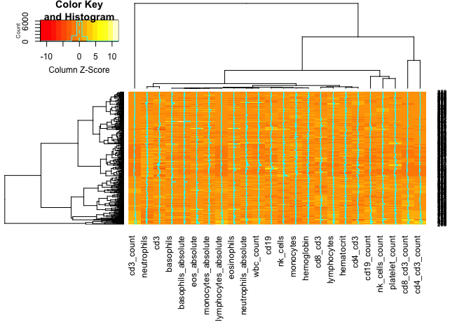
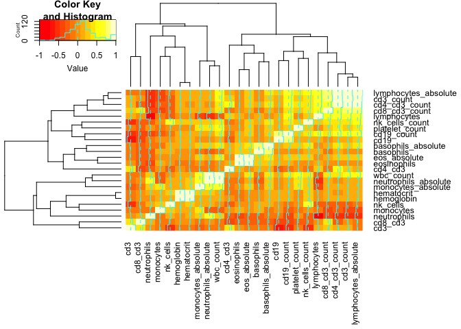
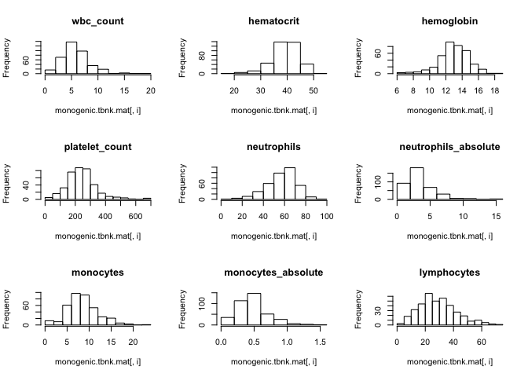
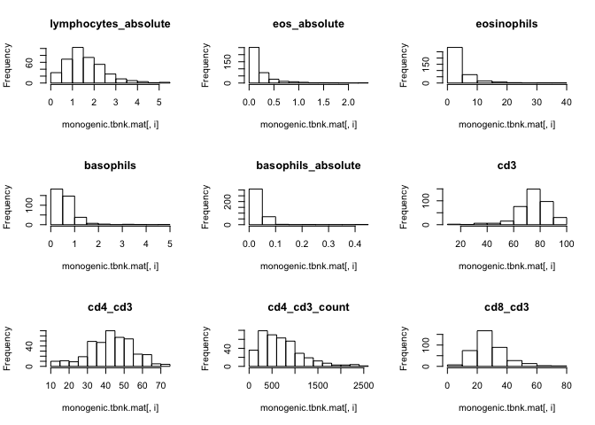
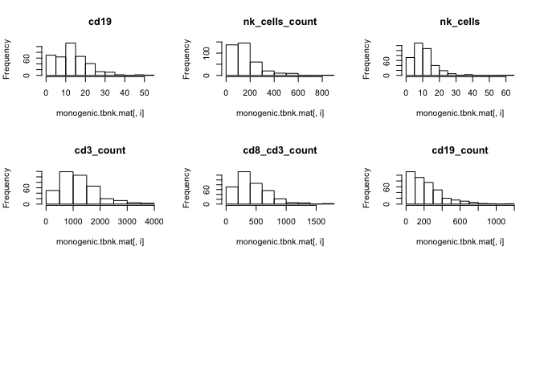
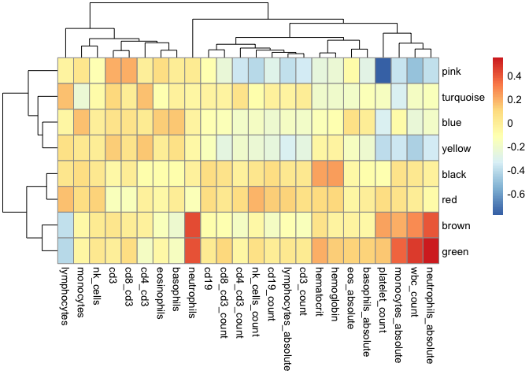
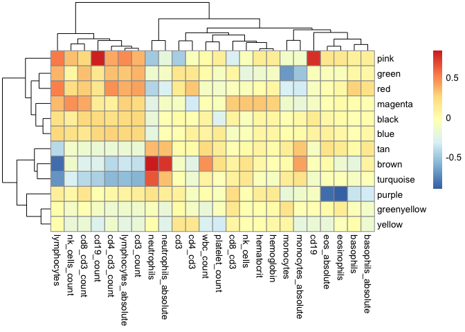
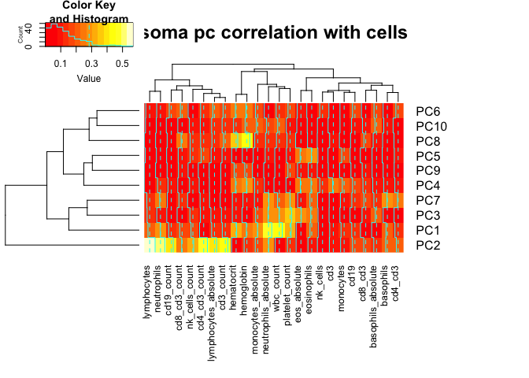
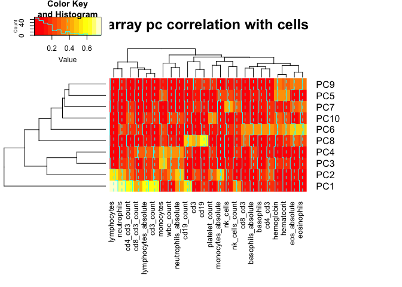
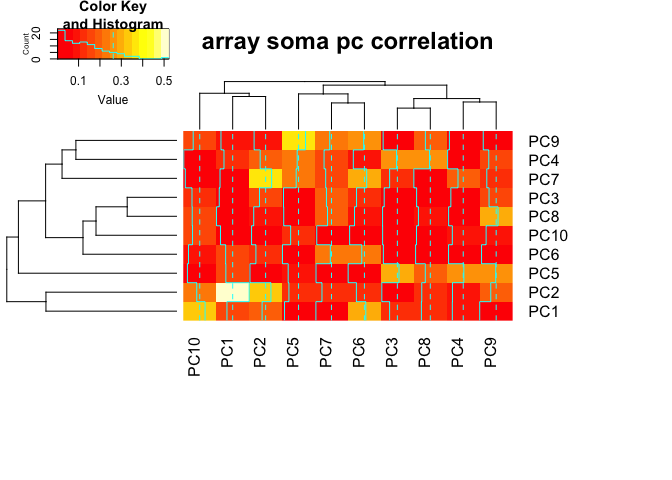

Module correlation to tbnk
================
Nicholas Rachmaninoff
10/30/2018

``` r
# set paths -------------------
# monogenic.project.dir <- "../../.."

ARRAY.ESET.PATH <- "Data/Microarray/data_analysis_ready/eset_batch_filtered.rds"
ARRAY.WGCNA.PATH <-
  "Data/Microarray/analysis_output/WGCNA/batch/scores.rds"

SOMA.ESET.PATH <- "Data/Somalogic/data_analysis_ready/analysis_ready_sample_level_training_somalogic.rds"
SOMA.WGCNA.PATH <-
  "Data/Somalogic/analysis_output/wgcna_results/scores.rds"

MONOGENIC.METADATA.PATH <- "Metadata/monogenic.de-identified.metadata.RData"

# load data ------------------- 

array.eset <- readRDS(ARRAY.ESET.PATH)
array.scores <- readRDS(ARRAY.WGCNA.PATH)

soma.eset <- readRDS(SOMA.ESET.PATH)
soma.scores <- readRDS(SOMA.WGCNA.PATH)

load(MONOGENIC.METADATA.PATH)
```

run PCA on array and somalogic
==============================

``` r
array.pca <- prcomp(t(exprs(array.eset)))$x
soma.pca <- prcomp(t(exprs(soma.eset)))$x

rownames(soma.pca) <- soma.eset$visit_id
```

filter data
===========

``` r
soma.scores.mat <- t(exprs(soma.scores))
rownames(soma.scores.mat) <- soma.scores$visit_id

array.scores.mat <- t(exprs(array.scores))

monogenic.tbnk.mat <- as.matrix(monogenic.tbnk[,c(-1, -2, -3)])
row.names(monogenic.tbnk.mat) <- monogenic.tbnk$visit_id

rows.remove <- apply(monogenic.tbnk.mat, 1, function(x) sum(is.na(x) !=0))
monogenic.tbnk.mat <- monogenic.tbnk.mat[!rows.remove, ]
```

Heatmap of tbnk
===============

``` r
heatmap.2(monogenic.tbnk.mat, scale = "column", margins = c(10, 4))
```



TBNK cor mat
============

``` r
heatmap.2(cor(monogenic.tbnk.mat, method = "spearman"), scale = "none", margins = c(9, 9))
```



plot TBNK distributions
=======================

``` r
par(mfrow= c(3,3))
for(i in 1:ncol(monogenic.tbnk.mat)){
  hist(monogenic.tbnk.mat[, i], main = colnames(monogenic.tbnk.mat)[i])
}
```



define correlation function tht matches visit
=============================================

``` r
cor.reorder.by.visit <- function(mat1, mat2){
  shared <- intersect(rownames(mat1), rownames(mat2))
  
  mat1 <- mat1[match(shared, row.names(mat1)),]
  mat2 <- mat2[match(shared, row.names(mat2)),]
  
  return(cor(mat1, mat2, method = "spearman"))
}
```

Module correlation with cells
=============================

``` r
soma.tbnk.mod.cormat <- cor.reorder.by.visit(soma.scores.mat, monogenic.tbnk.mat)
array.tbnk.mod.cormat <- cor.reorder.by.visit(array.scores.mat, monogenic.tbnk.mat)

# heatmap.2(abs(soma.tbnk.mod.cormat), margins = c(10,10))
# heatmap.2(abs(array.tbnk.mod.cormat), margins = c(10,10))

pheatmap(soma.tbnk.mod.cormat)
```



``` r
pheatmap(array.tbnk.mod.cormat)
```



PC correlation with cells
=========================

``` r
soma.tbnk.pc.cormat <- cor.reorder.by.visit(soma.pca[,1:10], monogenic.tbnk.mat)
array.tbnk.pc.cormat <- cor.reorder.by.visit(array.pca[,1:10], monogenic.tbnk.mat)

heatmap.2(abs(soma.tbnk.pc.cormat), margins = c(10,10), main = "soma pc correlation with cells")
```



``` r
heatmap.2(abs(array.tbnk.pc.cormat), margins = c(10,10), main = "array pc correlation with cells")
```



``` r
soma.array.pc.cormat <- cor.reorder.by.visit(soma.pca[,1:10], array.pca[,1:10])

heatmap.2(abs(soma.array.pc.cormat), margins = c(10,10), main = "array soma pc correlation")
```


