Enrichments
================
Dylan Hirsch
5/9/2019

R Markdown
----------

``` r
source('../../util/Enrichment/hyperGeo.R')
library(ggplot2)
```

    ## Warning: package 'ggplot2' was built under R version 3.5.2

Signature enrichments
---------------------

``` r
enrichments = readRDS('../../../Enrichments/transcriptional_surrogate_enrichments.RDS')
```

``` r
gene.sets = c('btms', 'go', 'kegg', 'reactome')
top3 = function(enrichment, pn = 'positive') {
    enrichment = enrichment[[pn]]
    dfs = lapply(gene.sets, function(gene.set) {
      enrichment.subset = enrichment[enrichment$gene.set == gene.set, ]
      enrichment.subset = enrichment.subset[order(enrichment.subset$pvals, decreasing = FALSE), ]
      if(nrow(enrichment.subset) >= 3) {
        enrichment.subset = enrichment.subset[1:3, ]
        return(enrichment.subset)
      } else {
        return(enrichment.subset)
      }
    })
    df = Reduce(rbind, dfs)
    df = df[order(df$pvals, decreasing = TRUE), ]
    df$term = factor(rownames(df), levels = rownames(df))
    df$nlp = -log10(df$pvals)
    return(df)
}
```

``` r
bar_plot = function(df) {
  p = ggplot(df, aes(x = term, y = nlp, fill = gene.set)) + geom_bar(stat = 'identity') + coord_flip() +
    ylab('Negative log10 p value')
}
```

``` r
p = bar_plot(top3(enrichments$somalogic.modules.magenta)) + ggtitle('somalogic.modules.magenta')
print(p)
```

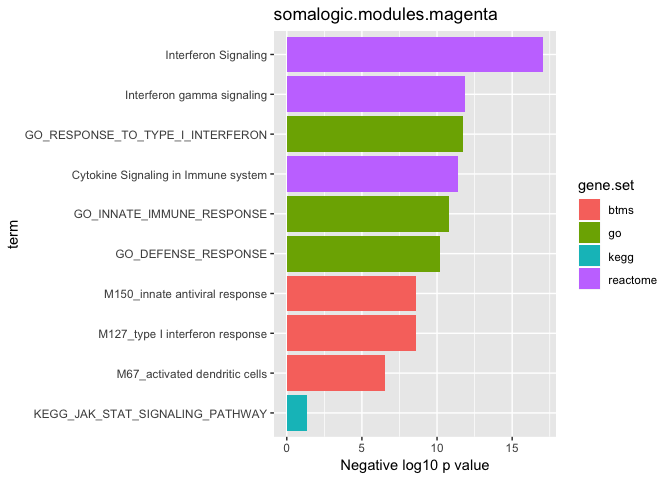

``` r
p = bar_plot(top3(enrichments$somalogic.grey.MIP.1a))
print(p + ggtitle('somalogic.grey.MIP.1a'))
```

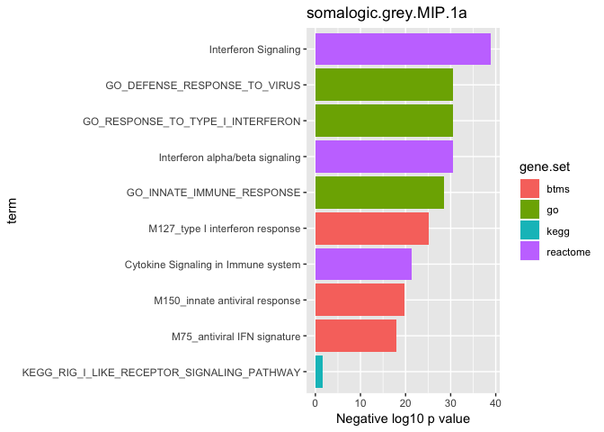

``` r
p = bar_plot(top3(enrichments$somalogic.grey.SAA)) + ggtitle('somalogic.grey.SAA')
print(p)
```

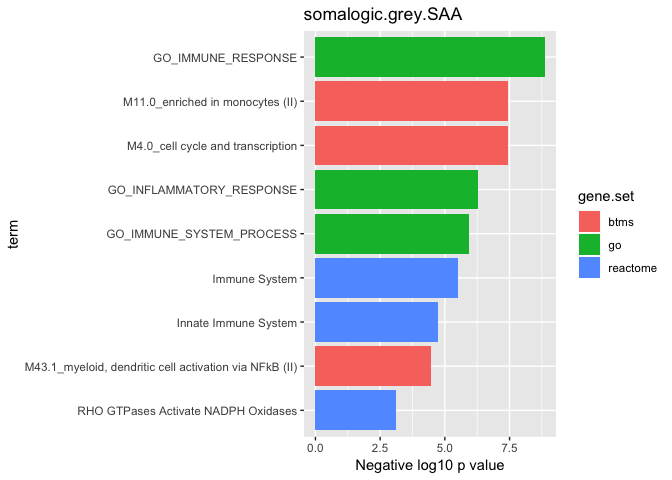

``` r
p = bar_plot(top3(enrichments$tbnks.rdw, pn = 'negative')) + ggtitle('tbnks.rdw')
print(p)
```

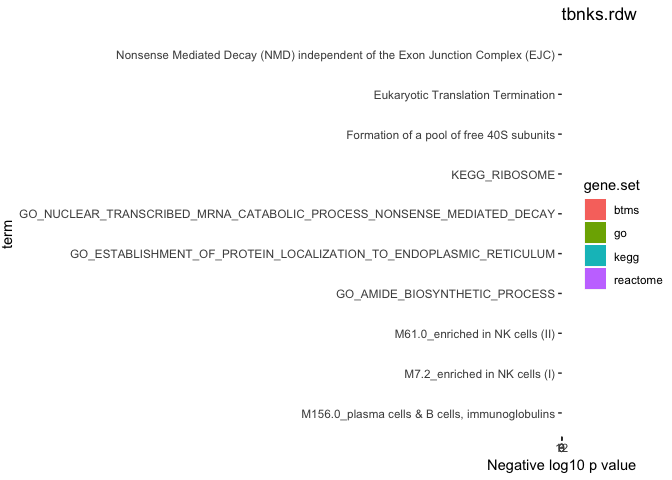

``` r
p = bar_plot(top3(enrichments$tbnks.nk_cells_abs)) + ggtitle('tbnks.nk_cells_abs')
print(p)
```

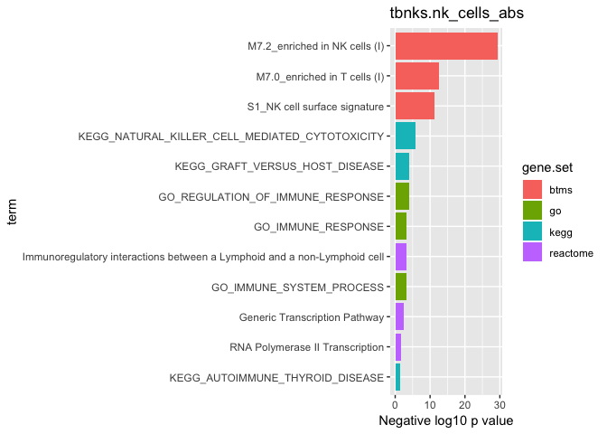

``` r
p = bar_plot(top3(enrichments$microarray.modules.greenyellow)) + ggtitle('microarray.modules.greenyellow')
print(p)
```

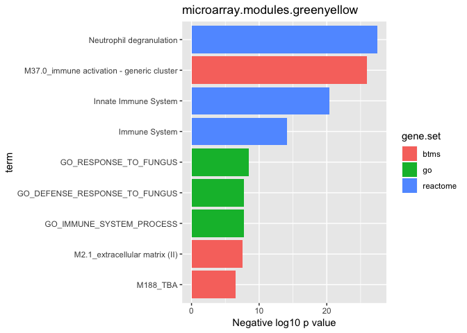

``` r
p = bar_plot(top3(enrichments$microarray.modules.red)) + ggtitle('microarray.modules.red')
print(p)
```

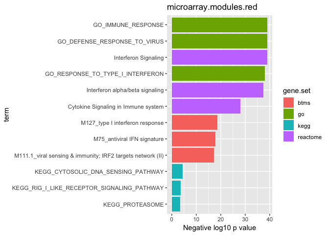

``` r
p = bar_plot(top3(enrichments$microarray.modules.magenta)) + ggtitle('microarray.modules.magenta')
print(p)
```

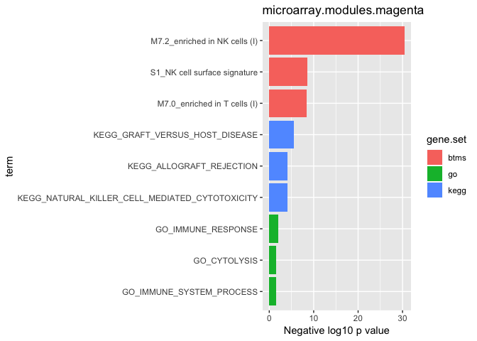

``` r
df1 = top3(enrichments$microarray.modules.greenyellow)
df1$module = 'greenyellow'
df2 = top3(enrichments$microarray.modules.red)
df2$module = 'red'
df3 = top3(enrichments$microarray.modules.magenta)
df3$module = 'magenta'
df = rbind(df1, df2, df3)
```

``` r
p = ggplot(df, aes(x = term, y = nlp, fill = gene.set)) + geom_bar(stat = 'identity') + coord_flip() +
    ylab('Negative log10 p value') + facet_wrap(~module, ncol = 1, scales = 'free_y')
print(p)
```

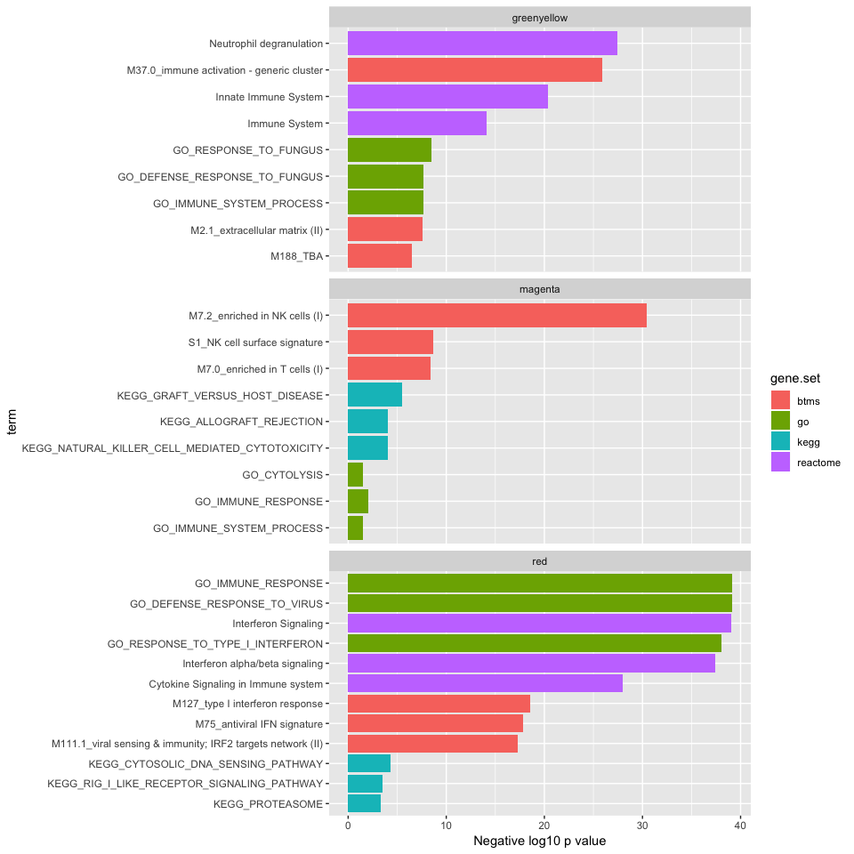

``` r
df1 = top3(enrichments$somalogic.modules.magenta)
df1$module = 'Proteomic Magenta Module'
df2 = top3(enrichments$somalogic.grey.MIP.1a)
df2$module = 'MIP 1a'
df = rbind(df1, df2)
df$module = factor(df$module, levels = c('Proteomic Magenta Module', 'MIP 1a'))
df$term = factor(df$term, levels = unique(c(levels(df1$term), levels(df2$term))))
```

``` r
p = ggplot(df1, aes(x = term, y = nlp, fill = gene.set)) + geom_bar(stat = 'identity') + coord_flip() +
    ylab('Negative log10 p value') + ylim(0, 40) + theme(
      axis.text.x = element_text(size = 10)
    ) + ggtitle('Proteomic Magenta Module')
print(p)
```

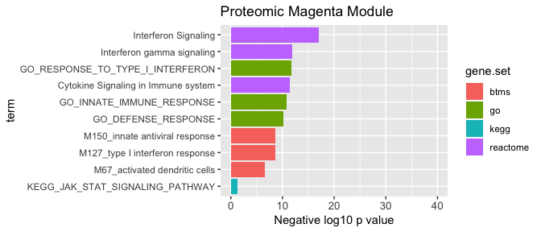

``` r
p = ggplot(df2, aes(x = term, y = nlp, fill = gene.set)) + geom_bar(stat = 'identity') + coord_flip() +
    ylab('Negative log10 p value') + ylim(0, 40) + theme(
      axis.text.x = element_text(size = 10)
    ) + ggtitle('MIP 1a')
print(p)
```

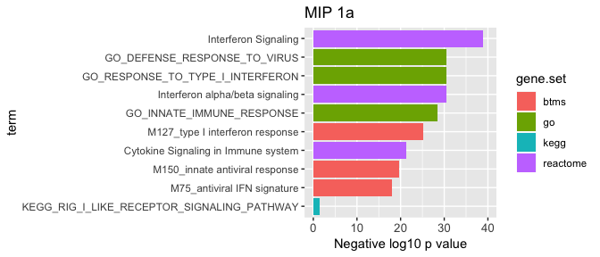
