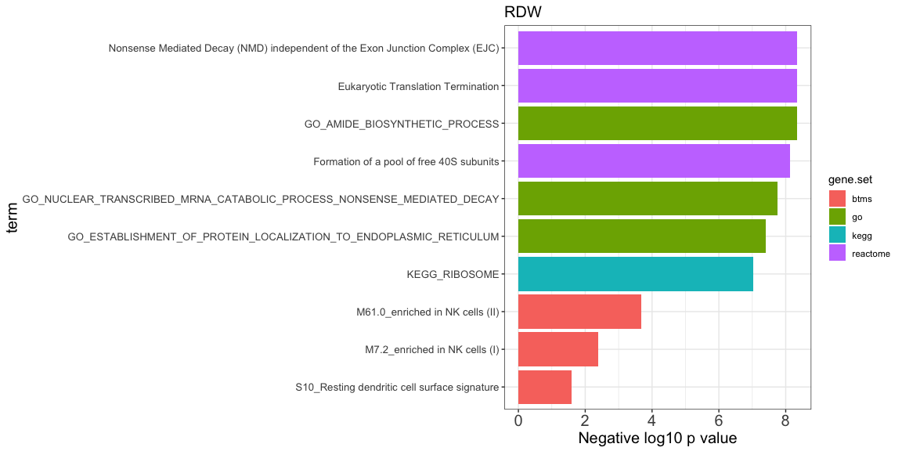

Enrichments
================
Dylan Hirsch
5/9/2019

R Markdown
----------

``` r
library(ggplot2)
```

    ## Warning: package 'ggplot2' was built under R version 3.5.2

``` r
library(reshape2)
library(cowplot)
```

    ## Warning: package 'cowplot' was built under R version 3.5.2

    ## 
    ## Attaching package: 'cowplot'

    ## The following object is masked from 'package:ggplot2':
    ## 
    ##     ggsave

``` r
library(ggpubr)
```

    ## Loading required package: magrittr

    ## 
    ## Attaching package: 'ggpubr'

    ## The following object is masked from 'package:cowplot':
    ## 
    ##     get_legend

``` r
rm(list = ls())
enrichments = readRDS('../../../Enrichments/transcriptional_surrogate_enrichments.RDS')
source('../../util/Plotting/enrichments.R')
```

``` r
p = make_enrichment_bar_plot(enrichment = enrichments$tbnks.rdw$negative) +
  ggtitle('RDW') +
  theme(axis.title.x = element_text(size = 15),
        axis.text.x = element_text(size = 15),
        axis.title.y = element_text(size = 15),
        axis.text.y = element_text(size = 10),
        plot.title = element_text(size = 15))
```

``` r
print(p)
```


