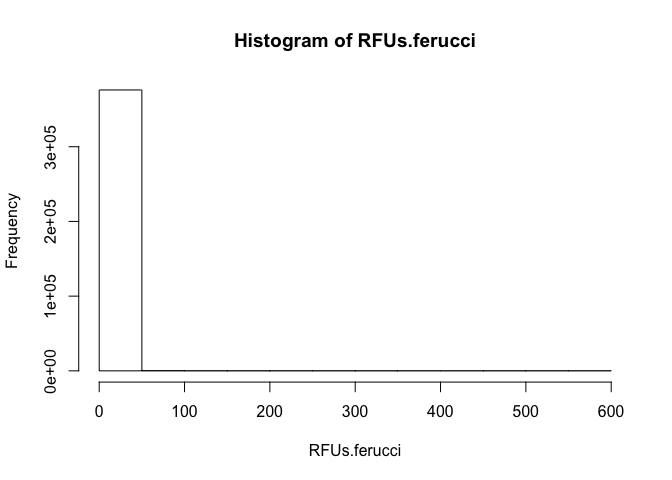
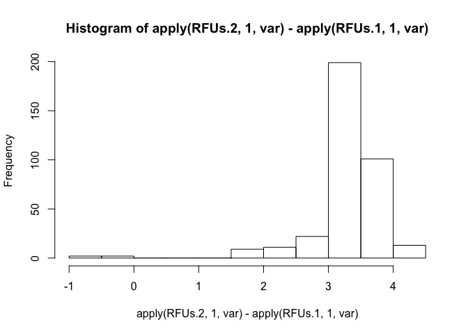
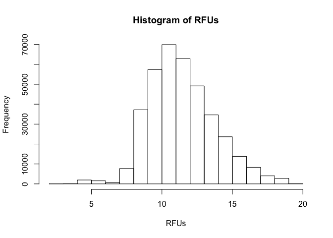
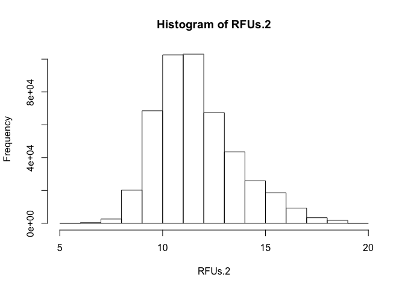
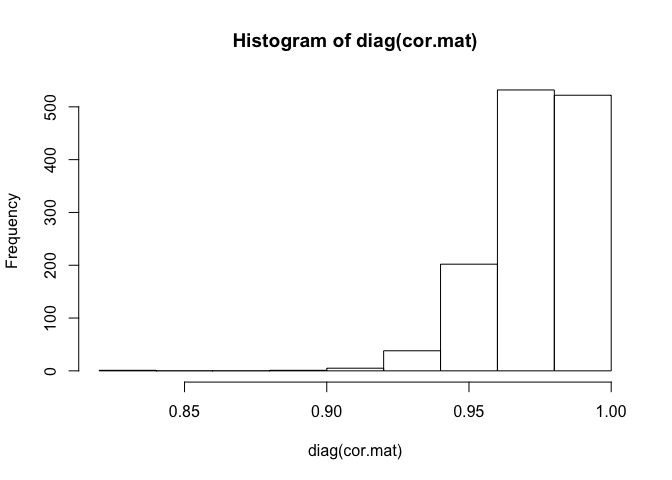
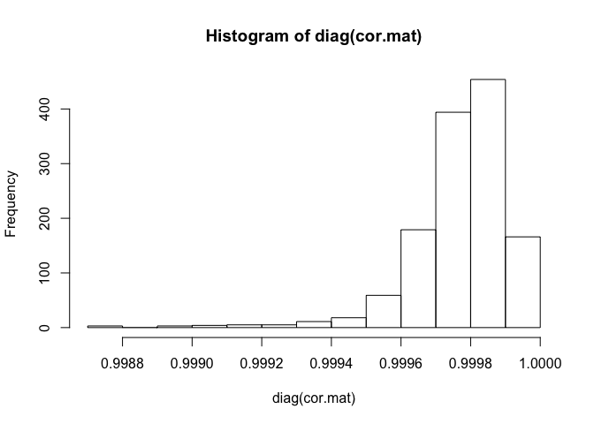
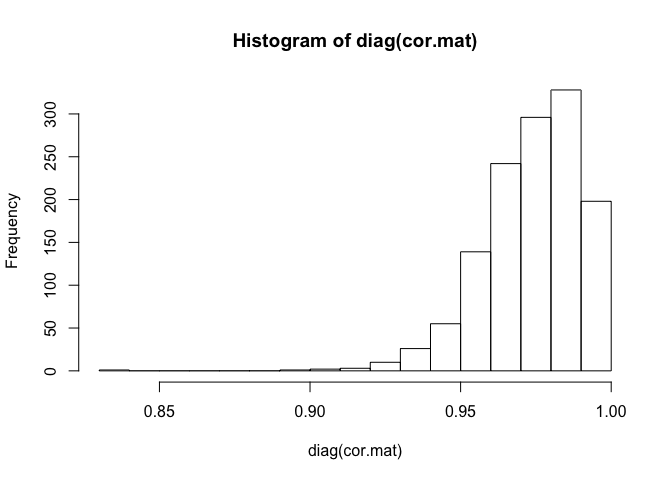

Ferrucci Data QC
================
Dylan Hirsch
4/12/2019

R Markdown
----------

``` r
library(Biobase)
```

    ## Warning: package 'Biobase' was built under R version 3.5.1

    ## Loading required package: BiocGenerics

    ## Warning: package 'BiocGenerics' was built under R version 3.5.1

    ## Loading required package: parallel

    ## 
    ## Attaching package: 'BiocGenerics'

    ## The following objects are masked from 'package:parallel':
    ## 
    ##     clusterApply, clusterApplyLB, clusterCall, clusterEvalQ,
    ##     clusterExport, clusterMap, parApply, parCapply, parLapply,
    ##     parLapplyLB, parRapply, parSapply, parSapplyLB

    ## The following objects are masked from 'package:stats':
    ## 
    ##     IQR, mad, sd, var, xtabs

    ## The following objects are masked from 'package:base':
    ## 
    ##     anyDuplicated, append, as.data.frame, basename, cbind,
    ##     colMeans, colnames, colSums, dirname, do.call, duplicated,
    ##     eval, evalq, Filter, Find, get, grep, grepl, intersect,
    ##     is.unsorted, lapply, lengths, Map, mapply, match, mget, order,
    ##     paste, pmax, pmax.int, pmin, pmin.int, Position, rank, rbind,
    ##     Reduce, rowMeans, rownames, rowSums, sapply, setdiff, sort,
    ##     table, tapply, union, unique, unsplit, which, which.max,
    ##     which.min

    ## Welcome to Bioconductor
    ## 
    ##     Vignettes contain introductory material; view with
    ##     'browseVignettes()'. To cite Bioconductor, see
    ##     'citation("Biobase")', and for packages 'citation("pkgname")'.

``` r
rm(list=ls())
RFUs.1 = read.table('../../Reference/CHI-16-018_Hyb.Cal_RFU.txt.adat_RFU.txt', sep = '\t', comment.char = '', header = FALSE)
sample.data = read.table('../../Reference/CHI-16-018_Hyb.Cal_RFU.txt.adat_Samples.txt', sep = '\t', comment.char = '', quote = '',
                         header = TRUE)
somamer.data = read.table('../../Reference/CHI-16-018_Hyb.Cal_RFU.txt.adat_Somamers.txt', sep = '\t', comment.char = '', quote = '',
                          header = FALSE, nrow = length(readLines('../../Reference/CHI-16-018_Hyb.Cal_RFU.txt.adat_Somamers.txt')) - 4, row.names = 1)

somamer.data = t(somamer.data)
somamer.data = as.data.frame(somamer.data)

colnames(RFUs.1) = somamer.data$SomaId
RFUs.1 = as.matrix(RFUs.1)
RFUs.ferucci = RFUs.1
RFUs.1 = log2(RFUs.1)

eset.1 = readRDS('../../Data/Somalogic/processed/v1/testing_somalogic.rds')
eset.2 = readRDS('../../Data/Somalogic/processed/v1/training_somalogic.rds')

eset = combine(eset.1, eset.2)
RFUs.2 = t(exprs(eset))
RFUs.monogeic = RFUs.2
colnames(RFUs.2) = fData(eset)$SomaId

somamers = intersect(colnames(RFUs.1), colnames(RFUs.2))
RFUs.1 = RFUs.1[, somamers]
RFUs.2 = RFUs.2[, somamers]
```

``` r
h = hist(RFUs.ferucci)
```



``` r
median(apply(RFUs.ferucci, 2, median))
```

    ## [1] 1.018215

``` r
h$counts
```

    ##  [1] 375974    131     13      3      3      2      0      0      0      0
    ## [11]      1      1

``` r
dim(RFUs.1)
```

    ## [1]  288 1301

``` r
dim(RFUs.2)
```

    ## [1]  359 1301

``` r
hist(apply(RFUs.2, 1, var) - apply(RFUs.1, 1, var))
```

    ## Warning in apply(RFUs.2, 1, var) - apply(RFUs.1, 1, var): longer object
    ## length is not a multiple of shorter object length



Hyb Cal Med Norm Data
---------------------

``` r
RFUs = read.table('/Volumes/hirschdc$/Scratch/Hyb.Cal.MedNorm_RFU.txt', sep = '\t')
RFUs = as.matrix(RFUs)
RFUs = log2(RFUs)
hist(RFUs)
```



``` r
hist(RFUs.2)
```



We compare the ferrucci data from our normalization with that sent by Giovanna
==============================================================================

``` r
RFUs.1 = read.table('/Volumes/hirschdc$/Scratch/Hyb.Cal.MedNorm_RFU.txt', sep = '\t')
RFUs.1 = log2(RFUs.1)
somamers = read.table('/Volumes/hirschdc$/Scratch/Somamers.txt', sep = '\t', header = TRUE)
samples = read.table('/Volumes/hirschdc$/Scratch/Samples.txt', sep = '\t', header = TRUE)
```

``` r
rownames(RFUs.1) = gsub(' ', '_', paste(samples$PlateId, samples$PlatePosition))
colnames(RFUs.1) = somamers$SomaId
```

``` r
RFUs.2 = read.table('../../Reference/CHI-16-018_Hyb.Cal_RFU.txt.adat_RFU.txt', sep = '\t', comment.char = '', header = FALSE)
RFUs.2 = log2(RFUs.2)
samples = read.table('../../Reference/CHI-16-018_Hyb.Cal_RFU.txt.adat_Samples.txt', sep = '\t', comment.char = '', quote = '',
                     header = TRUE)
somamers = read.table('../../Reference/CHI-16-018_Hyb.Cal_RFU.txt.adat_Somamers.txt', sep = '\t', comment.char = '', quote = '',
                      header = FALSE, nrow = length(readLines('../../Reference/CHI-16-018_Hyb.Cal_RFU.txt.adat_Somamers.txt')) - 4,
                      row.names = 1)
somamers = t(somamers)
somamers = as.data.frame(somamers)
```

``` r
rownames(RFUs.2) = gsub(' ', '_', paste(samples$PlateId, samples$PlatePosition))
colnames(RFUs.2) = somamers$SomaId
```

``` r
rows = intersect(rownames(RFUs.1), rownames(RFUs.2))
cols = intersect(colnames(RFUs.1), colnames(RFUs.2))
```

``` r
RFUs.1 = RFUs.1[rows, cols]
RFUs.2 = RFUs.2[rows, cols]
```

``` r
cor.mat = cor(RFUs.1, RFUs.2)
hist(diag(cor.mat))
```



``` r
RFUs.3 = read.table('/Volumes/hirschdc$/Scratch/Hyb.Cal_RFU.txt', sep = '\t')
RFUs.3 = log2(RFUs.3)
somamers = read.table('/Volumes/hirschdc$/Scratch/Somamers.txt', sep = '\t', header = TRUE)
samples = read.table('/Volumes/hirschdc$/Scratch/Samples.txt', sep = '\t', header = TRUE)
```

``` r
rownames(RFUs.3) = gsub(' ', '_', paste(samples$PlateId, samples$PlatePosition))
colnames(RFUs.3) = somamers$SomaId
```

``` r
RFUs.3 = RFUs.3[rownames(RFUs.2), colnames(RFUs.2)]
cor.mat = cor(RFUs.2, RFUs.3)
hist(diag(cor.mat))
```



``` r
cor.mat = cor(RFUs.1, RFUs.3)
hist(diag(cor.mat))
```


