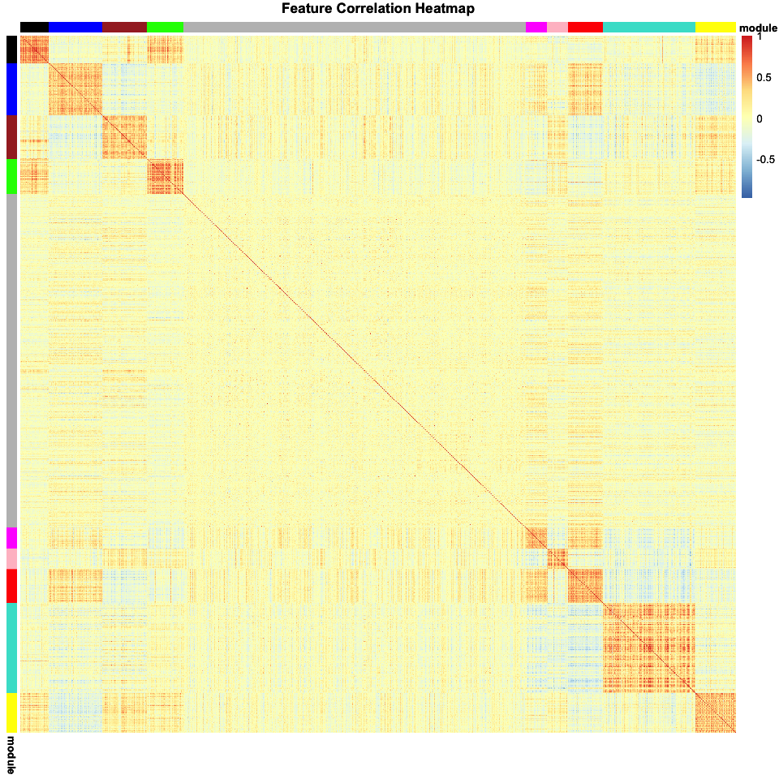
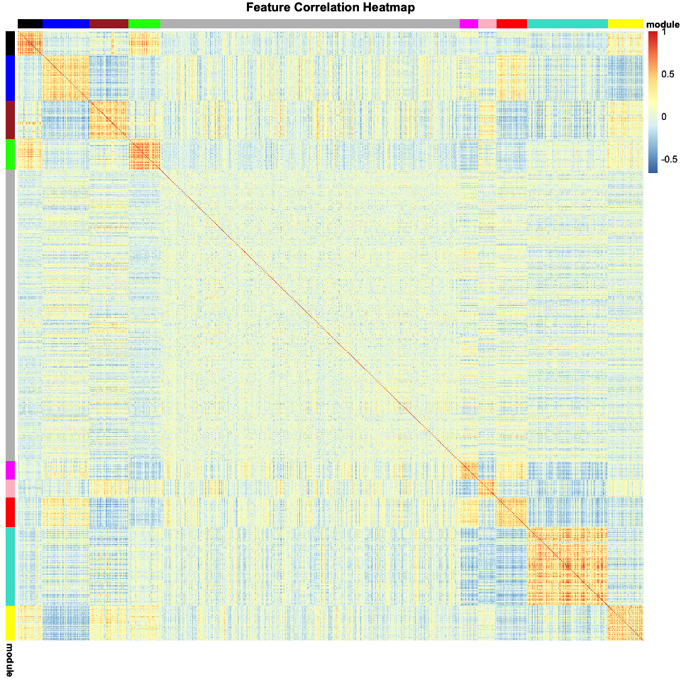
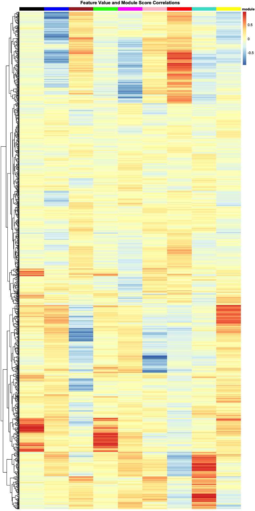
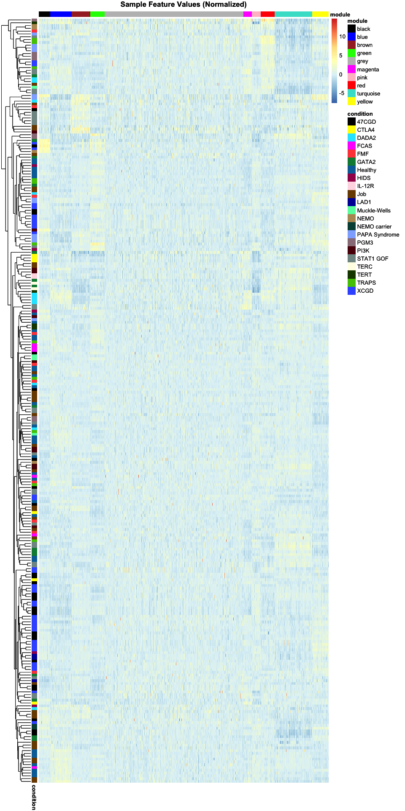
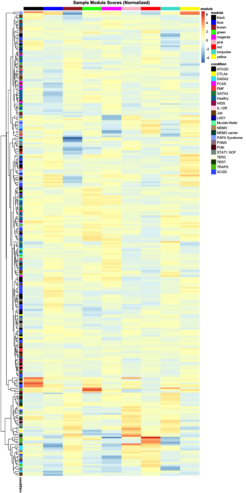

WGCNA Results
================
Dylan Hirsch
10/3/2018

    ## Warning: package 'Biobase' was built under R version 3.5.1

    ## Warning: package 'BiocGenerics' was built under R version 3.5.1

    ## ==========================================================================
    ## *
    ## *  Package WGCNA 1.66 loaded.
    ## *
    ## *    Important note: It appears that your system supports multi-threading,
    ## *    but it is not enabled within WGCNA in R. 
    ## *    To allow multi-threading within WGCNA with all available cores, use 
    ## *
    ## *          allowWGCNAThreads()
    ## *
    ## *    within R. Use disableWGCNAThreads() to disable threading if necessary.
    ## *    Alternatively, set the following environment variable on your system:
    ## *
    ## *          ALLOW_WGCNA_THREADS=<number_of_processors>
    ## *
    ## *    for example 
    ## *
    ## *          ALLOW_WGCNA_THREADS=4
    ## *
    ## *    To set the environment variable in linux bash shell, type 
    ## *
    ## *           export ALLOW_WGCNA_THREADS=4
    ## *
    ## *     before running R. Other operating systems or shells will
    ## *     have a similar command to achieve the same aim.
    ## *
    ## ==========================================================================

    ## Warning: package 'pheatmap' was built under R version 3.5.2

Plot feature correlation heatmap with module annotations 

Plot feature correlation heatmap again, but for the spearman correlation 

Plot gene and eigenvector correlation matrix 

Plot feature values among samples 

Plot module eigengene scores among patients 
