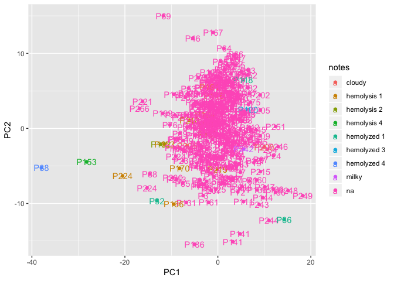
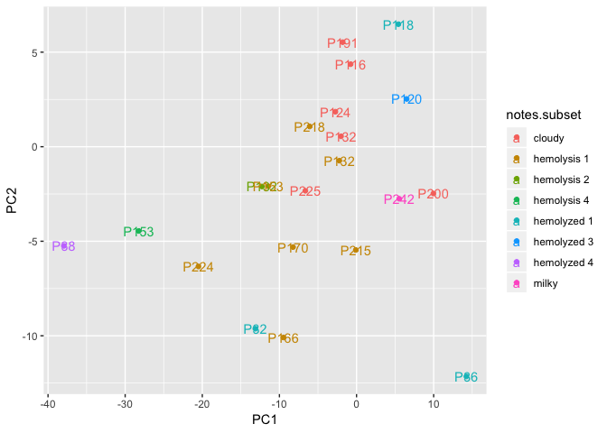

Somalogic\_outlier\_analysis
================
Dylan Hirsch
2/13/2019

R Markdown
----------

``` r
rm(list = ls())
library(Biobase)
```

    ## Warning: package 'Biobase' was built under R version 3.5.1

    ## Loading required package: BiocGenerics

    ## Warning: package 'BiocGenerics' was built under R version 3.5.1

    ## Loading required package: parallel

    ## 
    ## Attaching package: 'BiocGenerics'

    ## The following objects are masked from 'package:parallel':
    ## 
    ##     clusterApply, clusterApplyLB, clusterCall, clusterEvalQ,
    ##     clusterExport, clusterMap, parApply, parCapply, parLapply,
    ##     parLapplyLB, parRapply, parSapply, parSapplyLB

    ## The following objects are masked from 'package:stats':
    ## 
    ##     IQR, mad, sd, var, xtabs

    ## The following objects are masked from 'package:base':
    ## 
    ##     anyDuplicated, append, as.data.frame, basename, cbind,
    ##     colMeans, colnames, colSums, dirname, do.call, duplicated,
    ##     eval, evalq, Filter, Find, get, grep, grepl, intersect,
    ##     is.unsorted, lapply, lengths, Map, mapply, match, mget, order,
    ##     paste, pmax, pmax.int, pmin, pmin.int, Position, rank, rbind,
    ##     Reduce, rowMeans, rownames, rowSums, sapply, setdiff, sort,
    ##     table, tapply, union, unique, unsplit, which, which.max,
    ##     which.min

    ## Welcome to Bioconductor
    ## 
    ##     Vignettes contain introductory material; view with
    ##     'browseVignettes()'. To cite Bioconductor, see
    ##     'citation("Biobase")', and for packages 'citation("pkgname")'.

``` r
library(ggplot2)
load('../../../Metadata/monogenic.de-identified.metadata.RData')
eset.train = readRDS('../../../Data/Somalogic/processed/v1/training_somalogic.rds')
eset.test = readRDS('../../../Data/Somalogic/processed/v1/testing_somalogic.rds')
```

``` r
eset = combine(eset.test, eset.train)
X = t(exprs(eset))
pca = prcomp(X)
x = pca$x
df = data.frame(PC1 = x[,1], PC2 = x[,2], visit_ids = eset$patient_id)
```

``` r
meta = monogenic.somalogic
meta = meta[colnames(eset), ]
notes = meta$sample_notes
notes[is.na(notes)] = 'NA'
notes = tolower(notes)
notes = factor(notes)
```

``` r
p = ggplot(df, aes(x = PC1, y = PC2, label = visit_ids, color = notes)) + geom_point() + geom_text(aes(label = visit_ids))
print(p)
```



``` r
df.subset = df[notes != 'na', ]
notes.subset = notes[notes != 'na']
p = ggplot(df.subset, aes(x = PC1, y = PC2, label = visit_ids, color = notes.subset)) + geom_point() + geom_text(aes(label = visit_ids))
print(p)
```


