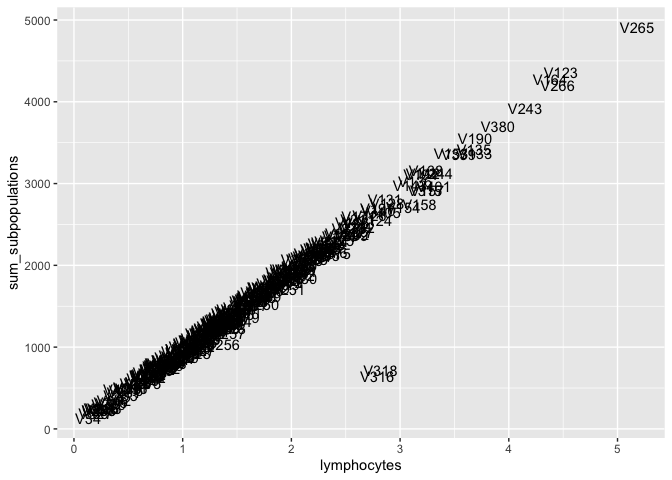
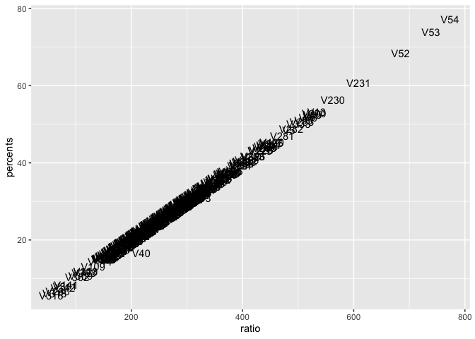
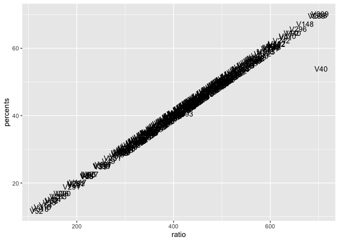
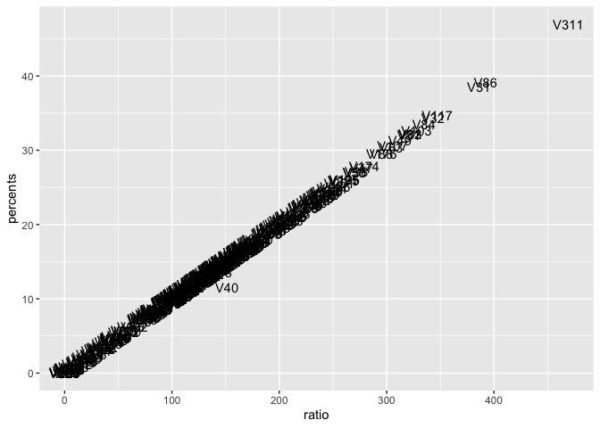
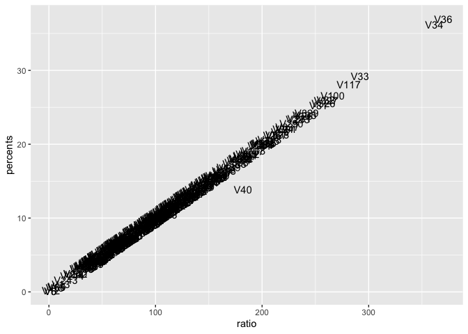

Find Outliers to Remove From TBNKs
================
Dylan Hirsch
2/8/2018

``` r
knitr::opts_chunk$set(echo = TRUE)
```

``` r
library(Biobase)
```

    ## Warning: package 'Biobase' was built under R version 3.5.1

    ## Loading required package: BiocGenerics

    ## Warning: package 'BiocGenerics' was built under R version 3.5.1

    ## Loading required package: parallel

    ## 
    ## Attaching package: 'BiocGenerics'

    ## The following objects are masked from 'package:parallel':
    ## 
    ##     clusterApply, clusterApplyLB, clusterCall, clusterEvalQ,
    ##     clusterExport, clusterMap, parApply, parCapply, parLapply,
    ##     parLapplyLB, parRapply, parSapply, parSapplyLB

    ## The following objects are masked from 'package:stats':
    ## 
    ##     IQR, mad, sd, var, xtabs

    ## The following objects are masked from 'package:base':
    ## 
    ##     anyDuplicated, append, as.data.frame, basename, cbind,
    ##     colMeans, colnames, colSums, dirname, do.call, duplicated,
    ##     eval, evalq, Filter, Find, get, grep, grepl, intersect,
    ##     is.unsorted, lapply, lengths, Map, mapply, match, mget, order,
    ##     paste, pmax, pmax.int, pmin, pmin.int, Position, rank, rbind,
    ##     Reduce, rowMeans, rownames, rowSums, sapply, setdiff, sort,
    ##     table, tapply, union, unique, unsplit, which, which.max,
    ##     which.min

    ## Welcome to Bioconductor
    ## 
    ##     Vignettes contain introductory material; view with
    ##     'browseVignettes()'. To cite Bioconductor, see
    ##     'citation("Biobase")', and for packages 'citation("pkgname")'.

``` r
library(ggplot2)
```

    ## Warning: package 'ggplot2' was built under R version 3.5.2

Load training expression set

``` r
eset = readRDS('../../../Data/TBNK/processed/tbnk_eset_training.rds')
```

We ensure the lymphocyte counts are equal to the counts of the subpopulations

``` r
X = t(exprs(eset))
subpopulations_sums = X[,'cd8_cd3_count'] + X[,'cd4_cd3_count'] + X[,'cd19_count'] + X[,'nk_cells_count']
df = data.frame(lymphocytes = X[,'lymphocytes_abs'], sum_subpopulations = subpopulations_sums, visit_id = eset$visit_id)
ggplot(df, aes(x = lymphocytes, y = sum_subpopulations, label = visit_id)) + geom_text(aes(label = visit_id))
```

    ## Warning: Removed 15 rows containing missing values (geom_text).



``` r
counts = list(cd8_cd3 = X[,'cd8_cd3_count'], 
              cd4_cd3 = X[,'cd4_cd3_count'], 
              cd19 = X[,'cd19_count'], 
              nk = X[,'nk_cells_count'])
percents = list(cd8_cd3 = X[,'cd8_cd3'], 
              cd4_cd3 = X[,'cd4_cd3'], 
              cd19 = X[,'cd19'], 
              nk = X[,'nk_cells'])

ratios = lapply(counts, function(count) {count/X[,'lymphocytes_abs']})

for(subpop in names(ratios)) {
  df = data.frame(ratio = ratios[[subpop]], percents = percents[[subpop]], visit_id = eset$visit_id)
  p = ggplot(df, aes(x = ratio, y = percents, label = visit_id)) + geom_text(aes(label = visit_id))
  print(p)
}
```

    ## Warning: Removed 15 rows containing missing values (geom_text).



    ## Warning: Removed 15 rows containing missing values (geom_text).



    ## Warning: Removed 15 rows containing missing values (geom_text).



    ## Warning: Removed 15 rows containing missing values (geom_text).


